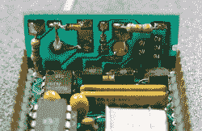

# Voja 公司 1991 年的 EEPROM 仿真器

> 原文：<https://hackaday.com/2016/06/27/vojas-eeprom-emulator-from-1991/>

我们很高兴我们不是唯一的黑客团队！[Voja Antonic]最近偶然发现了一个他早在 1991 年制作的 EPROM 模拟器。这是一个甜蜜的建筑，所以如果可以的话，把你的思绪带回到 25 年前。放上[《没关系》](https://en.wikipedia.org/wiki/Nevermind)，开始一个完美的复古项目。

仿真器基本上是 PIC 16C54 微控制器和一些存储器，以及一些用于输入和输出的缓冲器。一方面，它是 EPROM——过去时代的闪存——的插件替代品。另一方面，它通过串行端口连接到 PC。这个设备不需要经历拉 EPROM、擦除和重新编程的繁琐过程，而是瞬间上传新代码。

不需要模仿古代的 EPROMS？你仍然应该看看这个版本——它的机制非常棒！我们喜欢以 90°角焊接的串行端口背板。该接头是一个卡边连接器，但也是一个漂亮的小盒子，让人想起[Voja]的其他 [FR4 制作技巧](http://hackaday.com/2015/06/03/how-to-build-beautiful-enclosures-from-fr4-aka-pcbs/)。led 戳出来的钻孔是经典的。我们永远不会制造一个 EPROM 模拟器，但我们绝对会窃取一些制造技术。

[Voja]是黑客日[贡献者](https://hackaday.com/author/vantonic/)，[徽章设计师](http://hackaday.com/2016/05/06/how-to-design-manufacture-and-document-a-hardware-product/)，[疯狂黑客](http://hackaday.com/2015/06/29/true-random-number-generator-for-a-true-hacker/)，灵感来源[时钟建造者](http://www.voja.rs/PROJECTS/Dali/intro.htm)，以及(当时)南斯拉夫第一台 DIY 个人电脑的开发者[。](https://en.wikipedia.org/wiki/Galaksija_%28computer%29)