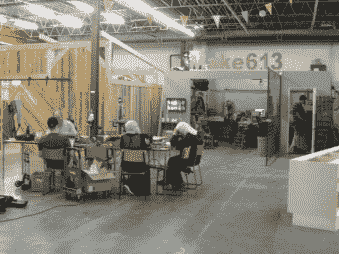
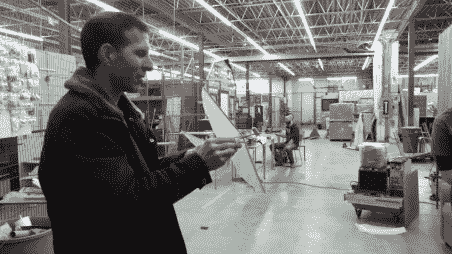
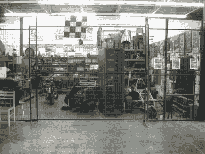
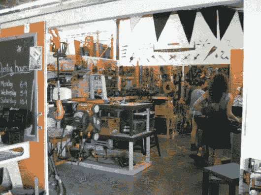
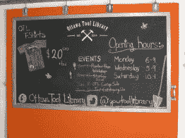
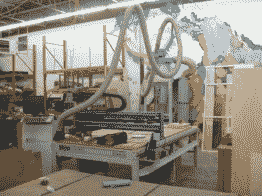
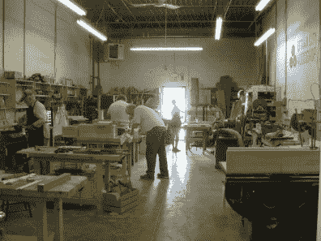
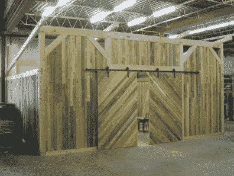
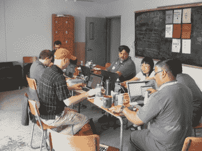
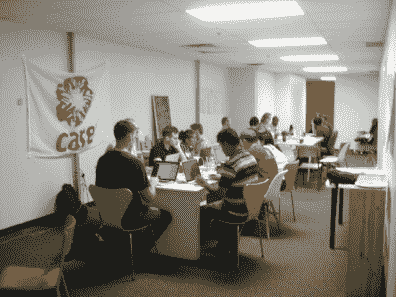

# 创客空间北，从空仓到创客磁铁

> 原文：<https://hackaday.com/2016/06/30/makerspace-north-from-empty-warehouse-to-maker-magnet/>

北创客空间在加拿大渥太华地区的 5 个创客空间中是独一无二的，因为它最初是一个空的 10，000 平方英尺的仓库，有相邻的办公空间和大型开放空间，并让社区填满它，从而成为创客以各种方式混合的主要中心，有些是意想不到的。

许多 makerspaces 由一个组织运营，该组织提供团队或个人使用的工具，以及针对特定工具的资格认证课程。另一方面，Makerspace North 提供空间，并让社区提供创客组件。其结果是各种大型活动，从室内无人机飞行和各种类型的制造商集会日，到工艺表演，车库销售，甚至音乐会。较小的聚会通常对任何人开放，由渥太华机器人俱乐部和渥太华电子俱乐部以及一些更普通的团体举办。社区提供的课程也多种多样。

这也意味着，Makerspace North 的业主不提供工具供人使用，而是提供专用的出租空间。这并不意味着没有工具——这意味着 Makerspace North 包含了各种租赁者的缩影，他们完成工具租赁等任务。这只是社区接受这种独特方法的一个例子。让我们仔细看看这一点以及该系统的其他一些新奇之处。

## 租赁空间的制造商

  Make613’s space with makers working away  Making an ornithopter with Make613’s help

对于 Hackaday 的读者来说，这个领域中最熟悉的居住者类型是由 4 个制造者组成的团体[make 613](http://inventorartist.com/make613/)。没错，只有四个人租了一个空间，在那里他们存放了许多共同使用的工具，包括一台数控机床、各种机床和常用的手动工具抽屉。

在周日下午和周三晚上，他们打开自己空间的门，根据需要摆放出尽可能多的桌子，供任何想要顺道拜访、制作材料、寻求帮助、表演和讲述或者只是闲逛的人使用。在制作橡皮筋扑翼机的过程中，我通过这种方式获得了很多帮助，我也是这里的常客，经常带着我的最新作品，越过每个人的肩膀问“你在做什么？”。人们非常渴望回答这个问题。

Mike’s Formula Junior race car and making space

另一个出租场地的制造商是赛车爱好者迈克·尼尔森。他利用他的空间进行一个正在进行的项目，修复他的 1960 年方程式青少年赛车，在照片的右边可以看到。他第一次买下这辆车是在 1980 年左右，但是在他 1995 年卖掉这辆车并在 2006 年再次买下它之前，他一直在研究和赛车。他几乎没有原创的身体作品，只能依靠照片。将汽车放在 makerspace 的露天场所，而不是藏在他的地下室，这为取得进展提供了一些动力，一个大目标是为 2018 年 6 月在加拿大举行的 Formula Junior Diamond Jubilee 期间的正式 Formula Junior 比赛做好准备。

[CNC 渥太华](http://cncottawa.ca/)是一家小公司，在 Make613 旁边租了一个空间，为客户做 CNC 工作，包括布线、切割、雕刻和设计。在照片中你可以看到他们的[8 ' x4 ' shop sabre SideKick 数控机床](http://shopsabre.com/cnc-plasmas.html)。

  Ottawa Tool Library  Ottawa Tool Library’s events etc.  CNC Ottawa and their Shopsabre SideKick CNC machine

如果你没有自己的工具，那么还有渥太华工具库，每年 50 美元的会员费，你可以无限制地借用工具长达一周。他们也有一些活动，比如最近的一次车库拍卖，他们卖掉了多余的捐赠工具，我买了一些东西，包括一把压顶锯来代替我再也找不到的那把，我已经很好地利用了它来切割聚苯乙烯泡沫塑料。他们偶尔还会举办季节性研讨会，比如修理自行车或制作花盆。

  Ottawa City Woodshop’s workshop  Ottawa City Woodshop’s classroom

渥太华市木工车间是由两个当地人创办的，他们在 Makerspace North 的一个大型相邻房间里有一个工作室，还在仓库区建了一个教室。教室本身就是一件艺术品。作为 Makerspace North 的常客，我目睹了它的逐步建设，包括他们将巨大的横梁削去尺寸，凿出护墙板和槽口，并将横梁锤击到位。他们教授木工课程，学生们可以制作各种东西，从平底雪橇到桌子、棒球棍和滑板，他们也有会员资格，这样人们可以进来做他们自己的项目。

令人意想不到的是，所有这些租赁者将开始分享专业知识、工具，让彼此制作零件，并在制作材料的漫长一天后，一起喝啤酒和烧烤。特别是 Make613 更进一步，欢迎所有人参与分享。

## 事件和类别

其他组织也在剩余的开放仓库空间或相邻的房间和办公室举办各种活动或课程。NorthLabs 是一个常客，它定期举办周三创客聚会，任何人都可以来分享他们的工作或聊天。NorthLabs 还就如何制造机器人、如何购买 3D 打印机、如何使用、如何设计 3D 打印等问题举办了课程和演示。就在刚刚过去的这个周末，我顺道拜访了那些为 IOT 不同项目工作的团队，他们占用了 4 个办公室空间，其中包括一个有趣的蜂巢远程监控项目。你知道吗，仅仅是打开和关闭一个蜂箱就会杀死蜂箱里 1000 只蜜蜂中的 20 只，仅仅是附带损害。

  Hacks of Random Kindness – Making an IoT beehive  Hacks of Random Kindness – Redefining the CARE package

还有一年一度的 Arduino 日，人们可以带着他们的 Arduino(或其他)项目来展示和讲述。[渥太华机器人俱乐部](http://www.ottawarobotics.org/)和[渥太华电子俱乐部](http://www.ottawaelectronicsclub.org/)定期在那里聚会，并且都向任何人开放。仓库里甚至有无人机飞行聚会，但现在空间越来越紧张。

还有许多其他事情正在发生，超出了这里所能容纳的范围，还有许多与 Hackaday 不太相关。那么，人们可以制造东西的创客空间在哪里呢？嗯，有 Make613 空间，周日和周三对任何人开放，还有木材车间。但大多数情况下，创客们可以无止境地拜访、分享、寻求帮助，或者只是闲逛。它基本上是一个仓库，已经成为创客的巨大空间，创客的磁石，尽管它的形式与许多人熟悉的不同。

在你所在的地区，有什么有趣的形式的创客空间或活动你可以利用吗？你的创造者在哪里相遇和混合？你住的地方有这样的机会吗？我们很乐意在下面的评论中听到他们的消息。