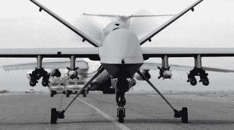

# 认真对待黑仔机器人

> 原文：<https://hackaday.com/2016/06/27/taking-killer-robots-seriously/>

黑仔机器人是科幻小说的支柱。但与心灵运输和飞行汽车不同，它们是我们有生之年很可能看到的东西。唯一阻止像美国、南韩、英国或法国这样的国家在短期内部署自主杀人机器的是，根据当前的国际人道主义法(IHL)——战争规则，它们可能是非法的。

但如果你只是宽慰地感叹人类的命运是安全的，那就再想想吧。自主杀人机器非法的原因本质上是一个技术问题，更糟糕的是，这是一个基于当前技术状态的技术问题。这个故事的简短版本，就像现在这样，使自主机器人杀人武器非法的唯一事情是机器人很难区分朋友和敌人。当技术赶上人类的判断时，所有的赌注都结束了。

觉得我疯了吗？联合国日内瓦办事处(UNOG)是给你带来战争规则的人，三年前成立了一个杀手机器人工作组，他们 2016 年会议的报告刚刚出来。现在是开始认真对待机器人杀手的最佳时机。

## 日内瓦

《特定常规武器公约》(CCW)，也称为《不人道武器公约》，是成员国之间的一项协议，旨在禁止使用某些被认为过于危险或滥杀滥伤的武器，即使在战争时期也不能使用。我们在谈论地雷、喷火器和(最近)致盲激光武器。

从 2013 年开始，联合国日内瓦办事处决定调查杀手机器人是否也应列入这一名单。你可能不会感到惊讶，在这样一个问题上达成国际共识需要一段时间，将平等的伦理、军事考虑、技术甚至未来主义混合在一起。2016 年的非正式专家会议在 4 月份举行，[份报告刚刚出炉](http://www.unog.ch/80256EDD006B8954/(httpAssets)/DDC13B243BA863E6C1257FDB00380A88/$file/ReportLAWS_2016_AdvancedVersion.pdf) (PDF)。这是对会议的高度总结，但也是一份很好的读物。

联合国日内瓦办事处用一个首字母缩写自然地提到了杀手机器人:致命自主武器系统(LAWS ),并开始指出目前没有部署法律，因此是否限制它们的问题是先发制人的。事实上，现在的法律可能是非法的，因为国际人道主义法要求任何致命行动都必须是必要的，并且与军事目标相称，而且必须能够区分平民和军事目标。

目前，要求一个自治系统区分平民和军事是一个难题，对什么是相称的道德判断可能永远都不可能。诸如此类的考虑是阻止 LAWS 现在被部署的原因，但是我们不认为这意味着 UNOG 是在浪费时间。我们的猜测是，解决人工智能和自主性问题只是时间问题。

## 人工智能

虽然像 Elon Musk 这样的 gadflys 甚至严肃的科学家都担心通用人工智能会通过相当复杂的策略接管世界，但现实是，第一个杀人的人工智能更有可能是专门设计来这样做的。虽然目前在技术上不可能区分敌友，但对于人工智能来说，这比自己意识到人类是脆弱的，因此需要消灭他们要实际得多。(或者随便。)

![South Korea's Super aEgis II sentry gun [Source Gizmag]](img/8a345659e990544ad7e661e5c3a857fa.png)

南韩的超级宙斯盾 II 哨兵炮【来源[Gizmag](http://www.gizmag.com/korea-dodamm-super-aegis-autonomos-robot-gun-turret/17198/pictures)

已经有 AI 系统做了大量的预选工作。例如，韩国的自动哨兵机器人[超级宙斯盾 II 系统](http://www.bbc.com/future/story/20150715-killer-robots-the-soldiers-that-never-sleep)，使用其红外摄像机定位并跟踪人们。诚然，这项任务变得简单得多，因为任何人都不允许进入它巡逻的非军事化区域(DMZ)，基本上任何在那里走动的人都是在自找没趣。但是据报道，该系统在几年前就可以完全自主运行。韩国政府*选择*来限制这个功能，让人类来控制。

在更复杂的情况下，人们可以想象一个经过训练的人工智能通过制服来区分战斗人员。考虑到明显不同的风格，或肩膀上的旗帜补丁，或类似的，这应该不会太难做到。当然，这样的系统可能不是 100%万无一失的，但只要它非常准确，它可能就足够好了。

## 目前，人类处于循环中

人类控制的问题是一个滑坡。对于像美国无人机这样的武器，问题不是人类是否完全控制。他们已经不是了。无人机的飞行、目标捕获和跟踪都是自主的。人们只在最后一刻参与进来——通过用操纵杆操纵十字准线来验证目标，然后按下发射按钮。就像韩国哨兵机器人一样，即使人类的参与非常短暂，他们也会被保持在回路中。

MQ-9 Reaper

在这个人的顶端，当然有一个完整的指挥链。无人机操作员*被命令*向一个人开火。这为行动提供了责任，战争罪审判的威胁有望防止不分青红皂白地以平民为目标。这种责任链使得像美国无人机项目[这样的事情甚至据称是合法的](https://www.americanprogress.org/issues/security/report/2016/04/01/134494/are-u-s-drone-strikes-legal/)，尽管这里值得顺便指出这不是一个解决的问题。

虽然无人驾驶飞机是远程遥控的，并且很大程度上是自动系统，但可以说它们在很大程度上是由人类控制的。但是当人类的投入进一步减少时会发生什么呢？例如，对于一个人来说，创建一个被[无人机瞄准](https://theintercept.com/drone-papers/)的 IMEI(手机标识符)列表是否仍然足够？当神经网络进行网络分析，生成属于目标的 IMEIs 的短列表时，情况会怎样？在这些情况下，自治的定义变得更加棘手。

联合国日内瓦办事处的报告设想了人类可能被慢慢挤出循环的另一种方式:如果他们的角色变得足够小和/或重复，以至于他们慢慢开始依赖机器的判断，而不是提供平衡。你们中的每一个习惯性点击弹出菜单的人都知道，你很容易被简化成一个机器人。自然，军用机器人监管的风险要高得多，但机制是相似的。

## 开放式问题

随着人工智能的技术进步和武器系统的集成，确定什么构成自动武器系统的“有意义的人类控制”在未来将变得更加困难。美国士兵已经经常使用机器人来执行拆弹和侦察任务，现有的武器，如韩国的哨兵机器人和美国无人机，已经能够进行近乎自主的致命行动，尽管它们被故意束缚。

黑仔机器人就在眼前，联合国日内瓦办事处已经花了三年时间，甚至还没有完全敲定其法律定义，更不用说采取措施监管它们了。我们会在它们被公约宣布为非法之前看到它们在战场上变得合法吗？比赛开始了！