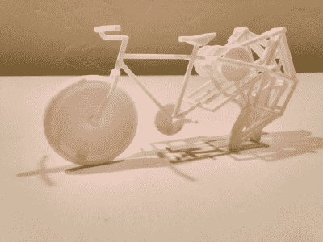

# Strandbeest 自行车

> 原文：<https://hackaday.com/2016/06/30/a-strandbeest-bicycle/>

“如果你问‘为什么’，你就没明白。”当[JP]告诉我们他的 strandbeest 自行车制造厂时，他是这样说的。毕竟，有哪个头脑正常的人会把一个复杂的多腿机械行走机构移植到一辆完美的自行车的尾部呢？但是扩展他的感情，不理解他的创作是错过了我们运动的整个本质。有时候你只要*有*去做点什么，*因为你能*。

3D printed strandbeest bike proof of concept

如果你不熟悉[strand beest](http://www.strandbeest.com/)，它是荷兰艺术家[Theo Jansen]的作品。风力驱动的复杂骨骼行走机器，比如[Jansen]的机器可以在荷兰的海滩上自主行走。因此得名，来自荷兰语:“海滩兽”。

[JP]的 strandbeest 自行车是经过 8 个月的努力才组装起来的。它从概念 CAD 设计和 3D 打印开始，经过多次反复微调将四条腿放在自行车架后面所需的 400 多个零件。这是一个令人印象深刻的成就，它完全可以骑，虽然我们怀疑我们不会在环法自行车赛上看到它。

他发布了几个自行车运行的视频，你可以在休息时看到其中一个。

 [https://www.youtube.com/embed/pYRqO1DHxkI?version=3&rel=1&showsearch=0&showinfo=1&iv_load_policy=1&fs=1&hl=en-US&autohide=2&wmode=transparent](https://www.youtube.com/embed/pYRqO1DHxkI?version=3&rel=1&showsearch=0&showinfo=1&iv_load_policy=1&fs=1&hl=en-US&autohide=2&wmode=transparent)

strandbeest 似乎对黑客和制作者的世界产生了一种魅力，我们已经报道了许多受它启发的项目。只是选择有[这个遥控的例子](http://hackaday.com/2016/04/11/strandmaus-small-rc-strandbeest/)，一个巨大的[蜘蛛状可骑乘的机器](http://hackaday.com/2015/05/18/tin-spider-is-13-foot-rideable-strandbeest/)，或者在天平的另一端[一个 papercraft strandbeest](http://hackaday.com/2011/05/01/papercraft-strandbeest-is-a-great-rainy-day-project/) 。