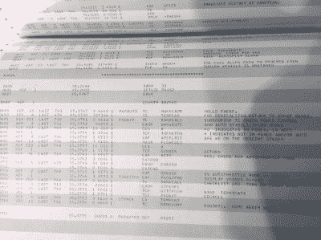
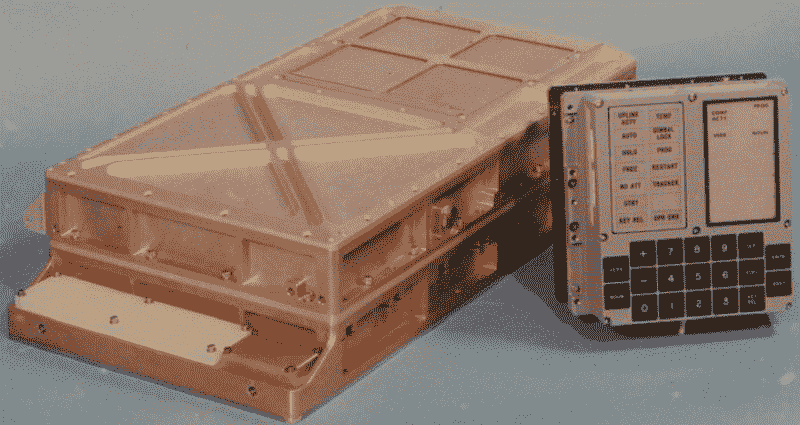
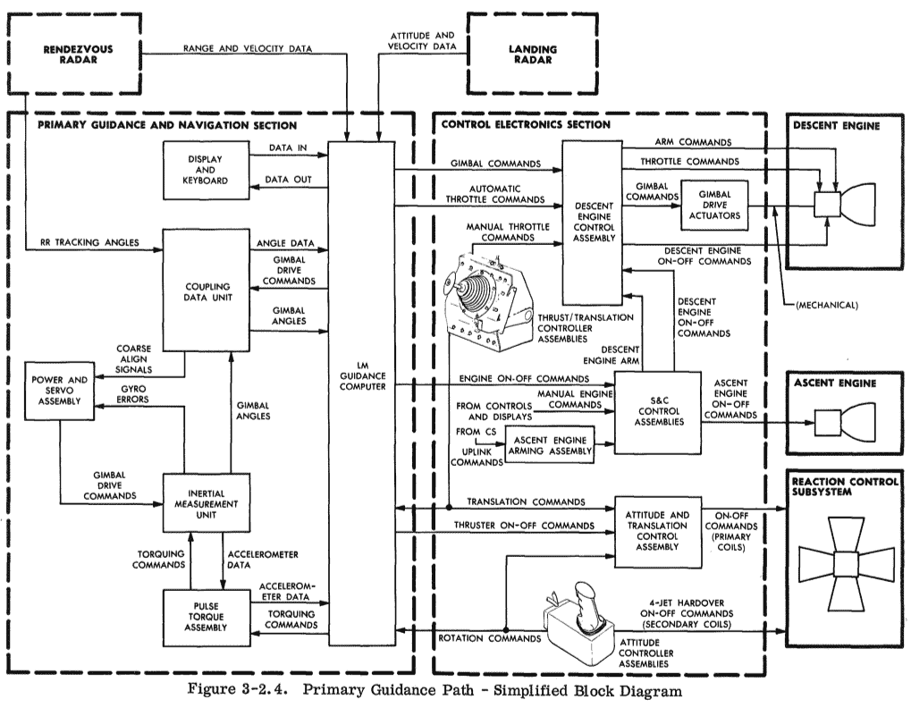

# 唐·艾尔斯带我们浏览登月舱源代码

> 原文：<https://hackaday.com/2016/07/05/don-eyles-walks-us-through-the-lunar-module-source-code/>

几周前，在一次聚会上，我用眼角的余光注意到桌子上有一本打开的巨大电话簿。它是用穿孔的绿色和白色纸张装订成的，封面看起来有点破旧。我和我的朋友詹姆斯·金赛近距离观察了一下。我们读到的东西令人震惊；[程序 63、64、65](http://history.nasa.gov/afj/compessay.htm) ，月球下降和着陆。[错误代码 1201，1202](https://www.hq.nasa.gov/alsj/a11/a11.1201-pa.html) 。注释印在代码上，代码段用笔草草圈出。这是我们以为看到的吗？谁会把这个带到派对上？

 我们在看据传仅存的[登月舱源代码的纸质副本](https://github.com/chrislgarry/Apollo-11)。这是唐·艾尔斯在阿波罗任务中使用的源代码手册。唐负责为登月舱编写代码，特别是大约 2000 行代码，这些代码实际上让人类登上了月球。6 月，他出现在麻省理工学院的教师俱乐部，并带来了这份原始印刷品，当然是放在自己的手提箱里。

### 它是如何工作的

阿波罗指令舱和登月舱都是人类第一架电传飞机。这意味着人类实际上不是通过操纵杆手动驾驶它，计算机是实时控制油门，推进器，万向节(这是控制较大推进器方向的伺服电机)的计算机。这是不得已而为之。人类无法手动驾驶这些航天器，尤其是登月舱在下降过程中，非常不稳定。

### 每毫秒一页

该系统的核心是阿波罗制导计算机(AGC)T1。部分是实时操作系统，部分是国家仪器数据采集系统，AGC 是一个多线程计算机&反馈控制系统，与从雷达到望远镜，再到陀螺仪和加速度计的所有东西进行通信，控制大型太空引擎并实时执行所有任务。许多程序共享 CPU 周期，一个执行程序跟踪并优先处理这一切。你可以自己去读，关于这个话题最好的书是[数字阿波罗](https://www.amazon.com/Digital-Apollo-Human-Machine-Spaceflight/dp/0262516101)。

唐亲切地带领我们浏览了代码，他解释了各种任务中的问题以及如何在代码中解决这些问题。一个例子是 LM 下降发动机的频率响应问题。制造商没有为发动机油门指定准确的传递函数，导致系统不稳定。记住，这是一个反馈控制系统，相当于不知道运算放大器输出电路的频率响应。

我之前提到的错误代码(1201，1202 等等。)在阿波罗 11 号着陆时被公开展示。这使得尼尔·阿姆斯特朗在登月的最后阶段非常紧张。唐解释说，这些错误是由于不小心让对接雷达开着。不幸的是，这种场景从未在地面上模拟或实践过。

对接雷达向处理器发送了许多中断，带走了宝贵的周期，这导致 AGC 警告尼尔·阿姆斯特朗，它的负担过重，将停止任何不必要的程序。像飞行和保持登月舱的稳定性和导航这样的基本项目仍然保留，像更新 DSKY 这样的非基本项目被暂停。

虽然下面视频中的画面有时会起伏不定，但请听听唐所说的亮点。除了上面的例子，他还提到了许多有趣的细节，比如代码开发过程中的经验法则；每页代码需要大约 1 毫秒的 CPU 时间。我 n 这个片段 [丹娜·约格](http://meche.mit.edu/people/dana-yoerger) 问了大部分问题。

 [https://www.youtube.com/embed/H0ITFbDuJz0?version=3&rel=1&showsearch=0&showinfo=1&iv_load_policy=1&fs=1&hl=en-US&autohide=2&wmode=transparent](https://www.youtube.com/embed/H0ITFbDuJz0?version=3&rel=1&showsearch=0&showinfo=1&iv_load_policy=1&fs=1&hl=en-US&autohide=2&wmode=transparent)

### 七十年代:长相怪异的怪物拯救了阿波罗 14 号！

唐是一名为军事工业综合体工作的反叛者，他知道自己服务于一个更伟大的目标，那就是帮助人类第一次登陆另一个世界。这篇发表于 1971 年的《滚石》杂志的文章提供了一个有趣的视角，展现了像唐这样的黑客在 60 年代后期的动机。

偶遇这些改变世界的项目的工程师，听听他们有什么要说的，这真是太棒了。如果你是这样的工程师，或者可以联系我们，请不要犹豫，使用文章提示热线联系[。](https://hackaday.com/submit-a-tip/)

### 非常重的源代码

我没有掩饰我对这堂历史课的热情。我想就是因为这个原因，唐问我要不要把代码背到他的车上。他是在开玩笑，但我让他抓住机会，去触摸那些被密封在玻璃后面、迟早会在博物馆展出的艺术品。源代码非常重，我不得不在仅仅两个街区的旅程中转换手臂大约三次。

From left to right; James Kinsey, Dana Yoerger, Don Eyles, Gregory L. Charvat. In the foreground, possible the last paper copy of the Lunar Module source code.

像许多参与阿波罗计划的人一样，唐风度翩翩，和蔼可亲，不会吹嘘自己，也不愿意邀功。在一个真人秀和自我推销的时代，这是一种令人耳目一新的态度。我们将很快了解更多，请关注唐的书，该书将于明年左右出版。

作者简介:格雷戈里·l·查瓦特利用一切机会向参与阿波罗计划的人学习。 [Greg 的作者简历可以在这里找到](http://hackaday.com/about#charvat)。