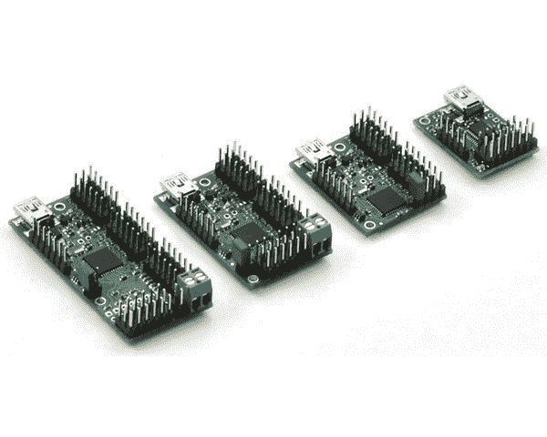

# 一个没有帽子的 Pi 机器人

> 原文：<https://hackaday.com/2016/07/06/a-pi-robot-without-a-hat/>

微控制器系统的子板，无论是盾牌、帽子、羽毛、斗篷还是其他什么，都是添加传感器和控制器的便捷方式。嗯，大部分时间都是这样，直到出现挑战，试图堆叠多个板。然后，您发现您想要成为堆叠中间的板没有可堆叠的接头，顶部的 LCD 板阻挡了来自较低板的 RF，并且需要额外的接头来为伺服系统、电机和输入提供布线间隙。然后你会发现一些电路板试图将引脚用于不同的目的。当支持库想要为不同的目的使用相同的计时器或其他资源时，软件就介入了。它会变得一团糟。

另一种方法是拆开堆栈，使用外部电路板。我在 2013 年的一次机器人竞赛中采用了这种方法。机器人上的计算机是 ITX 系统，它排除了使用子板，USB 端口是我的选择接口。我用了 Pololu 的一个伺服控制器和两个电机控制器。它们仍然可用，我正在用它们进行重建，这次使用树莓派作为大脑。不过，USB 并不是唯一的选择。快速搜索在 Adafruit、Robotshop 和 Sparkfun 找到了使用 I ² C 的电路板。

这种方法既有挑战也有好处。一堆子板构成了一个整洁的封装，而外部板则构成了一团乱麻。随机的尺寸会给安装带来挑战。由于电源引脚的随机放置，供电也可能是一个麻烦。你不能依赖 USB 电源，尤其是从一个 USB 是电力有限的树莓 Pi[。](http://hackaday.com/2015/04/06/more-power-for-raspberry-pi-usb-ports/)

另一方面，外部主板可以减轻主处理器的处理负担。一旦发出命令，这些板就会处理包括刷新要求在内的所有细节。它们很可能提供超出微控制器软件库的功能，因为它们的处理器专用于该任务。

我使用的是 Pololu Maestro 伺服控制器系列中的 18 通道板，它可以用一块板控制 6 到 24 个伺服系统。你可能会发现 Adafruit 16 channel I ² C 板是一个有用的替代品。对于电机控制，我转向 Pololu Simple 电机控制器系列，使用一个能处理 18 安培电流的控制器。其他将处理从 7 到 25 安培。或者考虑 Sparkfun 串行控制电机驱动器。USB 控制器的另一个来源是 Phidgets。我用他们的一个空间设备为原始机器人做了实验。我应该用它来测量倾斜度，因为我的一个机器人在山上翻车了。不对不对！

## 伺服控制

我的机器人目前安装的主板是 Mini Maestro 18。Maestro 提供对伺服速度、加速度和运动极限的控制。可以为启动或发生错误时设置原位。你甚至可以编写脚本或者设置动作序列来根据命令播放。

硬件方面，Maestro 还允许通道用于数字输入或输出，部分通道用于模拟输入。有些只有一个脉冲宽度调制输出通道。板载调节器将伺服电源输入转换为处理器所需的电压，简化了部分配电挑战。

我以前的机器人使用 Maestro 来控制摄像机定位的平移和倾斜伺服系统，一个从地面提升样本的伺服系统和一个安全 LED。来自电机上的电流传感器的两个模拟输入有助于避免失速时烧毁，来自简单 RF 密钥卡发射器的四个输入提供控制。后者对于测试来说很方便。我会编写一个测试序列，例如开始 360°相机扫描标志，或者开到起始平台上并放下样品。按下遥控钥匙上的按钮将启动该活动。一个按钮总是被设置为紧急停止，以阻止一个横冲直撞的机器人。重建遵循这一模式，并做了一些补充。

## 电机控制器

两个简单的电机控制器(SMC)分别控制 Wild Thumper 底盘两侧的三个电机。SMC 不仅仅控制电机速度和方向。您可以设置加速、制动以及前进和后退是否以相同或不同的速度运行。为了安全起见，电路板监控许多错误条件。这些停止电机，并禁止运动，直到清除。这种阻塞错误包括通信丢失、输入电压低或驱动器过热。

我发现一个非常有用的附加功能是从无线电控制(RC)接收器读取信号的能力。这些信号可用于控制电机，并通过两个控制器之间的一些交叉布线，提供差分驱动控制。这对于使用 RC 发射器将机器人驱动到新的位置是有用的。我没有直接使用 RC 输入。相反，我从我的程序中读取 RC 输入并发出控制命令。这让我可以在我的程序日志中监控速度与其他记录数据的相关性。我还使用了一个输入来命令机器人进行自主或遥控操作。还有两个模拟输入可用于直接控制电机，并可通过命令读取。

## 串行通信

我选择 USB 端口进行通信，但也有一个带标准 RX 和 TX 引脚的 TTL 级串行端口。Raspberry Pi、Arduino 或任何其他具有 TTL 串行端口的微控制器都可以使用该端口。

使用 USB 的 Maestro 主板显示为两个串行端口。一个是与 Maestro 处理器通信的命令端口。另一个是 TTL 端口。该端口可以简单地用作 USB 至 TTL 串行端口转换器，允许与其它电路板通信，甚至是来自其它供应商的电路板。TTL 端口的另一个用途是菊花链 Pololu 板。我可以用这种方式连接 SMC 板，并为其他设备节省两个 USB 端口。这些板通过 TXIN 引脚支持这一功能，该引脚将来自相连板的 TX 信号与板上的 TX 信号进行“与”运算。

这两种控制器都支持一些不同的通信协议。我用的是 Pololu 创造的，在他们的其他产品上也有。各板的命令细节不同，但基本命令结构是相同的。他们称之为二进制协议，基本格式如下:

```
0xAA, <device address>, <command>, <optional data>, <crc>
```

所有字段都是单字节的，除了数据字段通常是 2 字节来传输 16 位数据。返回的数据只有一两个字节，没有附加格式。注意，它们通过使用 CRC(循环冗余校验)来检测消息中的错误。这在 USB 上可能并不重要，但 TTL 线路可能会接收到来自电机、伺服系统和其他设备的噪声。CRC 错误会在错误寄存器中设置一个位，如果命令很关键，可以读取该位。

我为 PC 写了自己的代码，当然是 C++，并且刚刚把它转换成了 Raspberry Pi。主要变化是 Linux 和 Windows 需要的串口代码不同。Pololu 现在为该协议提供 Arduino 源代码，使得将这些板与该系列控制器板一起使用变得容易。

## 包裹

底盘，Pi 和这些板现在安装在 Wild Thumper 底盘上，还有一个由伺服系统控制的云台。通电时安全 LED 亮起，机器人主动控制系统时闪烁。一个 LiPo 电池为除 Pi 之外的所有电池供电，因为我需要配置一个电池消除器电路来提供 5 伏电压。我暂时用 USB 电池组给它供电。

一个从我的桌面编译而来的测试程序 [cross，让机器人向前移动，向左比向右转动，然后倒退。平移/倾斜移动，LED 闪烁。我最初使用网络摄像头进行视觉处理，但由于 Pi 摄像头更好，所以我将改用 Pi 摄像头。前一篇文章](http://hackaday.com/2016/02/03/code-craft-cross-compiling-for-the-raspberry-pi/)中讨论的 Neato 激光雷达[将很快在船上找到一个位置，以及一个加速度计来检测可能的翻车。](http://hackaday.com/2016/01/22/how-to-use-lidar-with-the-raspberry-pi/)

尽管我前面提到了一些挑战，但我确信我可以使用 Pi 子板来完成这项工作。在进行项目时，需要考虑这两种方法的利弊。但是外部电路板还有最后一个优势:它们有许多闪烁的 led。

Pololu 的产品照片。