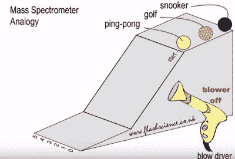
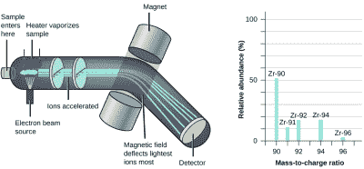
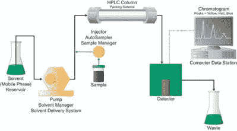
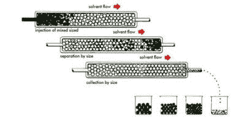

# 如何测量极小的原子质量

> 原文：<https://hackaday.com/2016/07/14/how-to-measure-the-extremely-small-atomic-mass/>

如何测量一个物体的质量？质量被定义为一个物体所包含的物质的数量。当然，这与重量有很大的不同，因为不管引力场的存在或大小，我们物体的质量都会保持不变。然而，可以肯定地说，大多数实验室测量系统都在地球上，我们可以利用地球引力来帮助我们测量质量。一种方法是使用一个天平和一个已知的质量。简单地把我们的物体放在天平的一边，并在另一边不断增加已知的质量，直到天平达到平衡。

但是如果我们的物体非常小…小到看不见，也轻到无法用重力测量，那该怎么办？如何测量单个原子的质量？此外，我们如何确定一个物体有多少是由特定类型的原子组成的？有两个常用的工具就是为了这个目的。你可能听说过其中一个，但没有听说过另一个。这些用于在原子水平上测量物质的工具是今天文章的重点。

## 定性与定量

Mass Spectrometer explanation [via FranklyChemistry on YouTube](https://www.youtube.com/watch?v=tOGM2gOHKPc)

如果艾萨克·牛顿爵士现在正在敲你的左大脑皮层，那么你的思考方向是正确的。力等于质量乘以加速度。如果我们对原子施加一个已知的力，并测量它的加速度，就可以知道它的质量。但首先，我们必须定义两种经常与原子尺度的测量系统混淆的技术。

**定性:**

定性测量会告诉你有什么，但不会告诉你有多少。这在本质上是主观的，但在理解某些情况下是有用的。说“你的工作台上有很多 Arduinos”是一个定性分析。

**定量:**

这是更直观的测量。它基于数字，是客观的。计算工作台上 Arduinos 的精确数量是一种定量测量。

这些术语用于其他领域，并有适用于每个领域的不同定义。但是为了本文的目的，请理解定性测量会告诉您“我们这里有 arduino”，而定量测量会告诉您“我们这里有 X 个 arduino。”[参见 wiki](https://en.wikipedia.org/wiki/Quantitative_analysis_(chemistry)) 了解应用于化学研究时定性与定量测量的更多技术解释。

## 质谱仪

Mass Spectrometer [via Khan Academy](https://www.khanacademy.org/science/chemistry/atomic-structure-and-properties/introduction-to-the-atom/a/isotopes-and-mass-spectrometry)

我没有提到上面的图表，但是回头看了一下。让我们想象一个小斜坡和一把小球会滚下斜坡。每个球都有不同的质量。现在让我们想象一下，当球滚下斜坡时，我们用吹风机把球吹向一边。质量最大的球偏转最小，而质量最小的球偏转最大。通过观察球落在斜坡末端的位置，我们可以测量球的质量。

质谱仪通过用电场代替斜坡，用磁铁代替吹风机来测量单个原子或分子的质量。首先，原子必须被加热到气态。然后用高速电子轰击它们，将电子从样品气体中撞出。这将样品变成正离子。请注意，电子的重量是 1/1836 amu，因此丢失的电子不会对我们样本的质量产生任何可测量的影响。

既然样品带正电荷，我们可以用电场来加速它们！处于不同电位的两个“板”被用于将样品离子聚焦并加速至磁体。离子被磁铁吸引，并被磁场偏转。**该偏转量与样品离子的质量**有关。

就像我们如何测量球在斜坡底部的撞击位置一样，我们也测量离子在行程结束时的撞击位置。通过测量它们撞击“检测屏”的位置，我们可以测量出被磁铁检测出的离子数量，从而测量出离子的质量。

## 高效液相色谱法

Isocratic LC System [via waters.com](http://www.waters.com/waters/en_US/Identifying-and-Quantitating-Compounds/nav.htm?cid=10049064&locale=en_US)

虽然质谱仪可以给我们原子和分子的质量，但它通常不用于量化样品中含有多少元素或分子。因此，质谱通常被认为是定性测量。

要知道你有多少元素或分子，你需要使用一种叫做液相色谱的技术。在压力下操作的 LC 仪器称为 HPLCs(高效液相色谱)。通常，质谱仪与高效液相色谱联用，称为[液相色谱-质谱联用仪](https://www.thermofisher.com/us/en/home/industrial/mass-spectrometry/liquid-chromatography-mass-spectrometry-lc-ms.html)。

高效液相色谱是如何告诉我们样品中元素或分子的含量的？让我们想象一下，我们有一桶不同大小的螺母和螺栓。我们的目标是根据他们的个人特征将他们分开并分组。一种方法是使用“摩擦过滤器”想象一下，我们把一桶螺母和螺栓倒进我们的过滤器。在过滤器输出的底部是一个传送带。较小的螺母和螺栓在穿过过滤器时受到的摩擦较小，最先出来，而较大的螺母和螺栓受到的摩擦较大，最后出来。

Size Separation Mechanism[via water.com](http://www.waters.com/waters/en_US/GPC---Gel-Permeation-Chromatography-Beginner's-Guide/nav.htm?cid=10167568&locale=en_US)

高效液相色谱的工作原理与分子相似。样品溶解在液体中。然后，液体样品在高压下被迫通过一个被称为色谱柱的装置。该柱有点类似于我们的摩擦过滤器。HPLC 色谱柱的尺寸和组成随着需要分析的样品的大致尺寸而变化。但是它们都以同样的方式工作。高压迫使样品通过色谱柱，与色谱柱填料的相互作用(不是摩擦)导致不同大小的分子以不同的速度通过色谱柱。

质谱仪和 HPLC 的组合用于获得分子的定量测量。质谱仪让科学家知道样品是由什么物质组成的，然后使用高效液相色谱法测量样品中每种特定物质的含量。这些技术应用于广泛的领域。这种方法的准确性允许测量食品中的农药(以及维生素或激素等所有物质),并且在开发和测试药物方面也具有不可估量的价值。