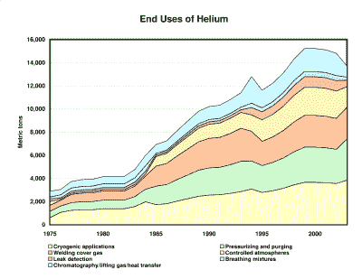
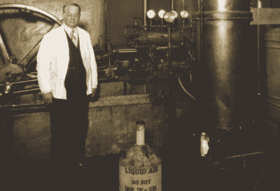
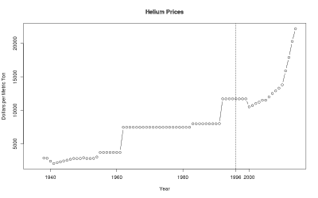
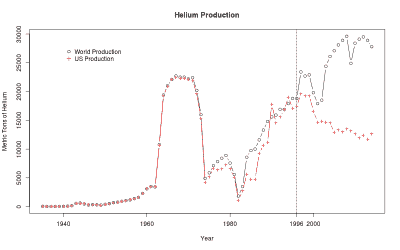

# 世界氦短缺的可疑说法

> 原文：<https://hackaday.com/2016/07/11/the-dubious-claim-of-a-world-helium-shortage/>

如果你最近一直在看新闻，你无疑会读到在坦桑尼亚发现了一个非常大的新氦气田。它被流行媒体吹捧为“拯救生命”和“改变游戏规则”，但这都是骗人的。氦对于气球动物、科学家和核磁共振成像仪等都很重要，但尽管氦的价格自 2000 年以来一直在稳步上涨，但这个新领域不太可能在大计划中有太大影响。

Source: USGS

氦上每一个新闻故事的基础都是我们的原料快用完了。正如大多数世界末日的场景一样，世界氦供应的终结被夸大了，我们不仅仅是指坦桑尼亚的新油田。氦是第二丰富的元素，占宇宙总质量的 24%。虽然地球上有不成比例的重元素，氦却存在于各地的岩石中。这只是一个把它拿出来的问题，以及以什么样的价格才是可行的。

因此，尽管我们为(相对)廉价氦气的时代还能继续几年而感到兴奋，但我们仍然非常确定价格将继续上涨，我们孩子的孩子不会将这种东西用于吹派对气球这样的琐事——它将像现在一样主要用于更有价值的地方:科学、医学和工业。

让我们借此机会思考一下第二轻元素的经济学。为你干杯，希雷姆！

## 天然气中氦的发现

我们发现了这个关于在天然气中发现氦的令人敬畏的[故事，所以我们要讲一个小故事。氦在 1868 年通过它在阳光下的光谱被识别出来，并在 1895 年正式在地球上被发现，从铀矿中泄漏出来。因此，科学家们在世纪之交就知道氦气，但被认为是极其罕见的。](https://www.acs.org/content/acs/en/education/whatischemistry/landmarks/heliumnaturalgas.html)

但在 1903 年，这还是一个相对较新的元素，当时，堪萨斯州的小镇德克斯特发现了一口他们认为是天然气的油井。为了庆祝他们的新发现的财富，他们打算(自然地)点燃东西，并陶醉于“燃烧的井里冒出的巨大火柱”。

市长演讲后，承诺所有人的繁荣，他们扔了一捆燃烧的干草到天然气喷井。它熄灭了。他们点燃了另一包烟，烟灭了。关于“风瓦斯”和“热空气”的笑话在失望的人群中传播，他们回家时和出发时一样穷。

Hamilton Cady and his Liquid Air Machine

地质学教授伊拉斯谟·霍沃斯(Erasmus Haworth)像科学家一样，说“这很奇怪”，并把一份样本带回堪萨斯大学，交给化学家大卫·麦克法兰(David McFarland)。霍沃斯和麦克法兰得出的结论是，这种气体含有 15%的甲烷、72%的氮气和 12%的其他物质。(是高含氮量把火扑灭了。)与另一位化学家汉密尔顿·卡迪(Hamilton Cady)合作，在-310°F 的温度下将气体浸泡在椰炭和液态空气中(这玩意儿你是编不出来的！)，那“其他东西”的 10%会变成氦。

麦克法兰和卡迪在许多其他天然气井中重复了这个实验，一夜之间，被认为是极其罕见的新元素被证明是极其普遍的。但是没有人真正知道如何处理它。然后有人建议它可以用来提升软式飞艇。

十年后，美国政府开始从德克萨斯州的天然气田开采氦气，价格从每立方英尺 2500 美元降到了 3 美分。现在你可以用氦气而不是易燃的氢气来填充软式飞艇。氦在第二次世界大战中成为一种战略气体，美国氦的生产由政府管理(并作为战略储备)，直到 1996 年。

## 氦气价格飙升

到了 20 世纪 90 年代中期，氦已经成为一种相当乏味的商品，不再具有真正的战略重要性。这是美国天然气生产的丰富副产品，我们用这种东西装满了我们的派对气球。政府一直以固定价格出售氦气，而市场的其余部分只是跟随最大的生产商。

Data Source: [US Geological Survey](http://minerals.usgs.gov/minerals/pubs/historical-statistics/)

但这并没有让美国政府赚到钱；计划退出生产游戏，出售现有库存。这被编入了 1996 年的氦私有化法案。

随着占主导地位的生产商退出氦气行业，全球价格上涨不足为奇。与此同时，美国的天然气生产转向了从页岩中提取，因为页岩中没有氦副产品。自那以后，美国的氦产量一直在下降，而全球对氦的需求一直在稳步增长，尽管速度缓慢。

你不需要经济学家告诉你，在这种情况下，氦的价格会上涨。到 2013 年，氦的价格几乎是 2000 年的两倍。我们到处都读到世界正在“耗尽氦气”。

## 照常营业

Data Source: [US Geological Survey](http://minerals.usgs.gov/minerals/pubs/historical-statistics/)

但那是疯狂的谈话。(或者至少是反经济的。)随着价格的上涨，氦气并没有耗尽，相反，更昂贵的捕获和提炼氦气的方法在经济上变得可行。尽管世界上没有几个气田像堪萨斯和得克萨斯那样丰富，但天然气所到之处都是氦气。虽然美国的氦气非常便宜，但这些其他来源只是把它们的氦气吹走了，因为它不值得提炼。

随着氦的价格大幅上涨，其他气田投资于氦的捕获和提炼。特别是，卡塔尔已经收拾了烂摊子，世界生产几乎没有放缓。“氦气短缺”到此为止。

在需求方面，使用大量氦的大学和其他机构开始采取措施回收氦，而不是仅仅让它排放到大气中。有趣的是，一位经营基于飞艇的建筑摄影业务的朋友发现，购买昂贵的内衬来帮助更好地收集氦气，而不是简单地每次演出都给他的飞艇加油，最终是值得的。随着氦变得越来越有价值，它也变得越来越有价值。相对于氦更便宜的情况，这反过来减缓了消耗的速度。

简言之，市场进行了调整。随着价格的上涨，氦的生产者和消费者都不再如此浪费。

## 新发现

以上所述只是为了正确看待坦桑尼亚目前的发现。一开始，作为世界上最廉价的氦生产国，美国拥有充足的供应。随着这些关闭，氦的价格上涨，现在从别处提取氦变得有利可图。*和*寻找新的氦源变得有利可图。

事实上，正是由于价格的上涨，牛津大学的学者和氦勘探公司的合资企业氦一公司才在经济上成为可能。在此之前，不值得花时间去勘探氦。现在是了。同样肯定的是，他们和其他公司会找到更多的网站。开采它们是否有意义将取决于世界价格。

因此，我们没有去大肆宣传一个新的氦田，即使这个氦田大到足以满足全世界六年的氦需求，而是把目光放得更长远。就在氦的商业发现之后，它变得异常便宜。直到最近，随着世界上最便宜的资源开始枯竭，价格才开始上涨。我们看不出有任何理由它不会继续这样做，除非发现一个真正巨大而廉价的氦场。如果价格继续上涨，以前负担不起的生产方式将变得负担得起。我们没有耗尽氦气，只是生产成本越来越高。

如果我们要对漂浮的派对气球的未来打赌，我们会把赌注押在保持氦气的聚酯薄膜气球上，而不是相对透气的橡胶气球。即使是氦最无聊的用途，它也不会被浪费掉。我们也不再开油老虎去杂货店了。