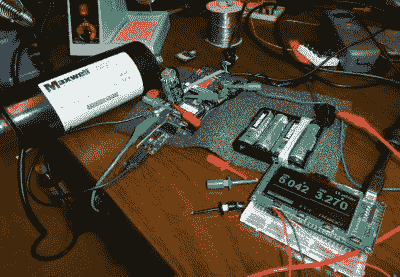

# 在床上用 Arduino，对抗睡眠呼吸暂停

> 原文：<https://hackaday.com/2016/07/13/in-bed-with-an-arduino/>

有时候，旅程和目的地一样有趣，这也是[Marc]对测量睡眠呼吸暂停症的追求。视频嵌入下方。).[睡眠呼吸暂停](https://en.wikipedia.org/wiki/Sleep_apnea)涉及几分钟不呼吸或浅呼吸的时段，影响 5-10%的中年男性(女性的一半)。)[马克]的努力仍在进行中，但一路走来，他尝试了许多东西，都涉及到不同的技术和有待解决的问题。令人惊讶的是有这么多方法来监测呼吸。

Debugging the Eeonyx conductive fabric approach

他的尝试是从使用一个 [MobSenDat 套件](http://www.freetronics.com.au/products/mobsendat#.V4TyW6Il9DQ)开始的，该套件包括一个 Arduino 兼容板和一个加速度计来查看他的睡姿。接下来是使用廉价的 SPO2 传感器测量血氧饱和度，但没有成功，还有一个带蓝牙的传感器确实有效，但给出的结果是图表，而不是原始数据。

接下来是通过使用[风传感器](https://moderndevice.com/product/wind-sensor)检测来自他鼻子的气流来测量呼吸，但是将“风”从他鼻子传到传感器的管子是有问题的，尽管这种方法是可行的。除了风传感器，他还尝试了杰欧床边睡眠管理器，其中包括佩戴一个头带，使用来自大脑的电信号来告诉你处于什么睡眠状态。他特别喜欢这个，因为它提供了访问数据的权限，甚至还提供了一些代码。

我们所知道的他最后的方法是通过在他的胸部/腹部放置某种形式的带子来测量扩张和收缩来监测呼吸。他试了几个带，结果证明一种导电织物/纱线是最好的。他确实遇到了 Xbee 的噪音问题，以及电压调节器问题和一个必须旁路的二极管。

虽然[马克]监控睡眠的方法很多，但他并没有穷尽所有的方法。例如,[用激光检测婴儿是否还有呼吸](http://hackaday.com/2012/08/21/making-sure-a-baby-is-still-breathing-with-lasers-and-a-wiimote/)。

 [https://www.youtube.com/embed/_NQusgRV3fQ?version=3&rel=1&showsearch=0&showinfo=1&iv_load_policy=1&fs=1&hl=en-US&autohide=2&wmode=transparent](https://www.youtube.com/embed/_NQusgRV3fQ?version=3&rel=1&showsearch=0&showinfo=1&iv_load_policy=1&fs=1&hl=en-US&autohide=2&wmode=transparent)

[途径 [Adafruit](https://blog.adafruit.com/2016/07/11/diy-sleep-apnea-monitoring/)