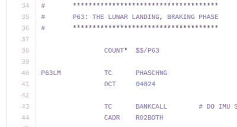

# 阿波罗 12 号登月车中的猎枪

> 原文：<https://hackaday.com/2016/07/14/riding-shotgun-in-the-apollo-12-lunar-lander/>

上周，我们和编写着陆程序的*的[唐·艾尔斯](http://www.doneyles.com/LM/Tales.html)一起[浏览了登月舱的源代码](http://hackaday.com/2016/07/05/don-eyles-walks-us-through-the-lunar-module-source-code/)。现在，您可以体验一次相当刺激的旅程，看看 Don 的代码是如何运行的。*

下面是阿波罗 12 号着陆的实时视频。留出一刻钟去检查一下是值得的。在这个时代，每个人都在口袋里带着一台高清(或者更好的)相机，跟随无线电广播、静止图像和视频片段可能听起来不那么可怕。但事实如此。

 这段视频带我们从动力下降开始，到皮特·康拉德和艾伦·宾在月球上着陆。随着音频的播放，视频会有注释，解释正在发生的事情，并翻译团队使用的行话。随着最近著名的[发布源代码](https://github.com/chrislgarry/Apollo-11/)，你甚至可以跟随视频显示当时哪个程序正在运行。只要搜索程序代码就能找到，就像这张 P63 例程的截图。代码注释足以让你了解全部的要点。

如果你喜欢这个，下面的 YouTube 视频描述包括了阿波罗 11 号、14 号、15 号、16 号和 17 号类似视频的链接。

 [https://www.youtube.com/embed/8WEEFHJsZ0k?version=3&rel=1&showsearch=0&showinfo=1&iv_load_policy=1&fs=1&hl=en-US&autohide=2&wmode=transparent](https://www.youtube.com/embed/8WEEFHJsZ0k?version=3&rel=1&showsearch=0&showinfo=1&iv_load_policy=1&fs=1&hl=en-US&autohide=2&wmode=transparent)

[感谢保罗·贝克发送此视频]