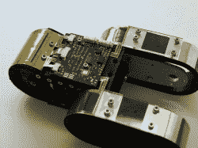

# 我们的机器人:当蛇机器人吞下自己的尾巴时会发生什么

> 原文：<https://hackaday.com/2016/07/20/ourobot-what-happens-when-a-snake-bot-swallows-its-own-tail/>

尽管他们开着“重新发明轮子”的玩笑，但我们机器人[背后的团队制造了一个非常酷的机器人](https://www.fh-bielefeld.de/presse/archiv/startseite/neuer-roboter-bewaeltigt-hindernisse)(德语，自动翻译[这里](https://translate.google.com/translate?hl=en&sl=auto&tl=en&u=https%3A%2F%2Fwww.fh-bielefeld.de%2Fpresse%2Farchiv%2Fstartseite%2Fneuer-roboter-bewaeltigt-hindernisse&sandbox=1))。位于德国[比勒费尔德](https://en.wikipedia.org/wiki/Bielefeld_Conspiracy)的应用科学大学的研究小组用 12 个部分构建了他们的车轮，每个部分都有自己的伺服电机、3D 打印的外壳和安装在车轮外部的压力传感器。后者，加上一些聪明的编程，允许机器人轮子改变其圆形门，并自动爬过障碍物*。*

*

One link in the chain

在设计这个机器人的控制时有一堆有趣的约束。自然地，地面上的轨迹必须调整它们的相对角度，使它们平放在表面上，即使表面本身并不平坦或水平。空中的部分不受约束，但所有伺服系统的内角总和必须达到 1800 度，*和*这些角度控制其重心的位置。

我们头晕目眩。不幸的是，这篇论文“our Robot——一种用于崎岖地形的自推进连续履带机器人”在 IEEE 付费墙后面，但如果你能找到它，它会更详细。

他们在里程计方面还有一些问题需要解决。他们关于片段不会在地面上移动的假设在实践中并不成立——很可能是因为可压缩泡沫压力传感器——所以机器人认为它总是在走下坡路。当然，现在还不能转弯。但是他们正在为 2.0 版本努力。

这个机器人也是用新鲜易得的部件(高质量的业余爱好伺服系统和 3D 打印框架)和爱好者友好的程序制成的。甚至柔性印刷电路板也是在内部使用蜡墨抗蚀剂印刷的。除此之外，还有自[库布利](http://hackaday.com/2013/12/19/a-balancing-walking-cube-named-cubli/)以来我们见过的最奇怪的移动方式，尝试建造一个的诱惑几乎无法抗拒。干得好！

 [https://www.youtube.com/embed/S7IK3mO4Wio?version=3&rel=1&showsearch=0&showinfo=1&iv_load_policy=1&fs=1&hl=en-US&autohide=2&wmode=transparent](https://www.youtube.com/embed/S7IK3mO4Wio?version=3&rel=1&showsearch=0&showinfo=1&iv_load_policy=1&fs=1&hl=en-US&autohide=2&wmode=transparent)

*