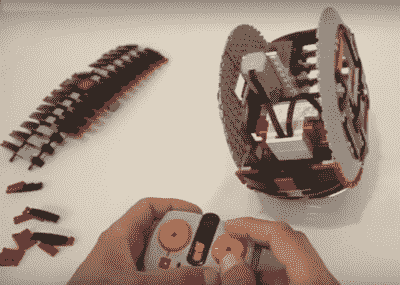

# 乐高 Monowheel 转角就像在铁轨上一样

> 原文：<https://hackaday.com/2016/07/14/lego-monowheel-corners-like-its-on-rails/>

[杰森]又开始了。这一次，这位乐高大师正在制作一个乐高 BB-8 机器人。作为第一步，他制作了一个电动单轮车，它不仅能在走廊和客厅里奔跑，还能转弯，任何路过的人都会有危险。

为了驱动它前进，有一个穿过车轮中心的轴和一个转动轴的马达。他还包括一些重量砖。如果没有这些砖块的质量来阻止旋转，马达和轮轴就会原地旋转，而地板的摩擦力会阻止轮子旋转。如果你看过 [DIYer 制作 BB-8 驱动系统的指南](http://hackaday.com/2016/06/24/driving-bb-8-more-than-one-way-to-move-this-bot/)，你会知道这被归类为轴驱动系统。

LEGO monowheel interior shown while leaning to turn

为了使单轮转向左边或右边，他在轴的正上方放置了另一个物体。将质量向左移动，会导致单轮向那个方向倾斜和移动。向右移动质量使车轮以同样的方式向右移动。由于效率很高，[杰森]有一个马达，可以将质量加倍。

与任何概念验证一样，仍有一些问题需要解决。当向左或向右转动方向盘时，它会向一侧倾斜。车轮圆周两侧的脊减少了发生这种情况的机会，但并没有完全消除这种情况。此外，转向质量/电机还没有自定心机制；转了一圈后，由拿着遥控器的人来寻找中心。如果质量没有正确地集中在一个回合后，往往会有一些摆动。

一如既往，我们期待看到[Jason]如何解决这些问题，但首先他必须将它重新组装起来，因为正如你从下面的视频中看到的，它没有完全通过楼梯测试。

 [https://www.youtube.com/embed/fIADzTanDo8?version=3&rel=1&showsearch=0&showinfo=1&iv_load_policy=1&fs=1&hl=en-US&autohide=2&wmode=transparent](https://www.youtube.com/embed/fIADzTanDo8?version=3&rel=1&showsearch=0&showinfo=1&iv_load_policy=1&fs=1&hl=en-US&autohide=2&wmode=transparent)

