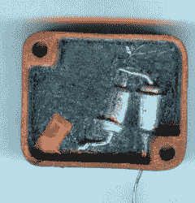

# 俄罗斯脱帽疯狂

> 原文：<https://hackaday.com/2016/07/18/russian-decapping-madness/>

一切开始时都很单纯。[mretro]对一个密封的金属盒子里的东西很好奇，用钢锯锯了一下，然后把照片上传到网上。超过一百个论坛*页面*和几年后，被称为[的](http://kxk.ru/dustyattic/v1_647735_1.php)(至少在谷歌翻译中是[)的【解剖室】继续令人惊叹。](https://translate.google.com/translate?hl=en&sl=ru&tl=en&u=http%3A%2F%2Fkxk.ru%2Fdustyattic%2Fv1_647735_1.php)

 如果你喜欢拍摄、开盖或拆卸古怪的俄罗斯零件，这就像用消防水管喝水一样。你当然可以翻译这个网站，但是用俄语打开它，在偷看之前猜测一下所有的内容会更有趣。(提示:不要看零件号。NE555 在俄语中显然是“NE555”。)

从一个简短的调查来看，其中很多似乎是无线电零件，而且很多是复古或过时的。论坛用户[lalka]似乎已经打开了[每一个可能的俄罗斯振荡器电路](http://kxk.ru/dustyattic/v1_647735_105.php)中的一个。不幸的是，该网站加载速度很慢，至少在我们所处的位置是这样，但请记住，它有很多图片。如果你的手指厌倦了点击，请注意网址以论坛页码结尾。一夜之间把所有该死的东西都清理干净简直易如反掌。

我们喜欢旧设备和新设备的拆卸和碎片拍摄。所以，当你认为[你得到了一个假的部分](http://hackaday.com/2014/04/10/fake-audiophile-opamps-revealed/)，或者如果你需要[获得环氧树脂团](http://hackaday.com/2015/08/24/using-a-laser-cutter-to-decap-ics/)下的东西，不管出于什么原因，[不管多么尴尬](http://hackaday.com/2015/08/29/co2-laser-decapping-to-fix-soldering-mistake/)，带上相机，让我们知道！

感谢[cfavreau]的精彩提示！