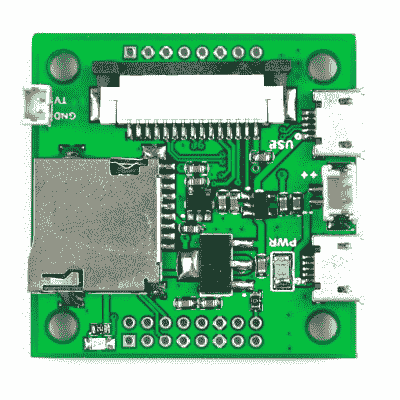

# ArduCAM 引入第三方 Raspberry Pi

> 原文：<https://hackaday.com/2016/07/18/arducam-introduces-a-third-party-raspberry-pi/>

有数百种基于 ARM 的 Linux 开发板，并且每周都有新的开发板出现。这些臂板的大部分都没有支撑，在最坏的情况下，它们根本不工作。树莓派是最畅销的微型 ARM 电脑是有原因的，而不是因为它速度最快或功能最强。Raspberry Pi 之所以有今天，是因为来自全球各地的开发人员做了大量的工作。

尽管他们可能会尝试，但这些其他 ARM 板的新制造商无法轻易抓住 Pi 的流行。这样做需要 Broadcom 芯片组。现在，基于 Broadcom BCM2835 的 ODROID-W 已经停产，因为 Broadcom 拒绝出售这些芯片，树莓 Pi 生态系统已经完全关闭。

事情可能正在改变。ArduCAM [推出了一款基于 Broadcom BCM 2835 芯片组的微型 Raspberry Pi 兼容模块](http://www.arducam.com/24-24mm-coin-size-raspberry-pi-compatible-board/)，该芯片与最初的 Raspberry Pis A、B、B+和 Zero 中的芯片相同。这个模块很小——不到一平方英寸——并且兼容所有支持的软件，这使得树莓派如此不可抗拒。

虽然这款兼容 Raspberry Pi 的主板还没有最终确定，但其规格是你所期望的，它实际上是一款 Raspberry Pi 零点切割至一平方英寸的主板。CPU 列为“Broadcom BCM2835 ARM11 处理器@ 700 MHz(或 1GHz？)”–是的，即使是规格表也不知道 CPU 的运行速度–RAM 要么是 LPDDR2 的 256 MB，要么是 512MB。

板上没有空间容纳 2×20 引脚接头，但有足够数量的 GPIOs 可供使用。你会发现一个微型 SD 卡插槽，两个微型 USB 端口，电源和复合视频连接器，以及 Pi 相机连接器。这个板基本上和 Pi 相机板一样大，使得一个非常小的 Linux 支持的成像系统的想法非常接近现实。

必须指出的是，这种板还没有出售，如果博通对该项目采取进攻，它可能永远不会。这正是 ODROID-W 所发生的事情，如果 ArduCAM 不能从 Broadcom 获得芯片供应，这个项目将永远不会实现。