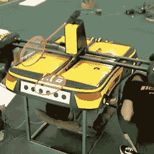
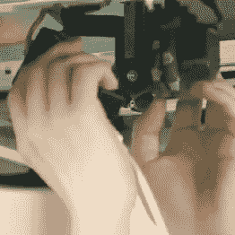
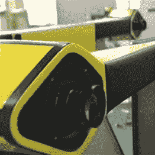

# 机器人羽毛球机器人将击败业余人类

> 原文：<https://hackaday.com/2016/07/21/robomintoner-badminton-bot-to-defeat-amateur-humans/>

从技术角度来看，观看机器人做运动是非常令人印象深刻的，尽管当我们将这些机器人卑微的尝试与我们自己的运动技能进行比较时，我们会偷偷微笑。现在，一个名为 [*的新机器人 Robomintoner* 试图挑战人类球员](http://www.youtube.com/watch?v=BRVdwINXpMI&t=0m22s)，它已经非常擅长羽毛球。

这不是我们第一次看到[一个球拍连接到一个全向运动平台](https://www.youtube.com/watch?v=m9nPOW3aEy8)或[一个球拍连接到一个线性运动门架](https://www.youtube.com/watch?v=OnGG5H58nNg)，但这是我们第一次看到这两者的特殊组合。这个聪明的设计允许机器人在它的全向轮上在整个比赛场上自主移动，同时仍然能够快速准确地定位球拍。这个机器人有两个球拍，每个都有一个自由度:一个水平摆动，另一个垂直摆动。

  courtesy of CCTV [video source](https://www.youtube.com/watch?v=BRVdwINXpMI)  courtesy of CCTV [video source](https://www.youtube.com/watch?v=BRVdwINXpMI)  courtesy of CCTV [video source](https://www.youtube.com/watch?v=BRVdwINXpMI)

蓝牙连接将机器人连接到一个固定的立体摄像系统，该系统可以检测羽毛球，预测其轨迹并计划动作。该系统在回击业余人类对手发球时的成功率达到 80%，这使其远远领先于其机器人羽毛球伙伴。毕竟，它最大的弱点不是它的基础，而是它的发球，它仍然来自一个固定的羽毛球发射器。

仔细观察下面的视频，我们想知道横轴的线性轨道是从哪里来的。在一些照片中，它看起来像端盖中有小螺旋桨。

 [https://www.youtube.com/embed/BRVdwINXpMI?version=3&rel=1&showsearch=0&showinfo=1&iv_load_policy=1&fs=1&hl=en-US&autohide=2&start=22&wmode=transparent](https://www.youtube.com/embed/BRVdwINXpMI?version=3&rel=1&showsearch=0&showinfo=1&iv_load_policy=1&fs=1&hl=en-US&autohide=2&start=22&wmode=transparent)

我们在这里只嵌入了一个视频，尽管 BBC 最近的报道也值得一看。感谢[Itay]的提示！