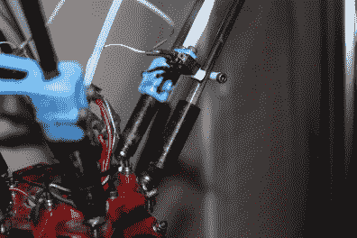
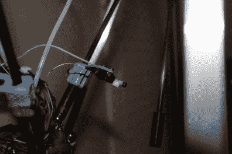

# 用于 Delta 3D 打印机的碰撞传感器

> 原文：<https://hackaday.com/2016/07/30/a-crash-sensor-for-delta-3d-printers/>

这种情况并不经常发生，但这是卢卡斯最后一次从数小时无人看管的 3D 打印中回来，发现一大块塑料意大利面和一个部分拆卸的 Kossel。[他设计的碰撞传感器](http://www.thingiverse.com/thing:1686218)现在可以安全地停止打印机，如果它检测到打印过程中出现问题。

如果你的 delta 打印机的效应器平台通过[磁性关节](http://reprap.org/wiki/Magnet_joint)连接到 delta 臂上，无人值守的 3D 打印会更加激动人心。虽然磁性接头有其好处，但印刷过程中的一个小的不规则会导致它们分离。未知的打印机将继续拖动半连接的效应器，直到整个东西，包括仍在运行的加热器，在某个地方停下来。[Lucas 的]碰撞传感器通过增加三个限位开关解决了这个问题。每个开关位于一个 3D 打印的底座上，连接到一对三角臂上，有效地[检测棒是否还在原位](https://youtu.be/vklbTqvdZ5Y)。

  The switch detects if the other rod is present.  In case of a failure, the print stops.

[Lucas]将开关与他的灯丝传感器串联起来，这样如果任何一个臂关节出现故障，打印机就会认为灯丝用完了，停止打印并冷却下来。如果你想在没有灯丝传感器的情况下尝试这个聪明的设计，Marlin 和 Repetier 固件都为此提供了一个专用的缺陷传感器例程。请欣赏下面的视频，其中[卢卡斯]解释了他的身材:

 [https://www.youtube.com/embed/VtVUUG3mnSo?version=3&rel=1&showsearch=0&showinfo=1&iv_load_policy=1&fs=1&hl=en-US&autohide=2&wmode=transparent](https://www.youtube.com/embed/VtVUUG3mnSo?version=3&rel=1&showsearch=0&showinfo=1&iv_load_policy=1&fs=1&hl=en-US&autohide=2&wmode=transparent)

