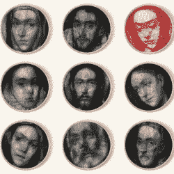

# 电脑设计的人像，手工编织的！

> 原文：<https://hackaday.com/2016/07/28/computer-designed-portraits-knit-by-hand/>

艺术家【Petros Vrellis】做了一些我们从未见过的事情:他的作品“[一种新的编织方式](http://artof01.com/vrellis/works/knit.html)”名副其实。他所做的是用传统的圆形织布机，一些黑线，和一些计算。然后他把绳子绕了一圈又一圈。

遵循计算机指令的最终结果是一幅灰度肖像。很少黑色线重叠的地方是亮的，重叠多的地方是暗的。这就是全部的噱头，但是效果超赞。当你放大和缩小时，它从一张可辨认的脸变成一团电线，然后又变回来。看看下面他的视频。

至少有几种方法可以做到这一点，所以我们发电子邮件给[Petros]询问。他给原始图像中较暗的像素分配一个较高的分数，然后将字符串运行到对面的引脚，使通过的像素之和最大化。对于每个字符串，他从字符串路径上的所有像素中减去一点黑暗，并重复，每次都从新的针位置开始。每一串“只有”200 个选择来进行 3000-4000 次传递，所以计算机应该很快就能完成。将这个算法调整到合适的工作状态，并在真实字符串上看起来不错，这可能就像它听起来一样简单。例如，他必须包含代码来中断连接。

虽然我们喜欢这件作品中的人机合作，但[Petros]提到他想让编织自动化。如果你喜欢你的艺术中有更多的机器，可以看看他的两件基于钟摆的作品(这里是，这里是)

说到用黑绳子制作肖像的话题，我们不得不提醒你[这件之前的艺术品](http://hackaday.com/2016/04/28/autograph-a-string-art-printer/)，它通过使用一台改良的 3D 打印机完成了绳子的所有实际铺设工作。情人眼里出西施，但我们不得不说，如果按照难度来评判艺术的话，[Petros]会因为只用了一台圆织机而胜出。不要介意他用手完成了这一切*。*

[https://player.vimeo.com/video/175653201](https://player.vimeo.com/video/175653201)