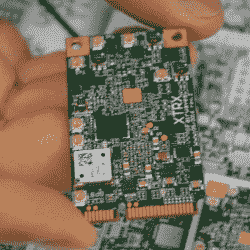

# 软件无线电的问题是

> 原文：<https://hackaday.com/2016/07/29/the-problem-with-software-defined-radio/>

软件无线电有一个问题。并不是说大家都需要重新学习什么是 TEMPEST 屏蔽，也不是说蓝牙坏得可怕。SDR 最大的问题是带宽和处理。通过一个简单的 USB 电视调谐器，你可以监听飞机，从数百英里的高空捕捉 Landsat 图像，或者嗅嗅物联网中使用的低功率无线电。你做不到的是自己做 WiFi 适配器，你无法创建自己的 LTE 无线网络。这只是一个将比特从空中传送到计算机进行处理的问题。

在上周末的 HOPE 上，非常强大的 LimeSDR 和一家使用 Lime 硬件的新公司展示了软件定义无线电的可能性，如果你非常快速地连接到计算机，并在 SDR 本身上添加一些处理。

LimeSDR 的关键特性以及所有源自 Lime Micro 技术的板都是 LMS7002M。它是一款现场可编程 RF 收发器，覆盖范围为 100kHz 至 3.8GHz，可编程 IF 滤波范围为 600kHz 至 80MHz，并且——这一点很重要——片内可重新配置“信号处理”和与计算机的快速 USB 3.0 接口。

The Fairwaves XTRX

除了酸橙，另一家公司也在 HOPE 展示他们最新的特别提款权产品。 [Fairwaves](https://fairwaves.co/) 与 [XTRX](https://xtrx.io/) 一同亮相，XTRX 是一款软件定义无线电，采用 miniPCIe 外形，围绕相同的 Lime Micro LMS7002M 芯片构建。

这种微型卡使用了 LimeSDR 中的相同技术，但有一个关键区别。XRTX 不是 USB 3.0 端口，而是通过 PCI 总线连接到计算机，以 8Gb/s 的速度将数据发送到 RAM。这很快。

miniPCIe 外形还有另一个有趣的应用。Fairwaves 的工作人员正在努力将该设备放入 miniPCIe 到 PCIe x1 适配器中——这很有意义，它们都是相同的信号，只是外形不同而已。

这也意味着你可以用一个尚未设计的 PCIe 16x 适配器运行四块 XTRX 板。将四个这种 SDR 放在一张卡中意味着相控阵天线、8×8 MIMO 和其他技术，使这个巨大的 SDR 非常有趣。Fairwaves 团队只组装了少数这种板，但当这种板上市销售时，你将能够建造一个钻机，使任何其他 SDR 的性价比都相形见绌。

在 HOPE 上的演讲中(尚未独立于其他演讲提供，但[从 1:46:12 开始进入这个现场录制](http://livestream.com/internetsociety3/hopeconf/videos/130824120))，LimeSDR 背后的人谈论了这种硬件的可能应用。一两年后，你就能以大约 2500 美元的价格建造一个便携式 3G 或 4G 基站。这是一项令人难以置信的技术进步，只有通过片上处理和对计算机内存的快速访问才有可能实现。