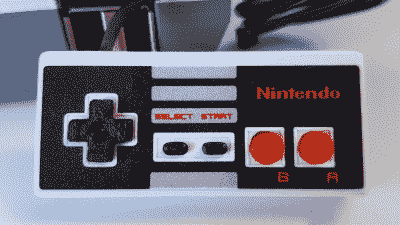

# 这个 NES 模拟器可以让你使用卡带玩游戏

> 原文：<https://hackaday.com/2016/07/29/this-nes-emulator-build-lets-you-use-cartridges-to-play-games/>

你可能不记得了，但是任天堂的硬件曾经是一件大事。最初的 Game Boy 和 NES 都有出色的工业设计，就像 Apple II 和 IBM Thinkpad 一样，直到生产结束多年后才受到重视。但是，像你们中的许多人一样，[daftmike]对 NES 经历的怀旧记忆仍然被安全地封存起来。

回忆就像打开墨盒门，对着墨盒吹气，以及墨盒咔嗒一声到位的感觉。因此，可以理解的是，重温这些经历是[daft Mike]基于 Raspberry Pi 的 NES 版本的关键部分，尽管只有原始大小的 40%。他不只是想体验他年轻时的游戏，他想体验整个 NES，就像他小时候一样。

现在，像任何值得尊敬的黑客一样，[daftmike]没有让他的知识差距阻止他。这个项目是一次学习经历。他必须自学很多关于 3D 设计和建模、使用 Linux 和编程的知识。但是，最终结果肯定是值得的工作；对细节的关注体现在 USB 放置、电源和重置按钮等功能上，当然还有游戏卡带，它们与 NFC 的魔力一起工作，并仍然包括原始卡带的插入和切换动作。

如果你有一台 3D 打印机和 Raspberry Pi，你可以自己制作一个类似的 NES 模拟器。但是如果你没有 3D 打印机，但是有 NES 的原作在身边，你可以在 NES 黑客案中找到 T2 的树莓酱。无论你做什么，NES 的美丽都值得在你的家中展示。

 [https://www.youtube.com/embed/3dgnD93pwX0?version=3&rel=1&showsearch=0&showinfo=1&iv_load_policy=1&fs=1&hl=en-US&autohide=2&wmode=transparent](https://www.youtube.com/embed/3dgnD93pwX0?version=3&rel=1&showsearch=0&showinfo=1&iv_load_policy=1&fs=1&hl=en-US&autohide=2&wmode=transparent)

