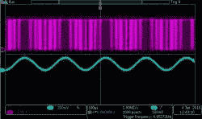

# 深入了解德尔塔适马 ADC 第二部分

> 原文：<https://hackaday.com/2016/08/11/tearing-into-delta-sigma-adcs-part-2/>

在第一部分中，我比较了不同的模数转换器(ADC)以及德尔塔适马 ADC 的作用和特性。我讲述了这些器件背后的许多理论，因此在这一部分中，我开始寻找一两个设计来帮助我演示一些要点，如过采样、噪声整形以及信噪比和分辨率之间的关系。

## 调制器实现

 看看第一部分，看看是什么把我们带到了这里。下面显示的原理图是我玩的几个实现，描述了一个单阶和一个双阶δ适马调制器。

 基本上我用了一个时钟使能，高速比较器，有两个极性，以防我在我目前的烧坏状态下得到它的逻辑倒退到灰质比率。视频包括实际使用的原理图。

因为我不是为生产而设计，所以我接受了三个电压的需要，因为我的工作台电源能够提供它们，这个小部件注定要和其他小部件一起放在抽屉里，反正只有几分钟的视频时间。

 [https://www.youtube.com/embed/mCWC0X2naY0?version=3&rel=1&showsearch=0&showinfo=1&iv_load_policy=1&fs=1&hl=en-US&autohide=2&wmode=transparent](https://www.youtube.com/embed/mCWC0X2naY0?version=3&rel=1&showsearch=0&showinfo=1&iv_load_policy=1&fs=1&hl=en-US&autohide=2&wmode=transparent)

## 寻找数字滤波器

 我也被赛普拉斯 PSOC-5 所吸引，因为它拥有组成调制器的所有元件，还有一个可以实例化和编程的数字滤波器元件。唉，这是一种有限脉冲响应(FIR)类型，虽然更常见，但不是我们需要的级联积分梳状(CIC)滤波器。

这看起来是了解数字滤波器的一种廉价而强大的方式，包括一个用于生成驱动滤波器的数学系数的工作台。我还想展示生成系数的不同方法，但是时间和空间都不够了。我看到一篇关于未来 FIR 和其它数字滤波器的帖子。

## 独立模块

最终，我选择使用 ADI 公司的独立δ适马调制器 IC AD7403 作为我要演示内容的清晰示例。(写这篇文章时，我得知 ADI 公司刚刚收购了 Linear Tech，这让我感到害怕。我喜欢竞争的多样性，并仍然渴望有一天我会根据自己的情况，找出 Precision Monolithics、Elentac 或 Intersil 的数据。我也非常想念国家队。)但是回到我们的调制器…

这个特殊模块还有一个很酷的特性，即芯片的 ADC 部分与数字输出部分隔离，因此有两组电源引脚，包括两个互不相连的地。这在仪器仪表或自动化应用中很有用，因为隔离用于保护数字后端设备免受传感器所处恶劣环境的影响。举例来说，想象一下将 480 伏电压短接到模拟信号，并且不使处理来自 ADC 的信号的计算机崩溃。之前有人问及 4-20ma 电流环路标准隐含的隔离，这是一个可以用来实现隔离的器件示例。

## 调制器输出

再次查看调制器输出，我们看到原始信号的单位表示，然后示波器通过求平均值来重构信号。

平均实际上执行的功能与我们需要执行的数字处理的第一步类似。请看下面 DSP 部分的框图，我们需要做的是积累一组样本，然后将其细化或抽取至我们需要的程度。积分使我们能够积累过采样的积极效果，并提供噪声整形，从而立即产生两种降噪技术。

## 采样率转换

顺便说一下，采样速率转换的基本工作原理是均值/积分功能后接抽取功能。例如，从每秒 44.1K 样本的音频 CD 标准转换到 DAT/DVD 48k 速率，44.1ksps 首先累加(乘以)160，然后抽取(除以)147，得到 48k 的最终结果。

## 数字信号处理(DSP)

 下面是描述 CIC 滤波器各阶段的框图。这是描述 DSP 操作的标准方式，求和模块显示简单的加法和减法，标有 Z 的模块基本上是时钟寄存器存储。您可以看到，一系列这些寄存器是中间结果的流水线，它们之间有运算。

许多 DSP 实现都以这种方式工作，在获得第一个结果时存在固有的延迟，因为它必须通过所有阶段进行计时，但随后的每个时钟都会提供答案。也就是说，使用流水线架构时，通常会有一些延迟，但吞吐量也很高。

## 最高司令官(commander-in-chief)

请看框图，与稍微复杂一些的滤波器拓扑相比，使用 CIC 滤波器的优势之一是无需乘法或除法，只需加法和减法。乘法器和除法器需要更多的硬件来实现，正如如果用软件实现，乘法需要更多的指令一样。

应当注意，这里的 CIC 功能可以用软件实现，不同之处在于它需要许多处理器时钟周期来产生结果。硬件 DSP 在每个时钟周期提供一个值。一般来说，过滤器的硬件和软件实现之间还有其他固有的差异，关于它们的争论已经在当地的小酒馆里持续了一个多小时。

## FPGA 中的 DSP

hack aday 的话题之一是，考虑到基于微处理器或微控制器的硬件的多功能性、性能、可用性和价格，FPGA 有什么用途。数字信号处理是一个领域，一旦采用 FPGA 实施，您可能会有许多选择，例如多个并行转换或复杂功能，但仍能在每个时钟周期提供答案。

我在网上找到许多用 Verilog 和 VHDL 编写的 CIC 滤波器示例，但 AD7403 的数据手册中有一个简单的示例。它们甚至包括与我们的相匹配的框图。我清理了 Verilog 中的一些打字错误，因为在创建 AD7403 数据手册的过程中可能有一个 OCR 步骤:[Verilog 中的 CIC 滤波器](https://hackaday.com/wp-content/uploads/2016/07/dec256sinc24b2.zip)。

该文件现在是 CIC 滤波器的基本构建模块，可以用于任何可用的 FPGA 设计套件。因为我已经加载了 Altera Quartus，并且手边有一个带有 Cyclone IV 的目标板，所以我将使用 Quartus。Quartus 有一个免费使用的版本，对我来说足够接近开源，它包括强大的 ModelSim 模拟器。我发誓当我没有落后于计划的时候，我会试着做一个点阵版本。

## 创建 FPGA 项目

 第一步是创建一个项目目录并保存一份用 Verilog 编写的 CIC filter 文本文件。下一步是运行新项目向导，并在我的目标板上选择 EP4CE6E22C8，这是 Cyclone IV 的 144 引脚版本。

接下来，我导入了我为这个特定的 FPGA 开发板所做的引脚分配，尽管在这个练习中，除了全局时钟，我并没有真正使用静态引脚分配。

接下来是将 Verilog 文件添加到项目中。

## 设计顶部

 我的一个个人偏好是用一个设计的图形顶层来工作，并把图钉和文件显示为相互连接的块。这使我可以轻松地可视化引脚分配，添加简单的反转或其他直观的逻辑，还可以添加测试点或其他临时功能，我可以在以后删除。

为了在 Verilog 文件中实现这一点，我为它创建了一个符号文件，用于顶级图形表中，它编译 Verilog 文件，如果成功，就创建符号。

## 插入块

最后的步骤包括插入块<insert symbol="" select="" file="">，并将其放在板材上。使用这种方法提供的快捷方式是，我可以通过选择符号然后选择<generate pins="" for="" symbol="" ports="">来自动生成 pin。【T2</generate></insert>

如果需要，我可以选择分配管脚号，或者让编译器创建管脚分配。在设计周期的后期，当需要一致性时，让编译器决定引脚通常是不可能的，但是允许编译器在初始阶段选择分配和其他资源通常可以更好地利用 FPGA 资源。

## 连接、编译和编程

这就是从 HDL 文件创建 FPGA 设计的全部内容，假设不需要优化或调试。接下来的步骤是进行最终编译和器件编程。<processing start="" compilation=""><programmer select="" file="" start=""></programmer></processing>

## 使用向导制作过滤器

Quartus 包括一个高级组件库，如 DSP 滤波器，只要程序员插入开发板，您就可以免费使用。我知道 Xilinx 在他们的设计套件中包含了类似的特性，但是我最近还没有足够的时间来使用它们。

本质上，我们无需编写一行代码就可以构建 CIC DSP 滤波器。打开系统构建器 Qsys <tools qsys="””">。CIC 滤波器可以通过从 IP 目录打开库并在 DSP 标题下选择滤波器下的 CIC 来安装。在右边，可以选择各种参数来创建我们感兴趣的滤波器的变体。</tools>

最后，我们设置互连，并将输入和输出导出为端口(最好观看该部分的视频)，然后单击<generate hdl="">，选择<verilog>，然后单击。由于复选框被选中，我们将获得 Verilog 文本文件和一个符号，就像我们在前面的例子中所做的那样。</verilog></generate>

从这里开始，就像前面的例子一样，你实例化代表 Qsys 设计的符号，并把它挂接到管脚，编译和编程。

## AD7760 评估板

 最后，我想展示一些与抽取率和平均大小等变量的交互作用。使用开发板和与之耦合的主板，我能够显示 24 位δ适马 ADC ad 7760 的输出。该界面允许我调整各种参数并观察它们，然后实时显示计算出的信噪比(SNR)和总谐波失真(THD)等信息。我再次建议检查视频，因为这是有点互动。

作为结束语，我选择频域中的调制器输出，这是我们的噪声整形，我们知道它内置于δ适马转换器的设计中。

## 德尔塔适马欧米茄

德尔塔适马模数转换器展示了多种技术的结合，这些技术共同提高了速度和分辨率，远远超出了单一技术所能达到的水平。它还受益于模拟和数字降噪技术，在模拟和数字领域发挥桥梁作用。

## 资源

*   [ADI 公司 AD7403 数据手册](http://www.analog.com/media/en/technical-documentation/data-sheets/AD7403.pdf)
*   [模数转换器的适马-德尔塔调制原理(摩托罗拉)](http://www.numerix-dsp.com/appsnotes/APR8-sigma-delta.pdf)
*   [σ-δ型 ADC 的工作原理，第 1 部分(TI)](http://www.ti.com/lit/an/slyt423/slyt423.pdf)
*   [σ-δ型 ADC 的工作原理，第二部分(TI)](http://www.ti.com/lit/an/slyt438/slyt438.pdf)
*   [TSA 002–16 位适马德尔塔型 ADC 设计](https://www.triadsemi.com/2007/01/25/how-to-design-a-16-bit-sigma-delta-analog-to-digital-converter/)
*   [基于 FPGA 的 sigma–Delta 模数转换器设计](http://www.ijecse.org/wp-content/uploads/2012/03/Volume-1Number-2PP-508-513.pdf)
*   [探索抽取滤波器](http://www.highfrequencyelectronics.com/Archives/Nov13/1311_HFE_decimationFilters.pdf)
*   [将 ADS1202 与 FPGA 数字滤波器相结合，用于电机控制应用中的电流测量](http://www.ti.com/lit/an/sbaa094/sbaa094.pdf)
*   [Verilog 基础知识](http://cseweb.ucsd.edu/classes/fa09/cse141L/Slides/01-Verilog1.pdf)
*   [CIC 滤波器介绍](http://home.mit.bme.hu/~kollar/papers/cic.pdf)
*   [了解 CIC 补偿滤波器(Altera)](https://www.altera.com/en_US/pdfs/literature/an/an455.pdf)
*   [揭开德尔塔-适马 ADC 的神秘面纱](https://www.maximintegrated.com/en/app-notes/index.mvp/id/1870)
*   [TSP # 32–德尔塔-适马模数转换器的理论、设计和测量教程–YouTube](https://m.youtube.com/watch?v=z9u-QTDAeaM)(非常好，包括数学)