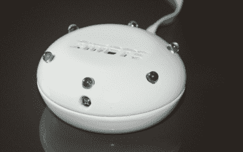
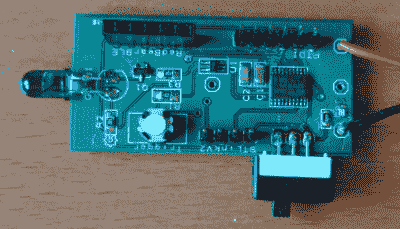

# hacklet 118–红外和通用遥控器

> 原文：<https://hackaday.com/2016/07/30/hacklet-118-infrared-and-universal-remote-controls/>

第一个电视遥控器是 20 世纪 50 年代的天顶太空指挥部。太空指挥部使用超声波频率的声音来控制电视机。直到 20 世纪 80 年代和 Viewstar 有线电视盒，红外线才出现。遥控器像野火一样蔓延开来。没过多久，每件消费电子产品都有了一个。咖啡桌上散落着这些设备。没过多久，通用遥控器就出现了。早在 1987 年，[沃兹]自己就在研究 CL9 核心设备。即使在智能电视和物联网的今天，通用遥控器仍然是一个大项目。黑客、制造商和工程师总是试图建立一个对他们更好的设备。本周的 Hacklet 是关于 [Hackaday.io](https://hackaday.io) 上一些最好的通用和 IR 远程项目！

 我们从【哈瑞克里希纳】和[兹莫特](https://hackaday.io/project/7858)开始。Zmote 是一个开放源代码的 WiFi 功能，红外，360 远程控制。那是一口。可能更容易说它是一个 ESP8266 和一些红外发光二极管。一个 ESP-01 模块将该设备连接到 WiFi，并提供运行该节目的 32 位处理器。学习功能来自 TSOP1738 调制红外接收器。Zmote 的魅力在于软件。REST 和 MQTT 连接是可用的。一切都是 MIT 授权的，所有代码都可以在 Github 上获得。

接下来是[本杰明·克诺比]，带着电视遥控器，限量版。不是每个人都能操作现代遥控器上的小按钮。[本杰明]为伊斯顿制造了这个装置，伊斯顿是一个特殊的残疾儿童，他的运动技能受到了损害。3D 打印的外壳有两个按钮——一个是电源按钮，一个是换频道按钮。运行[Ken Shirriff 的] IR 库的 Arduino Nano 是操作的大脑。为简单起见，IR 信号时序是硬编码的。[Ben]遇到的一个问题是 Nano 的高电流消耗，即使在睡眠模式下也是如此。电池撑不了一周。一个带有簧片继电器的简单二极管电路使 Nano 保持关闭，直到伊斯顿按下按钮。

 接下来我们有【Nevyn】带[OpenIR——红外遥控](https://hackaday.io/project/1939)。一个死去的 DSLR 遥控快门释放是[内文]开始研究他自己的通用遥控器的全部动力。OpenIR 可以通过 UART 连接到任何东西(并受其控制)——通过 FTDI 电缆连接到 PC、蓝牙模块，甚至是 ESP8266。该模块可通过自定义的 Windows 应用程序输入脉冲长度数据进行编程。Windows 应用程序甚至允许用户以图形方式查看脉冲，就像示波器一样。数据存储在 open IR PCB 上的 EEPROM 中。一旦编程完成，OpenIR 板就可以控制世界了。

 终于，我们有了【无面者】带[一键电视遥控器](https://hackaday.io/project/330)。这个项目可能是 TV-B-GONE 这边最简单的开源遥控器。他想为他的小女儿制作一个简单的遥控器，让她在不同的儿童频道之间进行扫描。一个简单的拨动开关打开设备，一个按钮完成剩下的魔术。[无脸失败者]想从 Arduino“升级”到 ATtiny85。这个项目成了他艺术教育的一部分。来自 OSH Park 的定制 PCB 将事物联系在一起。一个简单的黑色项目盒可以保护电子产品免受小手指的伤害——至少在她长大到可以使用螺丝刀之前。

如果你想看更多的红外和通用遥控项目，请查看我们新的[红外和通用遥控项目列表](https://hackaday.io/list/12912-infrared-and-universal-remote-projects)。看到一个我可能错过的项目？不要害羞，[在 Hackaday.io 上给我留言就行了](https://hackaday.io/adam)。这就是本周的 Hacklet，一如既往，下周见。同样的黑客时间，同样的黑客频道，带给你最好的 [Hackaday.io](https://hackaday.io/) ！

如果你想看更多的红外和通用遥控项目，请查看我们新的[红外和通用遥控项目列表](https://hackaday.io/list/12912-infrared-and-universal-remote-projects)。看到一个我可能错过的项目？不要害羞，[在 Hackaday.io 上给我留言就行了](https://hackaday.io/adam)。这就是本周的 Hacklet，一如既往，下周见。同样的黑客时间，同样的黑客频道，带给你最好的 [Hackaday.io](https://hackaday.io/) ！