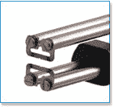

# 热剥线钳可能是你不用的最好的工具

> 原文：<https://hackaday.com/2016/08/09/hot-wire-strippers-are-probably-the-best-tool-you-arent-using/>

我想指出一个我经常使用，但很少在别人的工作台上看到的工具:热剥离器。它们并不便宜，但是一旦你使用了它们，就很难再用普通的工具来剥电线了。

我知道，我知道。当我第一次听说这样的事情时，我想到了你现在可能正在想的事情:也许对于一些奇异的涂层钢丝，但对于常规的钢丝，我只是使用一对对角切割器或机械剥离器或剃刀刀片。当然，你可以这样做，对于大的实心导线，你甚至可以得到很好的结果。但是对于处理任何类型的电线，无论大小，你就是无法击败热剥离器。

有两个小问题。首先，它们相当昂贵，尤其是新的。然而，在易贝这样的网站上，你可以买到价格合理的二手汽车。我有一台 Teledyne Stripall TW-1，它们的构造像坦克一样。你也可以很容易地为它们得到替换零件，所以你没有理由不能让它们运行一段时间。

第二个问题是，燃烧各种绝缘材料会产生烟雾。不多，但可能是一些讨厌的东西。你可能需要一些强制通风来吹走你身上的烟气。我用的是简单的风扇。

## 它们是如何工作的？

 正如你可能预料的那样，热剥离器有某种变热并熔化绝缘材料的夹具。TW-1 就像一把剪刀或钳子，所以你把两个热刀片放下，直到它牢牢抓住电线。刀片几乎立刻变热。有一个可调节的导轨来防止钳口靠得太近。你合上牙关，用力一扭，把线拉出来，线就被完美地剥开了。电线上没有刻痕，没有小股受损。只有裸线。

还有另一个向导可以让您控制工具沿电线长度去除多少绝缘层。想法是你插入电线，直到它碰到导轨，然后关闭钳口并扭转。每根电线都有完全相同数量的裸露导体。你可以在下面看到一个关于 TW-1 的视频。

 [https://www.youtube.com/embed/pgCkZeBICkY?version=3&rel=1&showsearch=0&showinfo=1&iv_load_policy=1&fs=1&hl=en-US&autohide=2&wmode=transparent](https://www.youtube.com/embed/pgCkZeBICkY?version=3&rel=1&showsearch=0&showinfo=1&iv_load_policy=1&fs=1&hl=en-US&autohide=2&wmode=transparent)

## 其他供应商

Teledyne 不是这种脱衣舞娘的唯一制造商。Patco 拥有不太贵的 PTS-10。Hakko 制作了一个版本。还有一家名为 Eraser 的公司(见下面的视频)以及许多其他制造商。

[https://player.vimeo.com/video/163724198](https://player.vimeo.com/video/163724198)

## 被黑？

我很惊讶，快速搜索没有发现任何自制工具。毕竟，这种设备算不上什么高科技。我找到的最接近的大概是【kl27x 的】“frankenclipper”(见视频，如下)。我敢肯定，如果我错过了一个，它会显示在评论中。

 [https://www.youtube.com/embed/K2hXvcF6ANU?version=3&rel=1&showsearch=0&showinfo=1&iv_load_policy=1&fs=1&hl=en-US&autohide=2&wmode=transparent](https://www.youtube.com/embed/K2hXvcF6ANU?version=3&rel=1&showsearch=0&showinfo=1&iv_load_policy=1&fs=1&hl=en-US&autohide=2&wmode=transparent)

我们过去已经讨论过[改进机械脱衣器](https://hackaday.com/2011/03/03/hacking-strippers-to-do-your-bidding/)。我们还看到了一台全自动的[切割和剥离](https://hackaday.com/2009/01/03/automated-wire-cutter-and-stripper/)机器。然而，货比三家，买一个便宜的热剥离器和风扇，我想你下次需要剥离电线时会非常高兴。