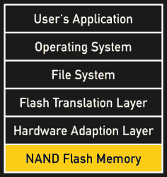
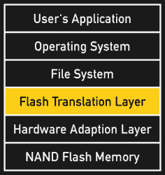
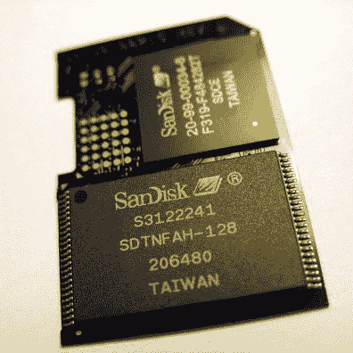
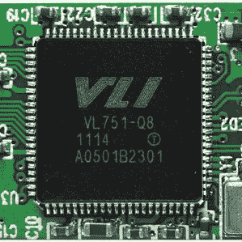
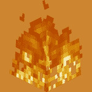
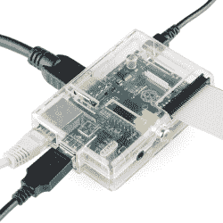
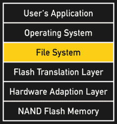
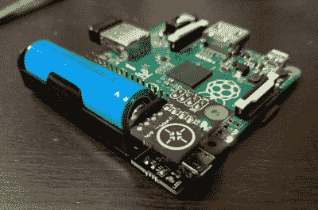

# 单板革命:防止闪存损坏

> 原文：<https://hackaday.com/2016/08/03/single-board-revolution-preventing-flash-memory-corruption/>

SD 卡肯定不是企业级存储解决方案，但单板计算机也不再只是玩具。你会发现它们的应用远远超出了它们出现的教育目的，非关键应用和关键应用之间的界限变得越来越模糊。

洗衣通知黑客和街机故障不会造成伤害。但是电子门禁或者自动宠物喂食器怎么样呢？你会依赖一个普通的微型 SD 卡的数据完整性来保证你的宠物在你度假和回来后的食物供应吗？毕竟，SD 卡损坏是 Raspberry Pi 社区中一个被广泛讨论的话题。怎么做才能让自己喜欢的单板电脑不至于随机失效，有没有比一堆 SD 卡更好的解决存储问题的办法？

## 了解闪存

 
闪存的特殊属性深入到硅片，其中各个存储单元([浮栅](https://en.wikipedia.org/wiki/Flash_memory#Floating-gate_transistor))按页分组(同时编程的区域)，页按块分组(同时擦除的区域)。因为必须先擦除整个数据块，然后才能向其中写入新数据，所以向现有数据块添加数据是一项复杂的任务:在给定的数据块大小(即 16 kB)下，存储更少量的数据(即 1 kB)需要读取现有数据块，在缓存中修改它，擦除物理数据块，然后写回缓存版本。
这种行为使得闪存(包括固态硬盘、SD 卡、eMMCs 和 USB 拇指驱动器)比其他读写介质更容易受到数据损坏的影响:在擦除数据块和恢复其内容之间总有一小段自由落体时间。

## Flash 转换层

 闪存转换层(FTL)是将物理内存块映射到文件系统的逻辑块地址空间的传统接口。SSD 和可移动闪存介质通常都包含一个专用的闪存控制器来完成这项任务。由于单个闪存块会随着每个写周期而磨损，因此这种映射通常会动态发生。这种技术被称为[损耗均衡](https://en.wikipedia.org/wiki/Wear_leveling)，随着时间的推移，它会导致物理内存块在逻辑地址空间中四处游荡，从而将损耗分散到所有可用的物理块中。逻辑块地址(LBA)的当前映射存储在闪存的受保护区域中，并根据需要进行更新。固态硬盘中的闪存控制器通常使用比 SD 卡更有效的损耗均衡策略，因此寿命明显更长。然而，在它们的正常寿命期间，它们可能表现得同样可靠。

  Upper IC: SD card controller (CC BY-SA 2.0 by [Uwe Hermann](http://randomprojects.org/wiki/Sandisk_SD_card_16_MB))  USB flash drive controller (CC BY 2.0 by [VIA Gallery](https://www.flickr.com/photos/viagallery/5976873457/))

## 追溯数据损坏

Blocks on fire (CC-BY-SA 3.0 [by Minecraft Wiki](http://minecraft.gamepedia.com/Fire))

对闪存的写操作通常包括缓存、擦除和重新编程之前写入的数据。因此，在写入中止的情况下，闪存上的数据损坏可以追溯性地损坏与正在写入的数据完全无关的现有数据。

损坏数据的数量取决于设备相关的数据块大小，从 16 kB 到 3 MB 不等。这很糟糕，但遇到追溯性数据损坏的风险也相对较低。毕竟，在一个块的擦除和重新编程周期之间，需要一个非常不寻常的事件。在数据中心之外，它通常被忽略，但对于依赖数据完整性的关键应用程序来说，它无疑是一个威胁。

## 意外断电

One of these cables is vital. (CC-BY 2.0 [by Sparkfun](https://www.flickr.com/photos/sparkfun/8248199710/in/photolist-dySbpQ-nhtN4r-njwywR-fgwcvF-ejXenn-e3dfoG-eau4hz-o5ABz8-epTD9j-rhP553-rx5QFE-fzLxfQ-oqS5HL-fgLsjd-oqS5qS-fzLxfW-ncqktS-pEYzcx-fzwdm6-fzLx7u-fgLsdL-pfUxYP-k2ocnG-rsueQi-e3dfoQ-e6HH8F-nhtKKQ-oLDPFs-oHmwGe-o5Bwtx-r9aRLK-fgLsdq-njwyGF-rsueQP-fzwdkx-iRfqEs-k2mrS6-eVVJY2-h6fVbZ-fzLxf5-iReQS6-fzwdmv-oqRV5i-pEYzdp-oLEjbk-fzLxdf-h6hgcX-k2kMP4-iRfqF9-h6geHY))

与写入中止相关的数据损坏最可能的原因是意外断电，尤其是闪存[不能很好地处理它们](http://www.eetimes.com/document.asp?doc_id=1279443)。无论是消费级固态硬盘还是 SD 卡，都无法在电源不稳定的环境中保持数据完整性。断电越频繁，数据损坏的可能性就越大。工业固态硬盘，最好在 UPS 供电的服务器机架中找到，另外还包含~~军用级仙尘~~ [令人印象深刻的钽电容](http://www.storagereview.com/samsung_sm863_ssd_review)(甚至是电池)，这为它们赢得了足够的时间，在断电的情况下将它们的大容量缓存刷新到物理内存。

虽然笔记本电脑、平板电脑和智能手机在安全关机前不必特别担心电量耗尽，但单板机往往很容易断电。看着晃动的微型 USB 插孔和我的 Pi 上没有关机按钮，功率损耗实际上是内置的。结合闪存，这确实是实现数据完整性的障碍。

## 文件系统的作用

 文件系统在逻辑块地址空间之上提供了基于文件的结构，并且还实现了检测和修复其自身损坏的机制。如果出现问题，修复程序将扫描整个文件系统，并尽最大努力恢复其完整性。此外，大多数现代文件系统都提供日志记录，这是一种在执行写操作之前记录写操作的技术。在写入中止的情况下，日志可用于恢复之前的状态或完成写入操作。这加快了文件系统修复的速度，增加了实际修复错误的机会。

不幸的是，日志不是免费的。如果每次写入操作都先写入日志，那么有效写入速度将减半，而闪存磨损将加倍。因此，常用的文件系统，如 HFS+和 ext4，只保留剥离下来的日志，主要覆盖元数据。正是这种实际的权衡，使得文件系统在底层存储介质出现故障后成为数据完整性的特别差的候选对象。他们可以恢复诚信，但也可能失败。他们无法恢复丢失的数据。

在闪存时代，文件系统的角色正在发生变化，它即将吸收 FTL 的功能。文件系统 JFFS2 准备直接管理原始 NAND 闪存，从而实现更有效的损耗平衡技术并避免不必要的写入周期。JFFS2 通常用在许多 OpenWRT 设备上，尽管它有很多优点，但是运行在带有 FTL (SD 卡、u 盘、eMMCs)的闪存介质上的 SBC 不会从这样的文件系统中受益。值得一提的是，~~beagle bone Black~~beagle board 实际上具有一个 512 MB 的原始可访问 NAND 闪存部分，[邀请用 JFFS2](http://elinux.org/BeagleBoardNAND) 进行实验。

## 钢的码头

要回答如何有效防止单板计算机上的数据损坏的最初问题:物理层很重要。尤其是在单板电脑中使用，优质 SD 卡恰好[性能更好](http://hackaday.com/2015/12/10/which-sd-card-to-use-in-a-pi/)寿命更长。使用比绝对最小值更大的 SD 卡增加了额外的余量，以弥补次优的损耗均衡。

The [LiFePo4wered/Pi](https://hackaday.io/project/9461-lifepo4weredpi) adds a power button and UPS to the Raspberry Pi.

钢铁通往*码头的下一步应该是处理意外的电力损失。采用基于电池的 UPS 将减少顺势疗法的剂量，在 [hackaday.io](https://hackaday.io/myFeed) ，Patrick Van Oosterwijck 已经设计出了一个[伟大的 UPS 解决方案](https://hackaday.io/project/9461-lifepo4weredpi)，可以让树莓派一直存活。*

对于一些应用来说，这可能还不够，而对于另一些应用来说，电池组增加的成本和重量可能是不实际的。在这种情况下，您实际上只能做一件事:[将 Pi 的根分区设置为只读](https://hallard.me/raspberry-pi-read-only/)。这实际上给你一个 SBC 的力量和微控制器的可靠性和寿命。

最终，读写模式下的单个闪存单元只能如此可靠，仅通过观察事实，我会在某些应用中使用基于 SD 卡的单板计算机之前三思。但是我们的读者怎么想呢？你保持 SD 卡正常的策略是什么？请在评论中告诉我们！