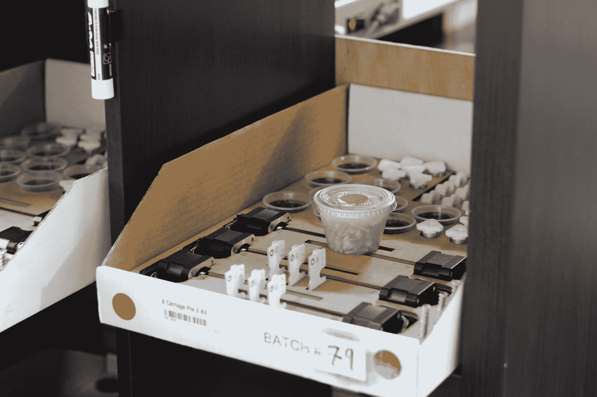
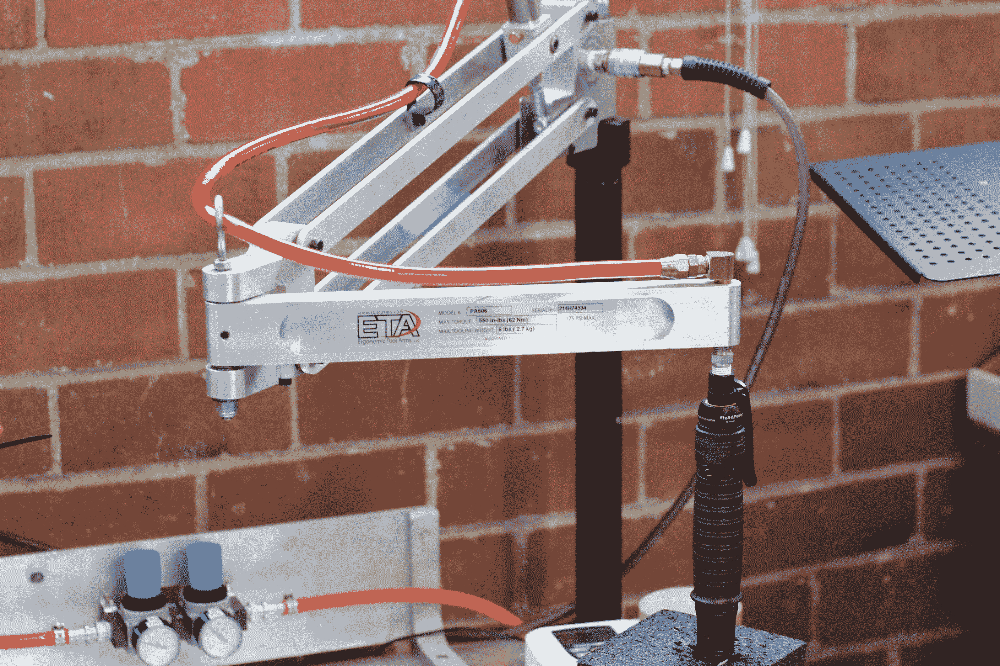
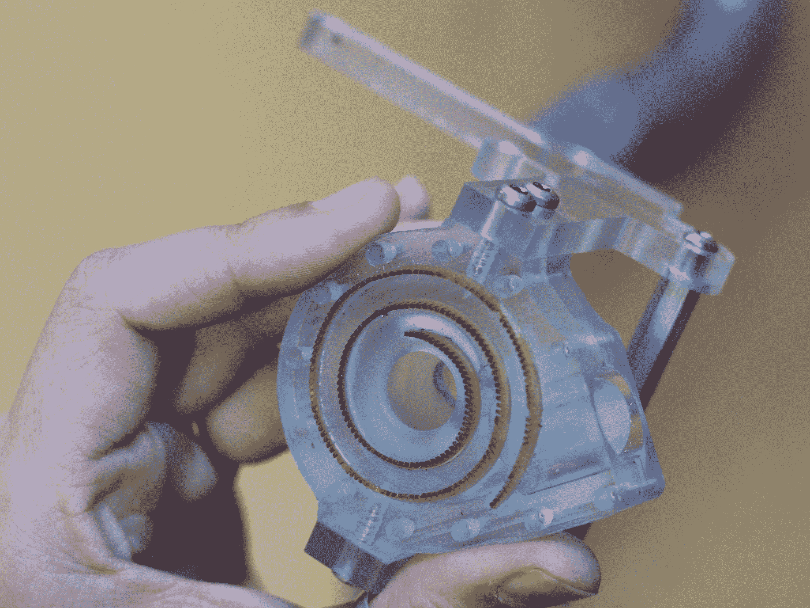

# 其他工厂车间小规模制造的经验教训

> 原文：<https://hackaday.com/2016/08/10/lessons-in-small-scale-manufacturing-from-the-othermill-shop-floor/>

Othermachine 公司不是一家大公司。他们的旗舰产品 Othermill 是小批量生产的，生产过程非常小心。正如我们在其他小型硬件公司看到的那样，[制造流程可以成就或毁灭公司](http://hackaday.com/2016/06/01/how-did-pocket-nc-survive-and-thrive/)。当我们参观他们在加州伯克利的工厂时，一些有趣的事情引起了我们的注意，这些事情向[展示了他们的制造能力。](http://makezine.com/2014/09/12/meticulous-machines/)

小公司很少分享他们车间的秘密。我们中的许多人都有销售工具包的梦想，所以从这些人身上学到的任何东西都是有价值的。任何制造过程优化的目标都是在保持或提高质量的同时降低成本。不管愤世嫉俗者愿意相信什么，这通常是完全可能的，而且往往容易得令人尴尬。

精益制造定义了流程中可以优化的七种浪费。

1.  **生产过剩:**简单地说，生产超过你目前的需求。这是第一次制作人常犯的错误。
2.  **库存:**储存超过自己需要的东西，以满足生产或需求。几乎每个我工作过的公司都有这个问题。拥有足够的 T2 是一种艺术。不要在六个月内购买一个 3000 个螺钉的批量订单，根据需要每个月订购 500 个螺钉。
3.  **等待:**流程之间有明显的延迟。这些事情包括从用完 [USB 电缆](https://www.youtube.com/watch?v=vDwzmJpI4io)到不得不等待太长时间等东西到达传送带。尽你所能确保流程总是从一个步骤流向另一个步骤。
4.  **运动:**如果你让一个人在工厂的两端来回走动，来完成制造过程中的一个步骤，这就是浪费运动。
5.  **运输:**与运动不同，这是在装配的不同部分之间移动每个单独过程的产品的浪费。
6.  **返工:**第一次做对。如果你的过程不能生产出符合规格的产品，那就修正这个过程。
7.  过度处理:不要做不必要的工作。如果你的零件规定了 1000 小时的运行时间，不要为了获得 2000 小时的运行时间而购买价值 100 万美元的机器。如果你能找到一步到位的方法，就不要三步到位。

走进 Othermachine Co .的车间，首先映入我眼帘的是他们一丝不苟的系统，让小批量产品及时通过工厂。这使得他们能够随着需求的波动而扩大生产规模。CNCs 和 3D 打印机肯定是季节性购买；随着销售在冬季月份的增长，黑客不再被好天气吸引离开他们的工作站。

正如七宗罪所宣称的。对其他机器公司来说，建太多工厂是一个糟糕的举动。假设他们在需求处于季节性低谷时多生产了 100 台。如果他们从客户反馈中发现了设计或质量问题，他们将不得不承诺返工，这可能会扔掉大量有缺陷的零件。如果他们想改变机器或发布新的型号，他们要么必须返工机器，丢弃它们，要么等到它们全部售出后再改进他们的产品。更糟糕的是，他们可能会发现自己无所事事，等待供应减少到足以重新开始生产。这剥夺了他们改进流程的机会，导致工作环境松懈。

确保正确处理零件并将库存保持在最低水平的一种方法是采用适当的视觉控制。为此，Othermachine 公司定制了纸板箱，将每道工序的所有精密零件完美地放置在各自的彩色编码容器中。由于车间很小，他们可以一天专注于制造主轴组件，一天专注于制造运动组件，而不必在每一步之间浪费时间。此外，有人可以轻松地为最近完成的步骤重新设定零件，而不会中断当前流程中正在进行的工作。

很难定义什么是过度加工，什么不是。我最喜欢的例子是适当的扭矩限制螺丝刀，这也是我在我工作过的几乎每个工厂都为之奋斗的东西。它们有点贵，但它们是一个很好的工具，有助于避免昂贵的返工和过度加工。例如，假设你没有扭矩限制螺丝刀。也许你的客户会抱怨偶尔会有一个螺丝松了。现在，解决这个问题的一个方法是乐泰的自由应用。另一种方式是额外的检查步骤。这两个都是额外的和完全不必要的步骤，因为大多数螺钉只要正确拧紧就能固定住。

在我工作过的一个工厂里，一个经常出现的问题是，一个新雇佣的工人会过度拧紧一个螺丝，要么把它拆下来，要么损坏与之配合的零件。扭矩限制螺丝刀将工人的体力排除在外，同时减少他们一天的疲劳。这是双赢。任何时候，一个关键的步骤可以通过应用适当的工具或测试步骤从未知变为可信，这都是值得的。

Othermachine 公司应用这一原理的另一个部分是数控机床的最终加工步骤。该步骤产生大量的废碎片。他们花了一些时间设计了一个定制的真空附件，而不是让员工在完成这一过程后浪费时间对其他工厂进行真空吸尘。这基本上取消了整个生产步骤。还不错！

通过适当的废物管理，完全有可能在节约资金的同时改进流程。学会如何看待它需要一点训练。有一个有经验的人在身边有助于学习如何正确地应对他们，但经过一点练习，它会成为一种扩展到生活各个领域的技能。你们中有人有过解决这类问题的经验吗？我真的很喜欢从评论中发布的工作故事中学习。