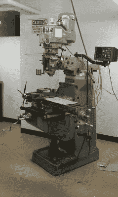
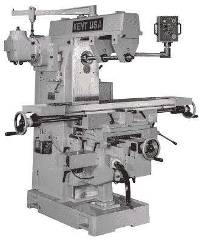
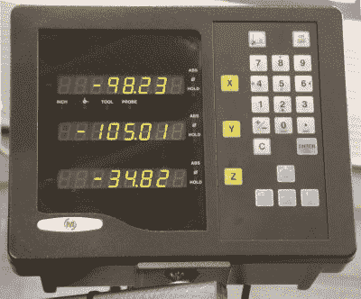
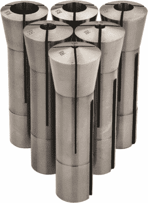

# 购买第一台铣床的技巧

> 原文：<https://hackaday.com/2016/08/17/tips-for-buying-your-first-milling-machine/>

如果你对制造东西感兴趣(既然你在读这篇文章，我们假设你是)，你几乎肯定有制造金属零件的欲望。3D 打印机很棒，但也有很多缺点:材料选择有限，缺乏精度，打印时间长。如果你想要的金属零件符合适度的公差，铣床是你唯一实用的选择。毕竟，有一个很好的理由说明它们对制造业是必不可少的。

然而，对于没有加工经验的爱好者来说，可能很难知道从哪里开始。你应该买什么样的铣床？你应该买新的还是二手的？什么是三相电源，你能得到它吗？这些问题，以及其他许多问题，对于门外汉来说可能是压倒性的。幸运的是，我们——您在 Hackaday 的朋友——在这里为您提供一些指导。所以，如果你准备好学习，那就继续读下去吧！已经是专家了？在评论里留下一些你自己的小技巧吧！

## 你需要什么样的铣床？

This is a vertical milling machine, with a head that rotates, tilts, and swivels (photo courtesy of Wikipedia)

在我们详细了解您最有可能购买的铣床配置之前，首先让我们指出，在本指南中，我们将只讨论**手动**铣床。数控加工厂是一个完全不同的行业，他们将会有一个自己的指南。手动和数控铣床有很多共同之处(数控铣床通常只是手动铣床的转换)，但是数控铣床有额外的要求，这将使本文过于复杂。所以，在这篇文章中，我们只涉及手动机器。

现代铣床分为两种基本类型:卧式和立式。这决定了机器的主轴是上下运行，还是左右运行。这两种类型的机器通常都有倾斜或旋转的头部、立柱和工作台，这意味着这两种机器都可以用于许多相同的任务。然而，某些工作在一台机器上会比另一台更容易。

实际上，这些机器之间的差异不仅仅是它们朝向的不同。立式机床将工作台垂直安装在主轴的零倾斜位置，而卧式机床将主轴平行于工作台平面安装。这就在每种类型的机器上什么样的工作是实用的方面引入了一个基本的区别。

Notice how the overhead arm of the horizontal milling machine braces the spindle arbor on both sides (photo courtesy of Kent USA)

卧式铣床的主要优势是上臂，它在两侧限制旋转心轴。这给了它令人难以置信的刚性，并允许机械师采取非常沉重的削减，将引入更多的侧负荷，然后一个垂直的机器可以处理。强度如此之高，以至于完全有可能(也很常见)在刀杆上堆叠多个刀具，以便一次切削一个带有槽的平板。这使得它非常适合表面加工工作，切割凹槽和槽，以及零件在一个轴上是平的类似任务。

当然，缺点是制造在所有轴上都有切口的零件要麻烦得多(有时甚至不可能)。这就是立式铣床的优势所在:多功能性。你很难找到立式铣床做不到的工作，尽管有时比卧式铣床耗时更多，这取决于零件的几何形状。

既然你知道了区别，你可能已经知道你想要哪一个了。但是，以防万一，我们会说，你几乎肯定想要一个立式磨机。卧式铣床对于一小部分任务来说是很棒的，但是那些也是大多数业余爱好者不会经常执行的任务。与卧式磨机通常用于的专业生产工作相比，立式磨机的多功能性非常适合爱好者倾向的各种不同的任务。

## 立式磨的特点很重要

希望你已经决定立式磨机是你的最佳选择，否则这一节就没什么用了。假设您已经决定选择立式磨机，您可能会好奇要寻找哪些功能，并想知道什么才是真正重要的。涵盖该主题的每个细节需要一整本书，但我们将讨论一些需要考虑的最重要的事情。

### 你应该买名牌吗？

这是一个驱动很多购买决策的问题，铣床也不例外。所以，这重要吗？是也不是。铣床已经存在了很长一段时间，而且在制造过程中也没有什么商业秘密。众所周知，什么是好机器，什么不是。理论上，任何制造商都可以遵循这些设计原则，制造出高质量的机器。

不幸的是，现实并没有兑现这一承诺。原因有两个:制造质量和成本。为了降低成本，许多制造商会偷工减料。他们可能使用劣质材料、动力不足的马达等等。即使制造商没有故意偷工减料，他们也完全有可能无法进行高质量的制造。制造不良的丝杠、不精确的加工和宽松的公差都会使你的铣床使用起来令人沮丧，而且不能保持可容忍的精度。

因此，买一台经过验证的机器是个好主意。通常，这意味着选择受人尊敬的品牌。但是，一些不太昂贵的品牌仍然生产高质量的机器(通常是更昂贵型号的克隆)。它们可能功能较少，或者马达不太坚固，但可能足以满足您的需求。一定要读一些和他们一起做实际工作的人的评论。

### 尺寸很重要

小型台式铣床可能很诱人，但如果你打算铣削金属，最好避免使用它们。想想上一次你不得不在钢上钻孔，或者不得不用钢锯切下一块。这是一项困难的工作，需要很大的力量。您的铣床需要能够施加这种力，而完全不弯曲——即使一点点弯曲也会破坏铣削具有可观公差的零件的任何机会。

出于这个原因，轧机的框架需要尽可能的重和刚性。一台小型台式机器几乎肯定无法加工比铝更硬的东西，即使这样也不会精确。如果你想要中等的精度，最明智的选择是买一个你能容纳的又大又重的磨。

### DRO 和电源馈电

[DRO(数字读数)](https://hackaday.com/2016/07/24/super-cheap-super-simple-dro/)是一个可以添加到铣床每个轴上的模块。有些机器是自带的，有些是作为升级包提供的。套件通常可用于改造最初没有它们作为选项的工厂。DRO 会给你一个显示屏，告诉你你移动了桌子(或鹅毛笔)多远，这使得几乎每一个操作都容易得多。

A 3-axis DRO display and control panel (photo courtesy of Wikipedia)

使用 DRO 并非绝对必要，因为所有工厂都有测量运动的刻度盘。然而，阅读它们可能会很麻烦和费时。当您考虑反冲(螺钉中的溢出)时尤其如此，当您有 DRO 时，这很容易补偿，因为它只告诉您工作台实际移动了多少，而不是手柄移动了多少。

像 DRO 一样，动力进给是可以添加到每个轴上的东西，许多工厂都有这种东西。它可以让你拨动一个小马达来移动桌子，这样你就不用自己转动把手了。这可以大大降低疲劳，但也可以给你一个更好的切割表面光洁度，因为速度在整个切割过程中保持一致。

### 主轴电机马力

像汽车爱好者一样，机械师对马力也很重视。而且，这并不是完全没有根据的——你最不希望的就是电机在切割过程中停转。也就是说，几乎所有的工厂都会有某种方式降低电机转速，以速度为代价获得扭矩。铣钢需要高扭矩低转速，而铝则相反。

所以，你当然可以补偿一个没有一吨功率的电机。这可能是一个好主意，因为当谈到成本时，马达马力会产生巨大的差异。也就是说，你可能应该避免任何低于 1 马力的磨。也很难找到不是三相的大马力电机。

### 三相？啊？

我们没有足够的空间来讨论多相电源是如何工作的，以及它的优缺点。但是，只要说你家里几乎肯定没有三相电源就够了。如果你有一个工业空间，你可能有三相电源，但即使这样，你可能没有。关键是，许多工业级工具都有三相电机，它们无法依靠标准的家用单相电源运行。

这意味着你们中的大多数人将被局限于使用单相电机的磨坊。然而，这通常使得找到比单相电机便宜得多的三相电机成为可能。如果你找到了这样一台你感兴趣的机器，有可能用单相装置取代主轴电机，或者购买或建造一台相位转换器。

### 铣床/钻床怎么样？

铣床/钻床基本上是一台钻床，上面绑着一个 2 轴工作台。它们比真正的铣床便宜得多，但这是有原因的。它们真的没有真正铣削所需的刚性，只适合精确钻孔和非常轻的铣削。除了节省一点现金，没有理由买一个，因为一个真正的铣床当然也可以钻孔。

## 买下你的磨坊

至此，您应该对铣床中的重要部件有了很好的理解。现在是时候深入了解你应该如何着手购买一个了。

### 新的还是二手的？

你应该认真考虑买二手的。优质磨坊是设计用来经得起几十年严重滥用的机器，你可以通过购买二手机器来节省很多钱。当地的工业拍卖和 Craigslist 是值得一看的好地方。检查二手机器有点像检查二手车:确保一切正常，没有过度磨损，并且你可以看到它已经得到了照顾。

灰尘和污垢是可以被清理的，只要重要的部分是干净的，润滑的，没有太多磨损。确保主轴旋转平稳，没有间隙(如果可能，测量[跳动](https://en.wikipedia.org/wiki/Run-out))，并且声音良好。抓住桌子，尽可能用力摇晃，确保感觉不到任何晃动。看一下螺丝，看看它们是否干净和没有损伤。确保滑道(桌子在其上滑动的光滑金属)干净、润滑，并且没有凿槽。如果所有这些都是好的，并且你没有注意到任何其他的危险信号，比如有裂纹的铸件，那么这台机器可能是坚固的，完全可以使用。只要它得到维护和保养，年龄通常不会被认为是一个问题。

### 把它带回家

铣床很重；它们可以轻则几百磅，重则几千磅。让一个回到你的家或商店不是一件小事。如果你自己运输，确保你的卡车或拖车能够装载货物，并且捆绑牢固。你还需要一辆左右两边都有的叉车(来装卸机器)。

如果像大多数业余爱好者一样，你没有重型平板卡车和自己的叉车，你可以雇用装配工为你移动机器。即使是很短的距离，也要花费至少几百美元(有时更多)来移动它。如果你知道谁有这种设备，那绝对值得打电话找人帮忙——你需要钱来买工具。

### 要购买的附件和工具

一旦你把铣床带回家，还有很多东西要买。首先，你需要一把像样的机械师用的老虎钳。你不一定需要花几百美元买一个库尔特虎钳，但是你会想要一个加工精良并且不会松动的东西。旋转支架很好，但不是必须的。

接下来，你需要一种方法来保持你的端铣刀。为此，您需要与您的铣刀上的刀杆相匹配的夹头或端铣刀架(这些信息在规格中应该很容易找到)。你可能想从两个或三个不同尺寸的铣刀开始，这样你就可以使用不同刀柄尺寸的铣刀。

A set of R8 collets for a variety of shank diameters (photo courtesy of Enco)

说到端磨机，你会想点一堆的。你可以通过易贝便宜地批量购买，这在你刚开始的时候是个好主意。买碳化物，还有一些不同尺寸的。确保刀柄尺寸与您购买的夹头/端铣刀架相匹配。一般来说，铝推荐 2 槽，钢推荐 4 槽。如果你不确定你要切割什么，你可以每样都买一些，或者买一些三槽端铣刀作为折衷。预计支付 10 美元以上的每个端铣刀(是的，工具变得昂贵)。

最后，你可能要考虑一个冷却系统。这些有一些不同的变化，但洪水冷却剂通常是最容易得到设置。尽管名字如此，冷却剂不仅仅是冷却；它也润滑和冲走芯片。冷却系统可以很容易地安装到任何铣床上，许多铣床出厂时都带有冷却系统。

## 开始铣削！

现在好戏终于开始了！开始的时候你会想要做很多实验。研究进给量和速度(并得到一个合适的计算器)，不同的端铣刀适合什么，以及如何执行特定类型的操作。不要气馁，如果你打破了端铣刀，这就是为什么你买了额外的。练习，练习，练习，很快你就会有借口为你所有的项目制造精密金属零件。