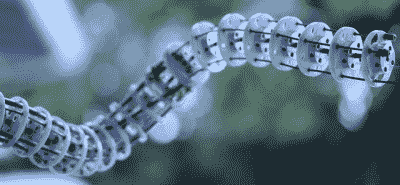
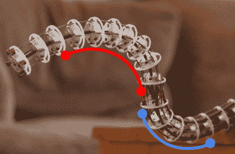
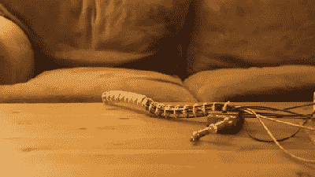
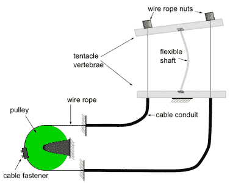
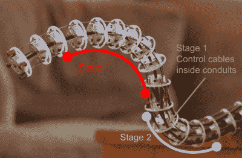
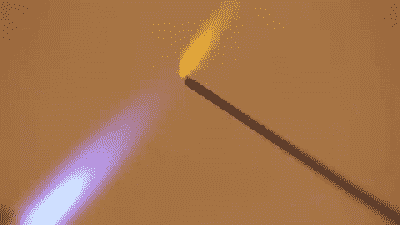
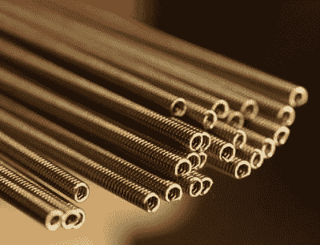
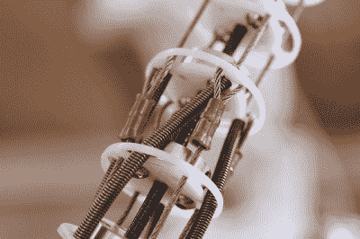

# 自制两级触须机构的启动指南

> 原文：<https://hackaday.com/2016/09/13/the-bootup-guide-to-homebrew-two-stage-tentacle-mechanisms/>

电子动画有什么不可爱的？只要剥开任何木偶的硅胶皮肤，就能发现一系列机电魔法，让它在大屏幕上焕发生机。我一直在网上寻找关于这些野兽的好介绍，但我只找到了一个详细的资源——尽管是一个很好的资源——来自[斯坦·温斯顿教程](https://www.stanwinstonschool.com/tutorials/animatronic-tentacle-mechanism-basics)系列。视频开始仅 30 秒，我就能感觉到那些触须唤醒了我最低级也是最无聊的创作欲望。不管喜欢不喜欢，我都被迷住了；我只是*有*去造一个…或者几个。这就是你如何建立一个非常真实的电子触手。

I built this. And you can too!

如果你刚开始进入这个领域，老实说:斯坦·温斯顿教程实际上是一个很好的起点。在大约两个小时的时间里，理查德·兰登(Richard Landon)讲师讲述了用一套车库工具制作触手机械装置的思维模式、一系列关键组件和技术，更不用说沿途给我们提供了大量的真实电影示例[1]。

我们还可以先睹为快，看看我们如何用同样的基本技术建造更复杂的设备。我想准确地从他停止的地方开始:4 向两级触须。当然，如果你已经意识到我是多么喜欢某种激光切割塑料的话，我将会在 Landon 的设计中加入现代元素。这些设计调整应该使你能够建立自己的触手*和*控制器，除了一些现成的零件、一些 Delrin 和一个激光切割机……好吧，好吧，几个 3D 打印零件也设法爬进来了。

以工程师对工程师的方式，我为这篇文章做了一点不同的事情:我用一组组装视频、一个 BOM 和原始 CAD 文件来结束这个系列，让首页上的那个怪物活起来。至于为什么，我想:为什么不呢？尽管这些机制已经在机器人社区和电影行业存在多年，但它们仍然缺乏可靠、开放的设计。这是我缩小差距的第一次尝试。给自己倒杯咖啡。我要告诉你这些野兽背后的每一个细节。

好吧。让我们开始吧。

## 两阶段触须的心智模型

这次我就不做数学计算了，但了解这些机制是如何运作的仍然很重要。在我们给自己弄一个活的放在桌子上之前，我们需要用这些野兽应该如何行为的正确模型来武装我们的大脑。这样，我们将有正确的洞察力来开始改进它的行为，直到它满足我们的期望——这些期望得到了物理学的适当支持。首先，让我们对动物的活动范围感到舒适。

Both Tentacle Stages, each of which has two degrees of freedom

我们的触手有两个阶段，每个阶段有两个自由度。这两个自由度使得工作台能够在两个方向上弯曲，两个方向都彼此正交。

用线性组合(一个 mix！)在所有这四个自由度中，我们有相当多的自由来恶搞一些相当有说服力的有机动作。如果我们仔细观看下面的剪辑，我们实际上可以看到这两个阶段的连接点，大约在身体的中间位置。

当它被正确组装后，我们可以独立控制每个阶段，而不会影响另一个阶段的任何曲率…理想情况下。在现实世界中，没有什么是完美的，我们的材料尤其有其自身的局限性。也就是说，我们需要调整我们的张力和椎骨间距，直到行为对我们来说足够好。

It’s aliiive!

在理想情况下，拉动每一级的缆绳会形成一个完美的弧形，我们拉得越多，弧形的直径就越小。摩擦导致每个椎骨都有损失，所以我们无法实现完美的弧线，但我们可以靠得足够近，骗过屏幕外的那些人。

请记住，虽然我们可以实现一系列的姿势，但没有一个涉及到沿着触手核心的扭动！这种设计选择是过去的木偶操纵者故意做出的，他们认为这不自然——特别是在我们可能试图模仿的猫尾巴和大象鼻子中[1]。

### 触手模型

为了获得电缆驱动的一些直觉，让我们建立一个由两个板和一个柔性核心组成的粗糙触手。下面是我们出生前触手的示意图:

通过在滑轮上施加一个扭矩，我们同时放松了一根绳子，同时以完全相同的长度拉紧了另一根绳子。由此产生的缩短的金属丝长度使触手向金属丝方向卷曲。由于这些缆索只能在张力下施力，因此它们必须与互补件配对，以实现单个自由度的全往复范围。因此，我们有一个混乱的总计 8 线管理后，但我们会谈到电缆管理在未来几周。

触手保持姿势是因为这里有两个关键特征。首先，电缆管可以抗压。第二，缆索被预张紧并刚性地固定在滑轮上。因为电缆长度的改变是移动触须椎骨的唯一方式，并且因为电缆导管不能改变长度，保持滑轮在固定位置将同样保持触须固定在它当前的姿势。

### 电缆导管的作用

在这种情况下，最重要的是电缆管道。没有它，上层的运动也会引起下层不必要的运动，而这正是我们所不希望的。相反，我们希望我们的两个控制器能够独立控制它们所连接的每个阶段。

电缆导管让我们可以自由地将力的方向从导管的一端转移到另一端，而不会产生任何不必要的力。这里的关键是导管保持柔性，同时抵抗压缩。

作为一个有趣的现象，在上面的设置中，我们可以在任何点抓住这个电缆导管，并以任何方式移动它，而不会遇到任何阻力，原因有两个:

1.  导管是柔性的。
2.  电缆布线的中心不会改变长度。

因为导管的任何弯曲都不会改变它的长度，所以我们可以随心所欲地弯曲导管，而触手会保持固定的姿势。相当整洁！

这种现象让我们可以同时做两件事:它防止我们将上级*的控制电缆滑入下级*中，同时它们与下级*和*一起自由移动；它让我们可以通过下级控制上级，而不会影响下级。

现在，让我们仔细看看之前的那张图片。如果我们仔细观察，我们可以看到*阶段 1* 的控制电缆在穿入导管后，实际上是挂在*阶段 2* 的内部。

## 触手螺母和螺栓:

现在，我们来深入了解新的零件词汇表。我保证，我们还没有和这些现成的组件交朋友，所以请睁大眼睛继续读下去，无畏的读者！

### 核心材料:

实现每个自由度的光滑、独立运动的关键在于将触手构建成一个能够抵抗其核心扭曲的结构。大多数人倾向于使用替换的旧汽车的速度计电缆来做这件事。在我第一次通过这些木偶时，我也使用了速度计的电缆。不幸的是，这些电缆被限制在一个单一的直径:0.125 英寸，这意味着我们的木偶不能变得那么大，而不会在自己的重量下开始扭曲。这些天来，我发现旋转工具的[软轴的性能有所改善，因为它们的直径稍大。平视:除非另有说明，这一轮的大多数照片都使用了速度计线，这对相当小而轻的木偶来说很好。](https://www.aliexpress.com/item/98CM-38-6-Length-Rotary-Tool-Flexible-Metal-Tube-Inner-Shaft-Cable-For-Foredom-F-Flex/32510179656.html?spm=2114.13010608.0.53.rXrB2n)

### 细分市场:

对于将成为我们触手椎骨的每一段，我们需要一种方法来牢固地固定那一段，而不会滑动或扭曲。这些椎骨用于正确地布置电缆和电缆导管(如果需要的话),同时保持它们在速度计电缆上的固定位置。Landon 的设计通过一体式 CNC 铝合金件解决了这个问题。幸运的是，通过网上购物，我已经模拟出了一个做同样事情的组件，但主要依赖于现成的组件。这个元素的关键是感谢像你这样的黑客。由于业余爱好机器人零件现在是一种商品，我设法用 Pololu 电机轮毂制作了椎骨，并额外增加了一个 Delrin 板，以将电缆固定在正确的位置。

### 控制电缆:

That soon-to-be-fraying cable tip was no match for my Soto Pocket Torch

实际上驱动这些机制的电缆就像我们期望在自行车刹车上看到的一样:钢丝绳。然而，这些要薄得多。我幸运地拥有两种 7×7 内核:3/64 英寸(1.190625 毫米)直径和 1/32 英寸(0.79375 毫米)直径。这种超级花哨的钢丝绳不会磨损，因为它是在制造过程中通过一个过小的孔挤压而退火的[1]。唉，我买不起这样的商品，但斯坦福电缆机械课上的几个人找到了一个不错的替代品。事实证明，点燃电缆尖端几秒钟直到它发光就足以防止它磨损。转眼间。现在我们的电缆不会磨损。

### 电缆导管:

对于电缆导管，有许多选项，包括尼龙管，变速器电缆外壳和拉伸弹簧。最终，我们试图实现一个目标:我们需要一个既能抗压又能保持灵活性的外壳。我们的导管需要抵抗压缩，以便提供产生运动所需的“大小相等方向相反”的力。

它需要灵活性，这样它也不会妨碍它所经过的触手的任何其他部分弯曲。对于单级触手机构，上面列表中任何选项都可以。然而，对于多级机制来说，灵活性是关键。到目前为止，我发现 extension spring 确实做得最好，因为它比任何其他选项都更灵活。

我相信麦克马斯特-卡尔公司可能会卖给你任何东西。你只需要知道它的正确名称。在这些部件周围，我们的电缆导管替代品被称为“连续长度拉伸弹簧”，36 英寸的价格为 4.40 美元，我没什么可抱怨的！

如果你的需求确实是定制的，或者你需要更小的东西，我很幸运地从坦普莱曼博士和他的同事那里得到了更小直径的弹簧。他们对任何超过默认 8 英寸长度的定价都将比麦克马斯特的 0.125 英寸直径略高，但这一系列微小尺寸可能值得多花几美元。任何极小范围内的事情都可能让你和莫仕公司拿着[微型线圈](http://www.molex.com/molex/products/family?key=medispec_micro_miniature_coils_mmc&channel=products&pageTitle=Introduction)的人交谈。注意:如果你最终发现自己选择了医用级拉伸弹簧，请给我们写信，并在完成后给我们发送一些你的项目的精彩照片！

### 拐点

这一部分标志着控制从一个控制器到下一个控制器的过渡，这是我第一次在这个设备上绕来绕去的一个大难题。尽管如此，一旦我们了解了每根钢丝绳的正确端接点，构建起来就非常简单了。控制较低部分的每根钢丝绳都终止于一个钢丝卷曲。在同一椎骨上，容纳下一组控制线缆*的线缆导管也*终止；并且，从它们开始，下一组控制线缆向前缠绕。

## 设计备选方案

值得思考的是——对于这些椎骨，我们难道不能使用不同的材料，如木材，以节省我们购买这些电机轮毂的费用吗？答案是“也许”,但是这个设计选择和这个设计中的许多其他选择都根植于头脑中的几个目标。

首先，设计中的任何复杂性都需要外包给现成的组件或现成的制造方法(在这种情况下:激光切割和 3D 打印)。)我做这个选择是为了没有任何特殊的手眼协调训练会阻止任何人建造其中的一个。是的，第一次将热定形插件滑动到热塑性塑料中可能有点棘手，但对于能够焊接几个通孔组件的黑客来说，这并不是什么难事。

第二，制造这些原型的技术*必须*具有确定性和可重复性。无论你生活在世界的哪个角落，他们都需要表现得一模一样。当你的环氧树脂在某个奇怪的湿度水平下固化时，没有魔法，也没有向一只脚上的粘着神祈祷。只是一些随时随地表现相同的技术。

至于替代设计，我会说——去做吧！在这一点上，我已经完善了控制器和触手，但这并不意味着它已经完成了。当我完成组装后(第三部分)，设计将在你的手中。把它变成你的！

## 请继续关注第二部分:电缆控制器

这一轮到此为止！下次请收听，认真看看用于驱动这些野兽的控制器设计。在那里，我们将讨论零件、制造技术和未来的改进。在那之前，坚持住！

### 参考资料:

[1] [斯坦·温斯顿缆索机构基础知识](https://www.stanwinstonschool.com/tutorials/animatronic-tentacle-mechanism-basics)
详细介绍基本的触手设计，一窥更复杂的机构

[2][Rick Lazzarini 的电子动画演示](https://youtu.be/KVeujH2k6mU?t=1h22m1s)1:21:01
Rick Lazzarini 的电子动画中使用的速度表电缆示例

[3] [CS235:应用机器人设计，第 7 讲——缆索传动简介](https://www.youtube.com/watch?v=jKZIvseA1Nk)
斯坦福在触觉学背景下的缆索传动简介。