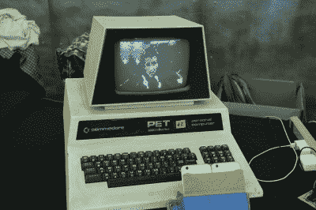

# 2016 年西 VCF 的 Commodore PET Mods

> 原文：<https://hackaday.com/2016/08/08/commodore-pet-mods-at-vcf-west-2016/>

在古董电脑节上，我们发现了许多过去的零碎东西。然而，有些已经有了现代的变化，比如[bitfixer]最近的 Commodore 宠物项目升级。

首先是[bit fixer]的增强现实升级。凭借两部 iPhones 和一个 raspberry Pi 的力量，用户戴上一个谷歌纸板式的平视显示器，就可以看到他们面前世界的 3D、ASCII 呈现。这个视图不仅显示在 HUD 中，而且还会传输到 Raspberry Pi，然后将其序列化为 Commodore 宠物上的视频显示。

TRON Legacy, can you tell??

这个黑客建立在一些[bit fixer][先前的工作](http://hackaday.com/2014/04/06/vcf-east-petpix-streaming-images-to-a-commodore-pet/)之上，让 ASCII 视频流启动并运行。当然，宠物准将的内存远远不能处理这些图像。事实上，将视频数据流式传输并存储到宠物的内存中，不到一秒钟就能填满它！相反，[bitfixer]依赖于一些预处理，这要归功于(相比之下)功能强大得多的 Raspberry Pi 和 iPhone 处理器来捕捉图像。

下一个是[bitfixer]的全彩色视频显示器，显示在同一个 Commodore 宠物上。同样，利用另一个 RaspPi 来编码视频并将其还原为位图图像，Commodore PET simple 抓取这些图像并尽快将其传输到屏幕上——以令人喜爱的每秒 5.8 帧的速度。