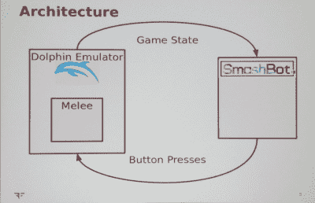

# 创造无与伦比的电子游戏人工智能

> 原文：<https://hackaday.com/2016/08/16/creating-unbeatable-videogame-ai/>

超级粉碎兄弟混战是 2001 年为任天堂 GameCube 发布的多人格斗游戏。在过去的 15 年里，它已经成为顶级格斗游戏电子竞技之一，这也是任天堂仍然为 Wii U 制作 GameCube 控制器的*和*原因。《粉碎混战》拥有大量追随者，多年来，人工智能能够在混战中击败顶级玩家的想法是不可思议的——游戏太复杂，策略要求太高，战术太难。

[Dan]又名[AltF4]不满足于计算机不能在近战中击败玩家，几年前开始致力于第一个可以击败任何人类玩家的近战人工智能。他刚刚在今年的 DEF CON 上发布了 Smashbot，虽然这个人工智能是有限的，但没有人能打败这个人工智能。

The architecture of Smashbot

Smashbot 不是一个带有摄像头的设备，你可以指向电视，也可以插入 game cube-game cube 仿真的状态已经足够先进，以至于[Dolphin emulator](https://dolphin-emu.org/)是一个可爱的小立方体的完美合理的替代品。在架构上，这个人工智能从海豚模拟器中读取游戏状态——有效地查看所有东西，并且只查看人类玩家会看到的所有东西。然后，人工智能做它的事情，向模拟器发送按钮按压，就像人类在 USB 游戏手柄上按压按钮一样。Smashbot 没有什么是人类做不到的，只是 Smashbot 拥有超人的性能。

虽然 Smashbot 可以击败任何人类玩家，但也有一些限制。混战中的每个角色都有不同的能力，策略和技术。到目前为止，Smashbot 只能扮演 Fox。这并不是说 Smashbot 最终不能扮演任何其他角色，只是允许这样做需要二十倍的工作量。出于类似的原因，并且因为混战中的阶段是交互式的，Smashbot 唯一可以玩的阶段是最终目的地，或口袋妖怪体育场的冷冻版本。此外，因为角色之间的策略是非常复杂的石头、剪子、布，人工智能只能玩*对* Marth。应该注意的是，在近战竞技圈里，福克斯对马尔斯的比赛几乎总是意味着福克斯输了。对于人工智能来说，这是最糟糕的情况，但如果它能赢得这场比赛，它就能做任何其他事情。

一个显而易见的问题是，如果你让机器人自己玩，会发生什么？这也是演讲后问答环节中的第一个问题。对此有两个答案。现在，Smashbot 被写为总是选择二号玩家。简短圆滑的回答是“没什么”。它还不能做到这一点。'

这个问题更好的答案要有趣得多。简而言之，每个人工智能会为他们的角色选择最好、最快的攻击，在这种情况下是狐狸，一帧反射器攻击链接成“多刃”(看起来像狐狸在击打地面)。由于两个机器人都在互相攻击单帧攻击，但没有攻击会击中，这意味着游戏计时器最终会耗尽。当这种情况发生时，游戏进入突然死亡，舞台开始崩溃。如果一个棋子落在一个玩家身上，该玩家受到伤害并失败。这种伤害是“随机”的，但在游戏中由随机种子有效控制，Smashbot 将能够在比赛开始前解决所有这些问题，并尝试定位自己，以便它可以阻止对其他 bot 的所有攻击，多闪八分钟，然后等待舞台崩溃。

如果机器人可以与另一个机器人比赛，这并不是一个确切的答案。这要么是有史以来最无聊的肉搏比赛，要么是最刺激的比赛。我们只是在[丹]完成 Smashbot 之前不会知道。

您可以在下面查看之前展示 Smashbot 的视频。

 [https://www.youtube.com/embed/Gb3v6uPuKic?version=3&rel=1&showsearch=0&showinfo=1&iv_load_policy=1&fs=1&hl=en-US&autohide=2&wmode=transparent](https://www.youtube.com/embed/Gb3v6uPuKic?version=3&rel=1&showsearch=0&showinfo=1&iv_load_policy=1&fs=1&hl=en-US&autohide=2&wmode=transparent)

