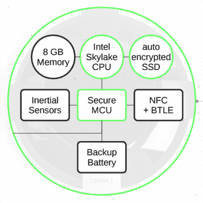

# 第一台邪恶的防女仆电脑

> 原文：<https://hackaday.com/2016/08/09/the-first-evil-maid-proof-computer/>

不管你的密码有多少位，你的加密有多可靠，或者你的电脑上有多少个 TrueCrypt 卷。如果有人想从您的设备上获取数据，他们可以通过物理方式访问您的设备。这是“邪恶女佣”安全场景，以一个三字母机构的工资单上的酒店女佣命名。如果有人实际接触到笔记本电脑，即使只有一两个小时，笔记本电脑上的数据也可能被认为受到了威胁。到目前为止，还没有针对这种邪恶女仆的方案，这是有充分理由的。阻止对数据的访问是一个非常非常困难的问题，即使数据在一个邪恶的女仆手中。

今天，Design Shift 发布了第一台考虑到*物理*安全的电脑 ORWL (乔治·奥威尔)。这个微小的计算机磁盘是为了通过一些非常聪明的工程，在我们已经使用的加密工具的基础上，击败邪恶的女仆而设计的。

从本质上讲，ORWL 是一台相对基础的个人电脑。CPU 是英特尔 Skylake，图形是集成的英特尔 515，通过微型 HDMI 连接支持 4K，RAM 是 4 或 8GB，存储是 120 或 480GB 的 SSD，采用 AES 256 位加密，无线是蓝牙 4.1 和 802.11 a/b/g/n/AC。电源通过两个 USB 3.0 Type C 连接器中的一个传输。规格是足够的，但绝不是这台电脑的主要卖点。

ORWL 存在的理由是成为一台物理上安全的计算机，这就是乐趣所在。ORWL 的整个主板被一个“主动安全网”包围着——这个外壳包裹着由[max 32550](https://www.maximintegrated.com/en/products/digital/microcontrollers/MAX32550.html)DeepCover Secure Cortex-M3 微控制器监控的电子轨迹。如果这个微控制器检测到这个网格中有一个中断，SSD 会自动加密，CPU 会关闭，所有数据都会丢失。就连打开电脑都需要一把带 NFC 和蓝牙 LE 的安全钥匙。如果 ORWL 被移动，或者当钥匙离开时惯性传感器被触发，安全 MCU 锁定系统。当然，这个微控制器是由一个小的内部电池供电的。如果不出意外的话，(最终，但希望不是很快)在没有安全密钥的情况下开放 ORWL 的数据将会非常非常酷。

我们第一次听说 ORWL 是在几个月前，来自黑帽欧洲公司。现在，这款安全电脑已经上市，ORWL 售价 700 美元，将于今年晚些时候上市。我们在这台电脑上的第一篇帖子的评论异常有趣，从为什么这是为 Windows 10 设计的这个明显的问题开始，继续到 YAG 激光器和猫须 JTAG 调试器。

宣称 ORWL 永远不会妥协是不负责任的。每种类型的安全都有规避的方法，即使那种方法是橡胶软管和管钳。ORWL 提出的问题是，一台设计时考虑了物理安全性的计算机是否能在市场上和对抗邪恶女仆时都获得成功。这是一个我们迫不及待想知道答案的问题。