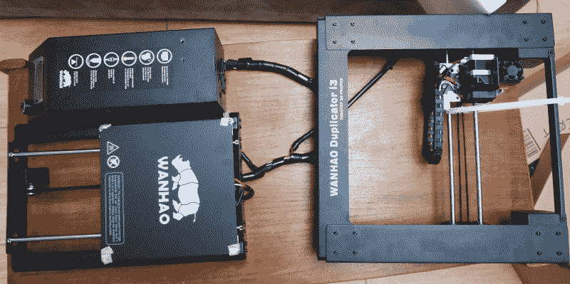
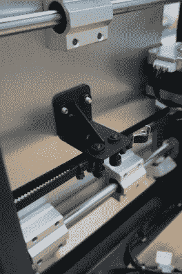
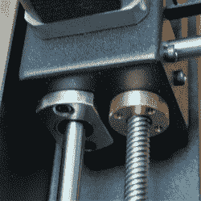
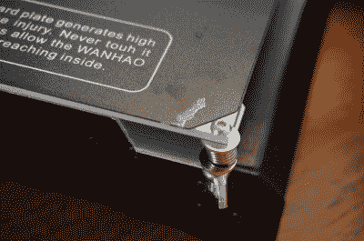
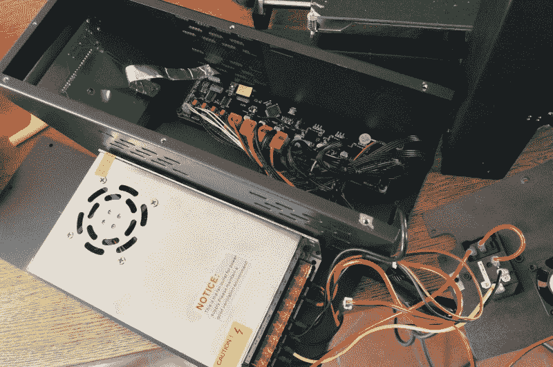
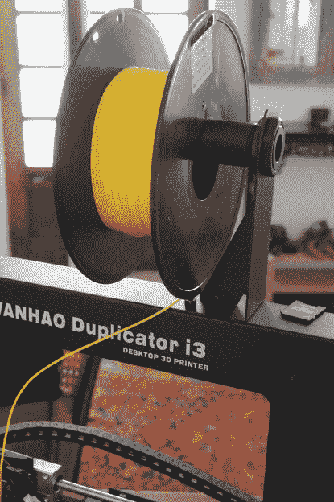
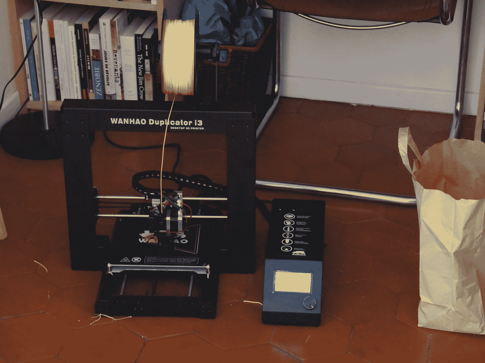

# 万豪复印机 I3 应该结束“最便宜的打印机”Kickstarters

> 原文：<https://hackaday.com/2016/09/14/wanhao-duplicator-i3-should-put-an-end-to-cheapest-printer-kickstarters/>

万豪复印机是市场上最好的打印机吗？一点也不。它是最佳低价打印机的竞争者吗？绝对的。如果你认为它是一个低价位的打印机，而不是一个成品，那么它可能是同类价格中最好的。

价格在 300 到 500 美元之间的复印机是一台很棒的打印机。同样以[茧](https://3dprint.com/119854/aldi-cocoon-3d-printer/)和[制造商选择](http://www.monoprice.com/Product?p_id=13860)的名字销售，打印机是 Prusa i3 的薄折叠钢板框架克隆。我打开盒子，期待着我能想象到的最明目张胆的成本削减。我以为钢铁会像纸一样薄。这些洞不会排成一行。我以为连接会被不恰当地终止。我以为会着火。

The Duplicator six screws away from being fully assembled. When the manual says find a 1m x 1m flat area to work in it’s not kidding. This table was too small.

我得到的不到一个小时就出来打印了。我得到的是由关心我的人设计的东西，但有明显的成本目标。作为奖励，它甚至打印得相当好。如上所述，框架的基本形状是一个 [Prusa i3](http://reprap.org/wiki/Prusa_i3) 的形状。一个水平钻头支撑着床和 y 轴运动。一个垂直的钻头连接在它的中间，形成一个 t 形，它包含 X、Z 和喷嘴。

 [")](https://hackaday.com/2016/09/14/wanhao-duplicator-i3-should-put-an-end-to-cheapest-printer-kickstarters/2014-07-17-11-13-08-2/) My previous experience with the MK10 can be characterized with the nickname I gave the 2X. An all metal cold-end replacement helped the situation considerably.  An example of the duplicator’s construction. Note the welded on gussets. Lots of nice small details like these.

挤压机和 hotend 是 MK10 挤压机的克隆，是在 Makerbot 得到[智能](http://hackaday.com/2016/07/09/3d-printering-makerbots-class-action-suit-dismissed/)和毁掉[一切](http://hackaday.com/2016/04/28/the-makerbot-obituary/)之前由 Makerbot 推广的[窃取 IP](http://hackaday.com/2014/05/24/makerbot-files-patents-internet-goes-crazy/) hodpodge 的一个进步。到目前为止，尽管警告说这是第一次去，挤出机已经表现出令人钦佩的中等质量的中国解放军长丝。它吃了一卷，正在处理另一卷，没有一次堵塞，这比第一次堵塞前 3000 美元的 Replicator 2X 要远。

我不确定除了 PLA 之外的任何东西是否适合从这个喷嘴中喷出，但是它已经在 200 到 220 摄氏度之间成功地打印出来了。我会一如既往地建议，不要买你能找到的最便宜的灯丝。尤其是黑色细丝。如果寿命和打印质量是你的目标，那就花钱买质量更好的[东西](http://atomicfilament.com/)。

打印机的线性机械是好的，但出身可疑。这台打印机真安静。我质疑最多的组件是杆，但它们似乎是直的，足够精确，如果不是精确的话。

So we meet again my old nemesis.

线性轴承是标准的 LM8UU 轴承，我们都知道和喜欢。所有这些都被压入坚固的铝枕块中，想必当时已经正确预加载。这意味着，如果您需要开始追踪精度问题，轴承可以在可能的怀疑列表中慢慢下移。杆的直径或它们安装在框架上的奇怪方式更可能是罪魁祸首。

Z 轴在两个 ACME 螺纹丝杠和黄铜丝杠螺母上运行。真的，这台打印机上的 Z 非常好，尽管我确实有一个[奇怪的熟悉的抖动](http://hackaday.com/2016/04/29/fail-of-the-week-my-3d-printer-upgrade/)，这让我相信如果想要更好的打印质量，需要认真解决对齐问题。另一种可能是其中一个螺丝弯了，但这似乎不太可能。不幸的是，我使用打印机的时间不到两个月，所以我没有机会弄清楚。此外，这看起来是一个巨大的没有回报的工作。整个 Z 装配是令人生畏的难以接近，当谈到把它拆开。尽管万豪包含了所有的工具。如果你想维修它，请做好完全拆卸的准备。

X 和 Y 是我们期待的标准皮带排列。两者都是可使用的结构。我印象非常深刻，看到焊接角撑板加强了一些支架。这种价位的打印机不一定需要它们，但对我来说，它们清楚地表明了打印机的设计者是在乎的。然而，X 带确实摩擦了其中一个轴台。许多人向万豪抱怨这一点。因此，我个人注意到零性能问题。不管怎样，万豪最终还是用卡扣式塑料片替换了一个轴台，从而解决了新型打印机的问题。这在机械上有点令人失望，但仍然显示了对社区值得称赞的响应。

Threaded rod and linear bearings. Complex sheet metal parts.

安装它的框架几乎全部由弯曲的涂漆金属板制成。总的来说，弯曲工作做得很好，零件显示出良好的加工程度。当需要将螺丝孔对准它们的匹配特征时，只需稍微弯曲一下框架就能使其完全对准。在这个问题上，每一个螺纹孔都是完美的。我还对每项任务所需的少量螺钉印象深刻。我仍然记得在 Makerbot Replicator 2X 上做简单的日常工作时，不得不拆除许多不必要的螺钉。

尽管是金属的，但框架确实有点弯曲。我不会说它比原始 Prusa 的螺纹杆和 3 毫米钢板结构更坚硬，但它肯定比任何由木头或丙烯酸制成的东西更坚硬。不过 Thingiverse 上有一个简单的 3D 可打印模块。它完成了底部和垂直部分之间的三角形，并极大地加强了整个结构，以获得更好的印刷效果。尤其是快速打印时。

The full bed assembly sandwich. With residue of an extremely hard to remove tape.

这张床是一块铝制的印刷电路板，上面有一层 BuildTak 类材料。这部分工作完美，我没有任何问题。然而，四个调平螺钉和弹簧连接的底板薄得可怜。这是一张冲切的铝板。平整印刷床真的很令人沮丧。如果拆卸零件需要任何力量，底板会轻微弯曲，需要重做整个过程。

如果我可以对这台打印机做一个明确的改变，它将集中在床安装板和水平螺丝。理想情况下，该板应由更轻、更硬的材料制成，螺钉应由自动床调平代替。

可以预见，电子产品会很便宜，但不会比许多更昂贵的套件包装的更差。它目前运行的是一种改良的 Melzi 板，旨在尽可能降低大规模生产的成本。它有一个定制的固件，[考虑到如果故障保险被移除可能发生的事情，](http://hackaday.com/2016/03/21/ask-hackaday-mrrf-edition-3d-printers-can-catch-fire/)可能应该立即被替换为香草马林或 Repetier。

The electronics were nicely done.

尽管万豪复印机的第一次迭代有严重的连接问题，但这一次做得非常好。连接器都是便宜的，但质量 JST 类型。压接正确，电线贴好标签。做工还不错。有一些奇怪的东西，比如用电工胶带把连接器粘在一起，而不是用热熔胶，或者更贵的选择，买一个带正锁的连接器。

就布线而言，纯粹出于价格原因，肯定有一些设计妥协。右侧的 z 轴电机、y 轴终点挡板和 x 轴电机没有任何保护装置。另一种长度的锚链甚至螺旋织布机可能会将预算压得太高。电缆本身应该耐用，但在移动机器时应小心不要将其拉出。

巨大的驱动外壳内部也很漂亮。有很多不错的东西，如彩色编码连接器、EMI 屏蔽和交流输入的适当隔离。电力供应是山寨的，但他们似乎在社区做得很好。值得注意的是，巨大的电子盒不会从主打印机上分离。这很可能是这样做的，以便不同的工厂或他们工厂的一部分可以做最后的组装，测试等。在电子设备上。然而，它非常笨重，而且如果移动打印机时不小心，很可能会断开连接。

The built in spool holder works well. It’s a nice feature. Weirdly, the plastic piece was turned on a lathe, not molded.

### 结论

我用复印机越多，我对这家公司的印象就越深刻。是的，这台复印机很便宜。元件很便宜。这个框架很便宜。它从头到尾都很便宜。该公司仍然提供服务。它工作了。很安静。它设计得很好。

这是一个开箱即用的完整打印机，但我觉得与高端完整打印机相比，它在排名中的价格一样低。然而，如果您不将这台打印机与完整的组件进行比较——如果您认为它是一个套件，并且不介意再花两三百美元购买它——完全有可能将这台打印机改装成与任何高端打印机一样好的打印机。 **[这些打印机周围的社区令人惊叹。](http://3dprinterwiki.info/wiki/wanhao-duplicator-i3/)** 更坚固的底座、框架加固、自动底座调平、更可靠的挤出机、仔细的校准和固件升级是这台打印机与其更昂贵的竞争对手之间的所有优势。

除此之外，我对万豪的印象很好。他们没有世界上最好的支持，但如果您想要更好的支持… *为您的硬件* 支付更多费用。尽管在每次迭代中改进都消失了，但他们似乎还是听取了抱怨。他们最新的打印机摆脱了恼人的微型 SD 卡，奇怪的外部电子盒，等等。他们正在证明自己是一个强大的竞争对手，高端 3D 打印机制造商需要大幅提升他们的竞争力，否则他们会发现自己很难证明自己在不远的将来会有更高的成本。我们经常看到新的 Kickstarter 活动，试图将自己推销为最便宜的 3D 打印机。这款打印机实际上避开了[的蛇油](http://hackaday.com/2016/05/11/peachy-printer-collapses-investor-built-a-house-instead-of-a-printer/)，并提供了一款大多数人认为“低”的打印机。

It wasn’t love at first sight. There were trust issues. The Duplicator did spend the first two weeks on the floor. Just in case it felt like catching fire.