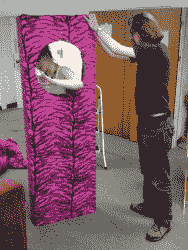

# EMF Camp 2016，个人评论

> 原文：<https://hackaday.com/2016/08/11/emf-camp-2016-a-personal-review/>

如果我能给 Hackaday 的读者提供一条建议，那就是:永远不要成为你的 hackerspace 董事会中唯一拥有大型旅行车的成员，除非你喜欢把整个 hacker camp village 装进你的车里，在八月的炎炎烈日下横跨半个国家运送它。

我洗好了衣服，晾好了帐篷，还把两个乐购包里的东西分成了几类:垃圾、食物、露营装备和有趣的东西。当我写这篇文章时，昨天是[电磁场 2016](https://www.emfcamp.org/) 的拆卸日，这个活动自称为“*一个非营利性的英国露营节，面向那些有好奇心或对制造东西感兴趣的人:黑客、艺术家、极客、手工艺者、科学家和工程师”*，这是从作为[牛津 Hackspace](https://oxhack.org/) 村的一部分和为 Hackaday 和 Tindie 摇旗呐喊的角度对这个活动的个人描述。

## 准备

The denizens of Oxford Hackspace hard at work on their M.

EMF 营地的准备工作对我们来说应该在六个月前就开始了，但是由于这种事情的方式，运行 hackspace 的所有其他部分都被打扰了，我们刚刚进行了大约十天的疯狂活动来让一切都开始进行。你可能已经看到了 EMF Camp 的标志性标志，但你可能没有意识到的是，每个字母都是不同黑客空间或团体的产品。在牛津 Hackspace，我们负责最后两个“M ”,所以这里有很多木制品和粉色丙烯酸老虎图案的毛皮。这个想法是，M 将有一双与运动探测器相连的眼睛，跟踪路人，但遗憾的是，我们尝试的小马达无法克服椅子脚轮的摩擦，眼睛仍然是静止的。如果我们不告诉任何人，没有人会知道他们应该移动，对不对？

我们周末的凉亭整理好了，最后一项任务是为快乐扳手做一根旗杆。我戴着我的黑客帽，我们将代表 [Tindie](https://www.tindie.com/) 举办一个黑客活动。为此，我们推出了一系列 PVC 管下脚料和电缆扎带，为了我的雇主，我将假装这是一个专业的解决方案，而不仅仅是我们在黑客空间中手头上的东西。

当代表 hackspace 计划参加露营时，仔细考虑你想去哪里是很重要的。马戏团的一部分，还是安静的地方？牛津共识是在最激烈的地方，所以我们在竞争的音响系统和烟雾机器之间走下坡路，我们的朋友来自[荷兰](https://wiki.emfcamp.org/wiki/Village:Camp_Holland)和[伦敦 Hackspace](https://london.hackspace.org.uk/) ，对面是[萨里大学 ARES](https://www.ussu.co.uk/ClubsSocieties/societies/ears/Pages/home.aspx) 正在进行焊接挑战的人。如果噪音是持续的，而不是断断续续的，那么噪音就不会成为睡个好觉的障碍，我们重视过往的车辆，因为它们永远是奇观和熟人的来源。

## 工作

A plethora of projects for the [Tindie](https://www.tindie.com/) bring-a-hack.

周五晚上，我们村举办了 Tindie bring-a-hack 活动，我的同事(Jasmine)和(Shane)带着大量的啤酒和小吃来到了现场。你会发现[Shane] [在 Tindie 博客](http://blog.tindie.com)上写关于这些项目的文章，所以除了对社区带来的东西表示感谢，我不会抢他的风头。

The austerity cuts start to bite in the Galactic Empire.

与此同时，在 OxHack 方面，我们有一些东西要展示。我们的同伴成员[菲尔]带来了他在太空中投入如此多精力的 TIE 战斗机飞行员服装，承蒙一位路过的[剑桥 makers pace](http://makespace.org/)成员的好意，他得以从[Sinclair C5](https://en.wikipedia.org/wiki/Sinclair_C5)的驾驶舱与叛军联盟作战。晚上，我们吃了牛肉干坦杜里，前提是在真正的坦杜里烹饪的任何东西都是坦杜里食物。即使是馅饼，现在这就是我们所说的融合美食！照明由另一名成员休·普赖尔(Hugh Pryor)装在老式瓶子里的电致发光灯泡提供，一批又一批的路人停下来取暖，吃坦杜里烤土豆。

## 玩

[![[Hugh Pryor]'s EL wire and bottle light bulbs. Image courtesy of [Jasmine]](img/cffeb500e66d15656fd296d08008f881.png)](https://hackaday.com/wp-content/uploads/2016/08/emf-roundup-hugh-pryor-bulbs.jpg) 

【休普赖尔】笔下的埃尔丝和瓶状灯泡。图片来自【Jasmine】

关于 OxHack、Hackaday、Tindie 说的够多了。其他的呢？第一眼看到这种规模的活动时，你可能会感到不知所措，因为活动实在太多了。你看到的任何地方都有互动艺术品、讲座、活动或迷人的黑客，你停下来打招呼的任何地方都可以无缝地进入有趣的对话，没有非创造者的茫然凝视。总之，我们都回家了，这是属于我们的地方。

Hitchin Hackspace’s Big Hak

那么，在这样一个创意的节日里，有什么会留在人们的脑海里呢？或许是拉平·琉米爱尔或者是 T2 的 Hitchin Hackspace。是的，一辆米尔顿·布拉德利大履带车，大得足以把你从你的村庄载到机器人的臂弯里。也许最好围绕[网站地图](https://map.emfcamp.org/)工作，并按位置提及一些亮点，因为我们已经提到的兔子和大白鲨彼此靠近，那么我们将从那里开始。

[![The Nottingham Hackspace BarBot. Image courtesy of [Jasmine].](img/ef4b5f127b6907a43d49353632a3c854.png)](https://hackaday.com/wp-content/uploads/2016/08/emf-nottinghack-bar-bot.jpg) 

诺丁汉 Hackspace BarBot。图片由【茉莉】提供。向山上移动，如果不参观诺丁汉 Hackspace，天黑后的露营地之旅就不完整。白天，他们卖糖果，但不知何故，从来没有匹配他们晚上的人群。

然后在营地漫步，你会经过爱尔兰大使馆，在那里可以找到都柏林的 hackspace。可悲的是，他们的移动橡皮鸭似乎没有和他们一起穿过爱尔兰海，我错过了吗？

South London Makerspace and their light rope.

在场地的顶部，安静区域的边缘是[伦敦南部的创客空间](http://southlondonmakerspace.org/),带着他们的 LED 标牌和灯绳。后者似乎有了自己的生活，我相信 Top Gear 团队会同意这一点。

场地的西侧似乎是噪音较大的部分，有一些繁忙的村庄和音响系统。沿着围栏的是业余无线电爱好者和高空气球驾驶员，但在主干道上，你会经过 Milliways 餐厅和苏格兰领事馆，然后到达荷兰村。白天是 Stroopwafels，晚上是舞曲，还有和伦敦人的烟雾机大战的一端。我们牛津黑客空间的成员只是坐在中间欣赏表演。

Stroopwafels at the Netherlands Village.

营地下面的场地底部是主舞台、休闲室、机械臂酒吧和食品摊贩。这里有一系列精选的装置，包括 [Fire Pong 游戏](http://wp.me/pk3lN-UIn)，一个由网络控制的 LED 灯棒组成的网格，以及一个巨大的吉他英雄克隆体。营地的这一部分还有一个较小但更吸引人的艺术装置，一个由接近传感器触发的[旋转音乐合成器](https://www.youtube.com/watch?v=zrD6dpDZits) (YouTube)。不断有游客停下来玩它，也许是互动性加上它像人一样的身材让他们将其拟人化。

这种短暂的网站之旅几乎没有触及到所提供的一切。这里有各种各样的官方会谈，也有许多小村庄的活动，所以总有东西可看。晚上有音乐，特别让我难忘的是 OxHack 成员和 ZX Spectrum chip tune rock star[gas man]的现场演出。遗憾的是，在我写这篇文章的时候，这场表演还没有上线，不过为了体验一下[的味道，你可以在 2014 年的 EMF 夏令营](https://www.youtube.com/watch?v=-vZ_M83dB7E)上看到他。

这就是我的 EMF 营地，主要分为牛津黑客空间和黑客日常工作。我睡眠不足，吃了太多油腻的食物，节日卫生是一种不被享受的体验，为了避免排队，我不得不在半夜洗澡。2018 年我还会回去吗？太好了。

当她不为 Hackaday 写作时，Jenny List 是牛津 Hackspace 的董事。