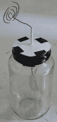
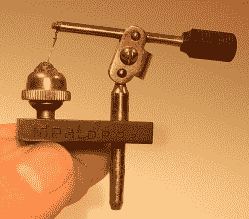
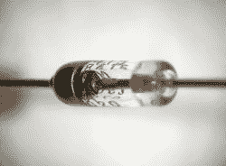
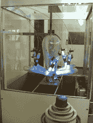
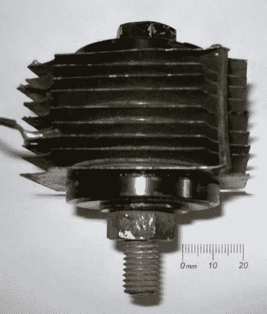
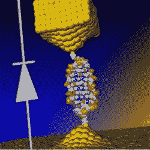

# 二极管的历史

> 原文：<https://hackaday.com/2016/08/15/history-of-the-diode/>

二极管的历史是有趣的，因为它充满了偶然的发现，有时不得不等待几十年才能使用所发现的东西。两个例子是我们的前两个主题:热离子发射和半导体二极管。所以让我们开始吧。

## 真空管/热离子二极管

我们的第一个意外发现是热离子发射，多年后导致真空管。热离子发射基本上是加热金属或涂层金属，使其表面发射电子。

Electroscope

1873 年，弗雷德里克·格思里给他的验电器充了正电，然后拿一块炽热的金属靠近验电器的终端。白热化的金属向终端发射电子，这当然中和了验电器的正电荷，导致叶片聚集在一起。带负电的验电器不能这样放电，因为热金属只发射电子，也就是负电荷。因此，电子流的方向是单向的，最早的二极管诞生了。

托马斯·爱迪生在 1880 年独立发现了这一效应，当时他试图找出为什么他的灯泡里的碳丝经常在正极连接的一端烧坏。在探索这个问题时，他制作了一个特殊的真空灯泡，其中他有一块金属连接到电路的正极，并固定在灯丝附近。他发现一股看不见的电流从灯丝流向金属。由于这个原因，热离子发射有时被称为爱迪生效应。

热离子二极管。由 Svjo [CC BY-SA 3.0]，via[Wikimedia Commons](https://en.wikipedia.org/wiki/File:Diode-english-text.svg)

但是直到 1904 年才首次实际使用这种效果。从 1881 年到 1891 年，约翰·安布罗斯·弗莱明实际上是爱迪生电灯公司的顾问，但现在为马可尼无线电报公司工作。1901 年，该公司展示了横跨大西洋的第一次无线电传输，即莫尔斯电码中的字母“S”或三个点。但是从背景噪音中分辨出接收到的信号是如此的困难，以至于结果是有争议的(现在仍然是)。这让弗莱明意识到需要一个比他们一直使用的相干仪更灵敏的探测器。所以在 1904 年，他尝试了爱迪生效应灯泡。它工作得很好，调整高频振荡并将信号传递给检流计。他申请了专利，弗莱明电子管，二元真空管或热离子二极管出现了，预示着几十年来许多后续类型真空管的技术发展。

真空管在 20 世纪 40 年代开始被硒二极管取代，在 20 世纪 60 年代被半导体二极管取代，但今天仍用于大功率应用。音响发烧友和录音棚也重新开始使用它们。但这只是我们历史的开始。

## 固态/半导体二极管

猫的触须。作者:霍尔格。几乎在弗雷德里克·格思里用验电器发现热离子发射的同时，1874 年，卡尔·费迪南德·布劳恩正在研究溶液中金属盐的导电性。他意识到有些盐，如方铅矿(又名硫化铅)，在未溶解时就导电了。他随后发现，它的电阻随电压的大小和极性而变化，如果电极是尖头线，这种效果最好。因此，他发明了方铅矿(又名硫化铅)点接触整流器。方铅矿是一种半导体，所以这是一个半导体二极管。

这就是后来众所周知的猫须探测器，并在 1894 年用于微波实验。1906 年，G.W .皮卡德获得了硅探测器的专利，而亨利·哈里森·蔡斯·邓伍迪获得了碳化硅探测器的专利。就这样，猫须开始广泛应用于水晶收音机中，并被大量生产。

锗二极管。由莫奇葩[CC BY-SA 2.5]，via[Wikimedia Commons](https://en.wikipedia.org/wiki/File:Diode-closeup.jpg)

但是到了 20 世纪 20 年代真空管在很大程度上取代了猫须探测器的使用。然而，在第二次世界大战期间，点接触半导体探测器，包括硅和锗，被重新用于微波雷达探测器，因为真空管探测器不能在这些频率下工作。

第二次世界大战后，没有需要调整的点接触的锗二极管被大量生产，并被证明与方铅矿一样灵敏。因为它们不需要猫须探测器所用的调整，这开启了现代半导体二极管晶体收音机的时代。

## 汞弧整流器

Mercury-arc rectifier

一种听起来吓人、看起来怪异的二极管是汞弧整流器。这是彼得·库珀·休伊特在 1902 年发明的，并在 20 世纪 20 年代和 30 年代得到发展。直到 20 世纪 70 年代，这些都被用于将高压交流电和大电流交流电转换成直流电。它们由一个汞蒸气容器组成，容器底部有一个汞池。汞池也充当阴极。容器中还有碳阳极。水银自由发射电子，而阳极发射的电子很少。电弧在池中产生，电离了阴极和阳极之间的汞蒸汽，形成了导电路径。应用包括电池充电、电弧照明系统、电车、地铁和电镀。

20 世纪 70 年代，晶闸管取代了汞弧整流器。但是由于晶闸管除了阳极和阴极之外还有一个栅极触点，我们在这里就不讨论了。

## 氧化铜和硒二极管

硒二极管是另一个早期发现后推迟实际应用的例子。第一个硒二极管是在 1886 年由 C.E. Fitts 制造的，但直到 20 世纪 30 年代才投入使用。它最终被用于收音机、高电流电池充电器、电视机和复印机。它们由一层硒和一层镉-锡层的钢板制成，在这两层之间形成一层硒化镉。这种硒和硒化镉形成了半导体-半导体结。它们可以很容易地无限堆叠起来，以承受高电压。它们在 20 世纪 60 年代被电压降更低的硅整流器所取代。1961 年，IBM 试图使用硒二极管开发计算机逻辑，因为硒二极管成本低，但它们被证明不可靠，被硅二极管取代。

铜氧化物二极管与硒二极管大约同时发明，用途相似。在他们的情况下，铜金属上的氧化铜层形成半导体层。像硒二极管一样，它们可以堆叠起来以承受高电压。这些也被硅二极管所取代。

  Selenium diode. By Binarysequence [CC BY-SA 3.0], via [Wikimedia Commons](https://en.wikipedia.org/wiki/File:Selenium_Rectifier.jpg)  Copper-oxide diode

## 肖特基二极管

也许很难找到谁发明了肖特基二极管，因为即使是猫的胡须检测器也是点接触肖特基二极管。肖特基二极管是由一种金属与适度掺杂的 n 型半导体接触形成的，猫须符合这一描述。这种二极管是以德国物理学家沃尔特·h·肖特基的名字命名的，他提出了处理金属-半导体结的物理学。

## DNA 纳米二极管

DNA nano diode (Image credit: University of Georgia/Ben-Gurion University)

为什么不用一些有趣的近期历史来结束二极管的历史呢？来自佐治亚大学和本古里安大学的研究人员在 2016 年 4 月 4 日的《自然化学》杂志上发表报告称，他们已经用 DNA 制作了一个二极管。他们通过在定制设计的 11 个碱基对的 DNA 双链体的特定位置插入两个小珊瑚分子来做到这一点。当在结构上施加 1.1V 电压时，根据极性，一个方向上的电流比另一个方向上的电流高 15 倍。这可能会对分子电子设备的发展产生影响，但正如我们在上面看到的，在实际应用之前有时会有延迟。但我们也知道，等待是值得的。

## 结论

二极管一词从何而来？英国物理学家威廉·亨利·埃克尔斯于 1919 年将希腊语词根 di(意为“两个”)和 ode(意为“路径”)结合起来，提出了这个词，尽管一些资料称 ode 是从迈克尔·法拉第创造的“电极”中借用的。

还有许多其他类型的二极管可以涵盖，但空间和困难，在寻找一些需求的历史，我们就此打住。然而，如果你知道二极管历史上任何其他有趣的步骤，我们很乐意在下面的评论中听到它们。