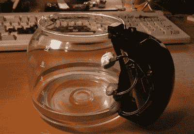
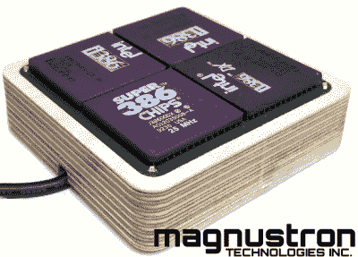
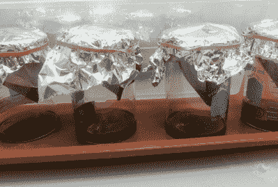
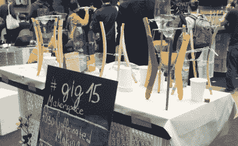

# hack let 120–咖啡黑客

> 原文：<https://hackaday.com/2016/08/13/hacklet-120-coffee-hacks/>

黑客需要燃料来黑客。一般来说，这种燃料以食物、水和咖啡因的形式出现。不一定是这个顺序。虽然苏打水或能量饮料在必要时也可以，但最优秀的黑客知道最纯净的咖啡因来自咖啡。这当然意味着咖啡黑客已经存在了几十年。第一个联网的咖啡壶可以追溯到 1991 年，那时网络还没有图片。从那时起，我们已经走过了漫长的道路。本周，我们将在 Hackaday.io 上盘点一些最好的咖啡秘籍。

 我们先从【opeRaptor】和 [CoffeeOfThings](https://hackaday.io/project/4541) 说起。[OpeRaptor]创造了一个无线、互联网连接的咖啡壶。玻璃瓶有三个 CdS 电池，这使得它能够检测出罐中还剩多少黑金。TMP36 传感器报告当前的咖啡温度。数据通过 NRF24l01 无线电发送出去。咖啡壶的大脑是 MSP430 微控制器。所有这些都来自一个简单的 CR2032 硬币电池。基站接收咖啡数据，并将其显示在一个非常漂亮的真空荧光显示器(VFD)上。然后，ESP8266 将数据传送到互联网上。

 接下来是【马格努斯顿】带 [quad-386 咖啡加热器](https://hackaday.io/project/2621)。没有人喜欢一杯冷咖啡。人人都爱老 CPU。[Magnustron]将这两个淋浴想法变成了世界上第一个 USB 供电的四 CPU 咖啡加热器，具有数据记录功能。一个简单的 ATtiny461 微处理器就能控制一切。使用 V-USB 库通过 USB 连接 PC。[Magnustron]已经让 CPU 预热，但在切换方面有一些问题。穿上。过快打开所有四个加热器会导致导轨下垂，从而导致 USB 连接断开。对于单个 USB 连接来说，那些耗电的 386 芯片可能有点太多了。可能是时候添加外部电源了。

 接下来是【kesh1030】与[利用废弃咖啡作为生物柴油来源](https://hackaday.io/project/7319-using-waste-coffee-as-a-biodiesel-source)。咖啡不仅仅是液体能量。他们的土地里有石油。每年生产的数百万磅用过的咖啡渣可以转化成生物柴油。[Kesh1030]试验了不同的咖啡渣和不同的制备方法。这种油是用己烷从咖啡中提取出来的，己烷是一种有点讨厌的溶剂。[Kesh1030]使用通风橱来保持安全。他发现均质化的咖啡渣具有 11.87%的出油率。用过的均质咖啡渣紧随其后，出油率为 9.82%。考虑到这些都被扔进了垃圾桶，每重量接近 10%的产量并不算太寒酸。

 最后，我们有【saadcaffeine】和[咖啡因:重力驱动的极客燃料滴头](https://hackaday.io/project/7267)。这是一个寥寥数语的项目，但图像讲述了很多故事。[Saadcaffeine]使用 upcycled 和 found 组件创建了自己的冷滴冰咖啡机。三个衣架组成了一个巧妙的三脚架。三脚架上有两个汽水瓶——储水器和冲泡罐。汽水瓶盖上的小孔限制了水的流动。这使得咖啡在机器中缓慢下降，让它有时间吸收所有的咖啡因。结果是一杯新的冷掉。只需添加冰块，享受快速启动！

如果你想看更多的咖啡秘籍，看看我们新的[咖啡项目列表](https://hackaday.io/list/13106-coffee-projects)。看到一个我可能错过的项目？不要害羞，[在 Hackaday.io 上给我留言就行了](https://hackaday.io/adam)。这就是本周的 Hacklet，一如既往，下周见。同样的黑客时间，同样的黑客频道，带给你最好的 [Hackaday.io](https://hackaday.io/) ！

如果你想看更多的咖啡秘籍，看看我们新的[咖啡项目列表](https://hackaday.io/list/13106-coffee-projects)。看到一个我可能错过的项目？不要害羞，[在 Hackaday.io 上给我留言就行了](https://hackaday.io/adam)。这就是本周的 Hacklet，一如既往，下周见。同样的黑客时间，同样的黑客频道，带给你最好的 [Hackaday.io](https://hackaday.io/) ！

如果你想看更多的咖啡秘籍，看看我们新的[咖啡项目列表](https://hackaday.io/list/13106-coffee-projects)。看到一个我可能错过的项目？不要害羞，[在 Hackaday.io 上给我留言就行了](https://hackaday.io/adam)。这就是本周的 Hacklet，一如既往，下周见。同样的黑客时间，同样的黑客频道，带给你最好的 [Hackaday.io](https://hackaday.io/) ！

如果你想看更多的咖啡秘籍，看看我们新的[咖啡项目列表](https://hackaday.io/list/13106-coffee-projects)。看到一个我可能错过的项目？不要害羞，[在 Hackaday.io 上给我留言就行了](https://hackaday.io/adam)。这就是本周的 Hacklet，一如既往，下周见。同样的黑客时间，同样的黑客频道，带给你最好的 [Hackaday.io](https://hackaday.io/) ！