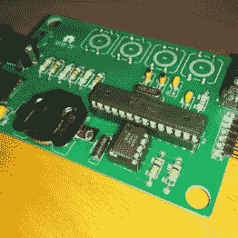
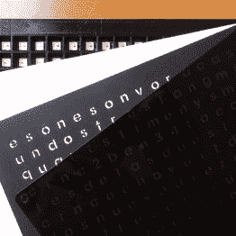
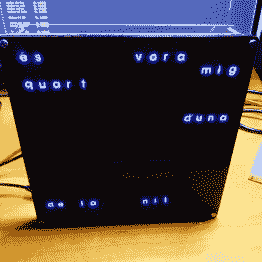

# 认识到真相…没有字钟

> 原文：<https://hackaday.com/2016/08/24/realize-the-truth-there-is-no-word-clock/>

你总是看着它被编码吗？你必须这么做。图像翻译为 construct 程序工作。

字钟被认为是将时间解码成更易读的格式。幸运的是*【Xose pérez】设法恢复了我们都生活在其中的模拟的编码时间信号，他的 [字钟使用时尚的矩阵代码动画](http://tinkerman.cat/wordclock/) 显示时间。*

 *[Xose]已经制作了自己版本的[Philippe Chrétien 的][Fibonacci 时钟](http://www.instructables.com/id/The-Fibonacci-Clock/)和[Jeremy Williams 的][游戏框架](https://www.youtube.com/watch?v=lN4X4grFZa0)，同时他还设计了一个漂亮的小 PCB。它由 ATmega328p 供电，具有一个带备用电池的 RTC 和一个 SD 卡插座，可以驱动一堆 WS2812Bs 又名 NeoPixels。由于他的设计还有几份备用库存，他的新单词时钟也是由这块电路板驱动的。

      

时钟本身基本上是一个三明治，正面是激光切割的烟熏丙烯酸面板，背面是透明的丙烯酸板。在它们之间是一个激光切割的纸板字母面具，一张作为扩散器的白纸，一个 3D 打印的黑色矩阵，以及一个灵活的 16×16 WS2812B 面板。

除了[矩阵效果](https://en.wikipedia.org/wiki/Matrix_digital_rain)，【Xose】还在他的固件中实现了一些其他的显示模式和多语言支持。所有 CAD 数据和时钟的固件都可以在 [Bitbucket](https://bitbucket.org/xoseperez/wordclock) 存储库中获得，还有一个[存储板的 Gerber 文件](https://bitbucket.org/xoseperez/fibonacci_clock/)，所以你可以轻松地复制这个版本。[Xose 的]时钟目前支持西班牙语和加泰罗尼亚语，但是可以很容易地修改固件和用于掩码的 OpenScad 文件，以添加其他语言。欣赏下面的视频，其中[Xose] ~~给你两粒药丸~~展示了他的身材:

 [https://www.youtube.com/embed/UyPIY5EXusk?version=3&rel=1&showsearch=0&showinfo=1&iv_load_policy=1&fs=1&hl=en-US&autohide=2&wmode=transparent](https://www.youtube.com/embed/UyPIY5EXusk?version=3&rel=1&showsearch=0&showinfo=1&iv_load_policy=1&fs=1&hl=en-US&autohide=2&wmode=transparent)

*