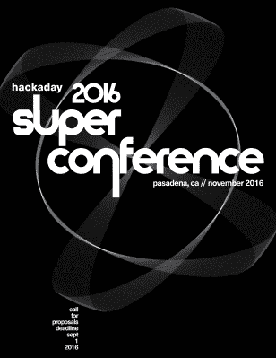

# 成为有史以来最好的硬件会议的一部分

> 原文：<https://hackaday.com/2016/08/15/hackaday-superconference-call-for-proposals-2/>

2016 年黑客日超级大会开始了。如果你还没有时间[提交你的提案](https://docs.google.com/forms/d/e/1FAIpQLScDw3-DVJSYZT8cQZBId671xSDScnJc6VSQ_Ga961ZEBu6F_A/viewform)参加全球最大的硬件会议的讲座或研讨会，现在是时候了。我们在寻找一切——来自战壕深处或抓放点附近的战争故事，让你的板房远离你的实验室 5000 英里的问题，以及那次你偶然在回流烤箱的固件中发现 P=NP。

Hackaday super co 将于 11 月 5 日和 6 日在加州帕萨迪纳举行，届时将有数百名黑客、设计师、工程师和你想见的唯一创客参加。我们将会有几个举办讲座、研讨会和其他各种活动的场所。

讲座将安排 20-40 分钟，研讨会将安排 1-4 小时。在这两种情况下，主题可以从快速原型，新的和有趣的技术，技术设计的创造力，以及产品开发和制造的故事。

去年的超级大会是我们见过的最大的硬件会议。这一成功完全归功于 Hackaday 社区的天才工程师、演讲者和主持人，他们将自己的故事汇集在一起，为了所有人的利益而分享。如果你不能来，你仍然可以查看去年的所有讲座。

如果你正在读这篇文章，并且认为你应该提议一次谈话，那就去做吧！。[提交您的提案](https://docs.google.com/forms/d/e/1FAIpQLScDw3-DVJSYZT8cQZBId671xSDScnJc6VSQ_Ga961ZEBu6F_A/viewform)。这次会议之所以成功，是因为有了令人敬畏的 Hackaday 社区和像你一样的读者的努力。

如果你想知道 Hackaday Supercon 的日常谈话是什么样的，我介绍(如下)我所见过的最棒的谈话。这是[耶鲁安·多姆伯格]也就是[sprite_tm]创造电子鸡矩阵的努力。这是 13 只电子鸡，完全虚拟化，模拟，运行在服务器上，在没有任何意识到自己在电脑里的情况下，过着自己的生活。

 [https://www.youtube.com/embed/3_-e_cJ1-Gs?version=3&rel=1&showsearch=0&showinfo=1&iv_load_policy=1&fs=1&hl=en-US&autohide=2&wmode=transparent](https://www.youtube.com/embed/3_-e_cJ1-Gs?version=3&rel=1&showsearch=0&showinfo=1&iv_load_policy=1&fs=1&hl=en-US&autohide=2&wmode=transparent)

