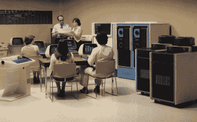
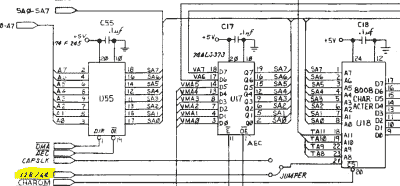

# 你应该读的书:新机器的灵魂

> 原文：<https://hackaday.com/2016/08/26/books-you-should-read-the-soul-of-a-new-machine/>

如果有一本书描述了处于前沿设计的战壕中意味着什么，那本书就是新机器的灵魂 [*。多年来，特雷西·基德的这本获得普利策奖的书激励了成千上万的人。*](https://en.wikipedia.org/wiki/The_Soul_of_a_New_Machine)

*魂*是创造数据将军 Eclipse MV/8000 的故事，代号鹰。Eagle 是数据通用公司的第一台 32 位小型计算机。如果你不是一个逆向计算爱好者，小型计算机在 70 年代和 80 年代是一个主要行业。从 1964 年数字设备公司(DEC)的 PDP-8 开始，minis 为公司提供了一种获得计算机的低成本方法。唯一的其他选择是像 IBM 这样的公司提供的大型主机。直到 20 世纪 90 年代，基于微处理器的个人电脑和工作站超越了小型机，小型机才开始突突前进。市场和产业蒸发了。

30 多年后的今天，小型机几乎被遗忘了。Data General 本身早已不复存在，于 1999 年被 EMC 收购。DG 在风景上的印记几乎被技术进步的流沙抹去了。除了在 *Soul* 中设定的快照 Kidder。

An MV/8000 installation (from DG literature)

设计新计算机的技术方面只是这本书的一部分。一台新机器的灵魂是三个故事:工程师的故事、经理的故事和他们制造的机器的故事。由于这个原因，这本书已经成为工程学院和管理学院的必读书目。

这本书吸引大众的地方在于基德用通俗易懂的语言解释极其复杂的话题的非凡能力。他设法解释了 32 位 CPU 的内部工作原理，一直到微代码的层次。他深入研究了可编程阵列逻辑(PALs)，这是你今天在我们的页面上读到的 CPLD 和 FPGA 器件的前身。PALs 在 70 年代后期是一项热门的新技术。他们允许 Eagle 团队快速做出更改——而无需拿出他们的绕线工具。

基德设法解释这些事情的方式不会让普通人抓耳挠腮，但也不会让技术娴熟的人感到厌烦。如果 Tracy Kidder 决定不再写非小说类的东西，他将会以写用户手册为职业。

一台新机器的灵魂开始于一个非常不可思议的地方——一场狂风暴雨中一艘帆船的甲板上。这个场景是我们对书中明星的介绍——汤姆·韦斯特，Data General 公司的一名经理。西方是多面的，至少可以说是神秘的。一位受阿波罗计划启发而从事电子工作的民谣吉他手。尽管对美国国家航空航天局来说，他晚了几年。最终，他发现自己在世界各地旅行，为史密森尼学会的天文观测站建造和调整极其精确的时钟。这条曲折的道路最终把他带到了 DG，在那里他被聘为计算机工程师，并迅速晋升。

此时，Data General 已经在 32 位计算机上工作。该公司最优秀、最聪明的工程师已经开始研发“源泉”，这是一款无拘无束的下一代机器。Data General 和马萨诸塞州政府之间的税务纠纷导致该公司将整个 FHP 团队转移到北卡罗莱纳州的 RTP。韦斯特领导了设计 Eclipse 计算机的小组——这种 16 位微型计算机是通用数据公司赖以生存的基础。这为激烈的公司间竞争以及激烈的资源竞争创造了条件。West 的几个项目还没推出就被取消了。直截了当地说，他很生气。

韦斯特找到首席执行官埃德森·德卡斯特罗，问他想要什么。答案很简单:没有模式位的 32 位 Eclipse。

### 男人和时尚

任何公司都要处理老产品。在计算世界中，这个术语就是遗产。在计算机行业，这是一个特别棘手的问题。新一代的计算机通常需要与旧的兼容。破坏兼容性将意味着所有客户的软件都必须被移植——这是一项漫长而艰巨的工作，为竞争对手的入侵打开了大门。

设计师如何添加新功能，同时保持与旧软件的兼容性？答案往往是模式位。在“传统模式”下，新机器的行为与老一代完全一样。切换到“现代模式”,新电脑的真正力量将被释放。问题是，下一代机器将需要不同的模式位来与之前的每一代兼容。一个(简化的)例子是英特尔的 x86 架构。286 必须与 8086 兼容，因此创建了保护模式。快进到 x86-64，并且[我们有多达 7 种模式](https://en.wikipedia.org/wiki/X86-64#Physical_address_space_details)，在 16、32 和 64 位系统之间切换。

韦斯特无法独自制造一台计算机。他找来了卡尔·阿尔辛和埃德·拉萨拉中尉。他们一起招募了一个由 20 多岁刚从大学毕业的年轻人组成的团队。工程师分成两组——设计硬件的哈弟小子和编写微码的 microkids。

项目中的每个人都进行了非正式的“注册”仪式，这是 West 发明的一个术语。签约一个项目的工程师同意超越职责要求，以确保项目成功。周六，周日，每周 90 多个小时，无论如何。所有这些都是以工程师的个人生命为代价的。让应届大学毕业生报名很容易。

Tracy Kidder (left) and Tom West give a talk at the computer museum

韦斯特不是一个友好的经理。他没有打招呼，甚至没有在走廊里向他的新成员打招呼。有人甚至给他起了个绰号叫“黑暗王子”。这完全是一种蘑菇管理和聪明(如果不道德的话)操纵的形式，以从团队中获得最大利益。另一方面，韦斯特让他的团队免受上层管理人员的干扰。他们在隐蔽的地下室里辛苦工作。

基德在书中花了很多篇幅讲述韦斯特和这些工程师。他变得深入人心，拜访工人的家，会见他们的家人，看他们在鹰计划之前花时间做的爱好和艺术品。了解他们的希望、梦想，以及驱使他们如此努力工作的原因。

这毕竟是一本关于历史的书，不想剧透就此打住。可以说，这个团队最终确实把老鹰弄出了门。在一次政治行动中，韦斯特被派往日本数据公司。老鹰乐队解散了，他们中的许多人离开了公司去寻找新的工作。如果他们中的任何人期望从公司获得荣誉和股票期权，他们来得很慢。《连线》杂志在 2000 年调查了这些工程师。现在，随着 1978 年 20 多岁的人接近退休，你可以在 LinkedIn 和其他社交媒体网站上找到他们。

一旦这本书付印，这个团队，尤其是韦斯特，就成了计算机行业的小名人。Data General 利用了这一点，一有机会就跑到西部去签名售书和推广新设计。他对此并不满意，但他在公司一直呆到 1998 年退休。韦斯特于 2011 年去世。他的讣告登上了《纽约时报》。他的女儿[杰莎敏·韦斯特](https://en.wikipedia.org/wiki/Jessamyn_West_(librarian))，一位有成就的图书管理员和元过滤器工作人员[发布了一个链接](http://metatalk.metafilter.com/20664/RIP-Tom-West)到[他的 Flickr 页面](https://www.flickr.com/photos/tomwest/)。虽然它没有包含许多数据通用鹰项目的照片，但它确实有汤姆传说中的家庭工作室的镜头。

鹰的故事并不是独一无二的，事实上，几乎每个公司都有一个让员工回忆的故事。一个是关于一个项目，人们投入了疯狂的时间，克服重重困难完成了工作。不同的是，这个项目是用每个人都能理解和理解的语言写的。特雷西·基德的能力在这里怎么强调都不为过。

 *一台新机器的灵魂*对当时的工程师以及此后的几十年都产生了影响。我发现了一个与 Hackaday 编写人员交谈的例子:一名开发 Commodore 128 的工程师被告知删除 128/64 模式位。它几乎成功了，除了字体 ROM 中的一个 bug，这个 bug 是由流行的考拉画图程序发现的。128 的首席硬件设计师比尔·赫德也读过这本书。他决定在手边准备一个伪模式位，本质上是所有在 64 模式下开启的东西的总和。[比尔的]保险政策用这个 bug 得到了回报。128/64 模式位用于在原始 C64 字体 ROM 和扩展的 128 ROM 之间切换。

### 进一步阅读

*   [*亚马逊上一台新机器的灵魂*](https://www.amazon.com/Soul-New-Machine-Tracy-Kidder/dp/0316491977)
*   [汤姆·韦斯特和特雷西·基德 1983 年在计算机博物馆的谈话(pdf 链接)](http://ed-thelen.org/comp-hist/TCMR-V04.pdf)
*   工程师:连线，2000 年 12 月 1 日
*   [灵魂，失物招领:连线，2000 年 12 月 1 日](http://www.wired.com/2000/12/eagleteam/)
*   [汤姆·韦斯特的讣告:纽约时报，2011 年 5 月 27 日](http://www.nytimes.com/2011/05/28/business/28west.html?ref=deathsobituaries)