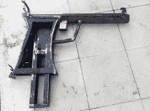
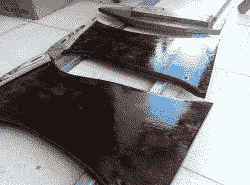
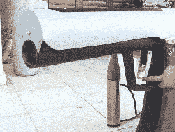

# 啤酒枪射出非致命剂量的饮料

> 原文：<https://hackaday.com/2016/08/16/beer-gun-shoots-non-lethal-doses-of-bewerages/>

喜欢用钢铁建造东西。枪是钢做的。他和他的朋友也喜欢动作片和啤酒。为了满足每个人的需求，他建造了一个巨大的啤酒枪。这件壮观的艺术品的尺寸和口径相当于一门小型野战加农炮，为毫无戒心的电影夜游客分发冰镇易拉罐。

在由焊接钢和木头制成的 100 x 70 x 25 厘米(39 x 28 x 10 英寸)的组件内，[Michaelis]安装了一个从自动开窗器中提取的电机。电机驱动桶上方线性轨道上的滑块，将易拉罐从装有弹簧的料盒中取出，并通过桶进行分配。枪管两端的限位开关以及扳机上的限位开关控制着运动。

这种枪还具有一个外部冰水容器，很好地伪装成子弹，以及一个泵，让冰水从容器中通过弹匣循环。像往常一样，在[MakeItExtreme]上，结果得到了一个很好的油漆工作，成为一个真正的醒目。请欣赏下面的构建视频！

 [https://www.youtube.com/embed/OmBTXvRnN-Q?version=3&rel=1&showsearch=0&showinfo=1&iv_load_policy=1&fs=1&hl=en-US&autohide=2&wmode=transparent](https://www.youtube.com/embed/OmBTXvRnN-Q?version=3&rel=1&showsearch=0&showinfo=1&iv_load_policy=1&fs=1&hl=en-US&autohide=2&wmode=transparent)

感谢[Itay]的提示！