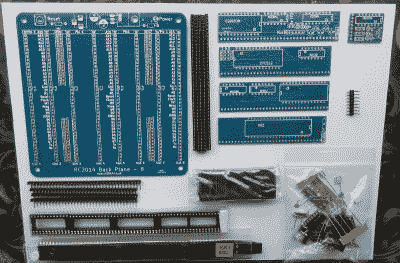
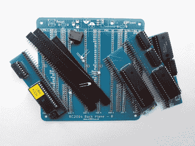
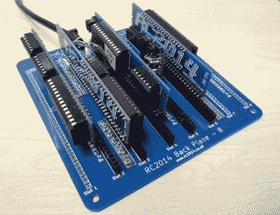
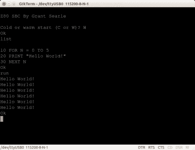
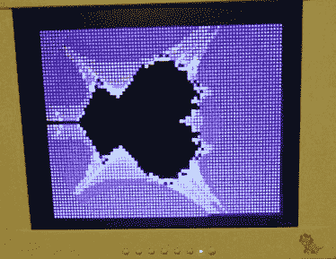

# 回顾:RC2014 Z80 计算机

> 原文：<https://hackaday.com/2016/09/08/review-the-rc2014-z80-computer/>

作为黑客和创造者，我们被多种多样的无障碍计算所包围。从微型微控制器到多处理器发电站，它们已经成为我们艺术的通用工具。如果你考虑它们的架构，你会有一个令人惊讶的发现。现在很少直接与微处理器总线接口。微控制器和片上系统将曾经是独立外设的所有功能集成到了它们的封装中，尽管笔记本电脑或服务器等大型机器的处理器总线暴露在外，但当它们进入主板的芯片组时，您永远不会接触到它们。

几十年前，情况绝对不是这样。20 世纪 70 年代典型的 8 位微处理器有一条 8 位数据总线、一条 16 位地址总线和几条请求线，以指示它是想与内存还是 I/O 端口通信。你连接到它的每一个外设都必须有一些逻辑来解码它的地址，并在你想使用它的时候选择它，而且所有的外设都共享处理器的总线。这就是我们这些在 20 世纪 70 年代末和 80 年代初拥有第一台 8 位计算机的人学习计算机硬件的方式，在一个 Arduino 和 Raspberry Pi 的世界里，这似乎是一门失传的艺术。

今天回顾的主题为好奇的硬件黑客提供了一个难得的机会来掌握传统的微处理器总线。[RC 2014](http://rc2014.co.uk/)是一台模块化 8 位计算机，其中包含 RAM、ROM、串行接口、时钟和 Z80 处理器的子卡排列在背板上，允许完全了解和访问系统各部分的工作情况。它带有一个 ROM BASIC，并通过一个串行端口连接到一台主机。此外，外设卡的范围也在不断扩大，包括数字 I/O 卡、LED 矩阵卡、闪光灯卡、用作 VDU 的 Raspberry Pi Zero 卡和小键盘卡。

## 建筑

The RC2014 components as supplied.

打开包装，元器件和电路板整齐地装在塑料袋里。我们的套件没有印刷文档(2016-09-09 更新-我们的套件是几个月前提供的，设计师[在评论中告诉我们，套件现在带有印刷说明](http://hackaday.com/2016/09/08/review-the-rc2014-z80-computer/#comment-3188885)。)，所有文档都可以在项目网站上找到。这些元件都很容易识别，有通孔无源元件、集成电路插座和带有清晰标记的大型双列直插式芯片。套件的模块化性质意味着每个子卡具有相对较少的组件，这意味着它将工作划分为大小方便、易于构建的单元。

这种便利的例外是背板，背板上放置了一系列长的单列插座。像这样焊接 0.1 英寸间距的器件很容易，但考虑到要焊接的引脚数量，有点繁琐。外部两个插座的数据和地址线由一组未提供的跳线隔离，您需要找到并剥去一些连接线来进行这些连接。

Our RC2014, half-built.

子板装置的一部分是一排直角引脚的附件，以与底板插座配合。在这一点上，在组装或我们的审查系统中，一个缺陷在构建中变得很明显。不同的 RC2014 子板面向不同的方向，我们错误地将引脚放在了几块板的错误一侧。这不是一个不可克服的问题，但是它稍微限制了我们的模块可以被放置的顺序。我们建议仔细研究每块板的在线手册和照片，不要被这个项目相对容易的施工所迷惑，产生一种虚假的安全感。

当所有的子板都准备好时，将它们放在背板上是一个简单的过程。每块板上都清楚地标明了插针 1，并且可以很容易地与相应的插座位置对齐。该套件中唯一的非全长板是时钟振荡器，它很容易与背板上标记的 GND 引脚对齐，而不是与引脚 1 对齐。

Our completed RC2014.

我们系统的构建被烙铁上的温度控制器损坏了，烙铁达到了炽热的温度。当时，这导致了[一篇关于 Weller tip 可用性的黑客文章](http://hackaday.com/2016/06/01/long-term-review-weller-magnastat-soldering-iron/#more-206261)，但对于我们的 RC2014 构建来说，这意味着我们的系统在完成时无法工作。它展示了一个奇怪的几乎功能，从 RC2014 发送到主机的文本可以被读取，但从主机发送到 RC2014 的文本是垃圾。

由于使用示波器进行了大量的故障查找，套件设计者提供了支持，并且对连接进行了连续性测试，但未能找到答案，因此套件一直萎靡不振，直到 8 月份的 EMF 夏令营，才有可能与他面对面地一劳永逸地找出问题的根源。在一个节日 hackspace 村的烧烤烟雾中坐了一个小时的英勇的客户支持后，我们最终追踪到问题是一个插座的间歇性故障。过高的焊接温度削弱了接触弹簧，使其具有足够高的电阻来引起问题，但不足以被检测为开路。快速更换带来了立竿见影的效果，我们有了一个正常工作的 RC2014。

## 运行正常的

构建完成并描述了我们背后的硬件，那么软件呢？使用 RC2014 再简单不过了，只要将 FTDI 串行转 USB 引线插入主机，配置终端软件的串行设置，按下复位按钮，就可以使用了。RC2014 不是一个耗能设备，因此很高兴通过 FTDI 从 USB 插槽获取电力。

Proof of a Hackaday writer having learned something at school.

ROM BASIC 由[Grant sear le 提供，源自 20 世纪 70 年代末 Nascom 计算机套件中使用的一种。它有一个典型的时代的基本完整的实现，随着一些自定义关键字转换为二进制和十六进制值。在启动时，如果已经复位，它会让您选择使用现有的内存内容，然后指定一个自定义内存限制。这些选择结束后，你会发现自己处于一个基本的解释器中；准备好挖掘那些在青少年时期数小时输入列表中收集到的几乎被遗忘的技巧。

A BASIC-generated Mandelbrot fractal shows off the RC2014’s graphical capabilities ([rc2014.co.uk](http://rc2014.co.uk/)).

令人高兴的是，许多为类似计算机编写的当代 BASIC 程序可以移植到 RC2014，并且有一个 GitHub 库，其中有许多硬件和 ROM 信息以及一些基本示例。如果您的终端支持向串行端口发送文本文件，无需繁琐的键入即可将代码加载到 RC2014 中。

在一个我们期待即时计算的世界里，在 RC2014 上运行一些软件并意识到它可能需要相当长的时间才能完成，这有点令人震惊。以今天的标准来看，几兆赫的 8 位微处理器上的一个基本解释器并不快。但 RC2014 的买家追求的是 8 位体验，而不是它提供的计算能力，因此从这个意义上说，它提供了一个真实的过去。几十年前，像这样的机器的用户会认为它们非常快，与手工完成同样的任务所需的时间相比，复杂计算的几分钟似乎无关紧要。

## 你需要吗？

RC2014 可能是掌握 1980 年左右的典型 8 位微型计算机硬件的最佳方式，该硬件将在大约 35 年后提供给发烧友。与当时的单板设计相比，模块化设计和标记清晰的总线可能更适合实验人员，因为在检查评估板故障时，用示波器识别和跟踪信号非常容易。我们当然从这个构建中了解到机器的水平比我们用更集成的东西了解到的要低得多。

如果对 RC2014 有什么不满，尽管在于~~它缺乏物理文档~~(更新 2016-09-09-我们的套件是几个月前提供的，设计师[在评论中告诉我们，套件现在带有印刷说明](http://hackaday.com/2016/09/08/review-the-rc2014-z80-computer/#comment-3188885)。).我们关于有缺陷的烙铁的经历纯粹是运气不好，但是如果信息更容易消化的话，我们可能会避免我们犯的其他小错误。然而，这是一个小问题，因为所有的东西都在网上，如果你准备接受它，我们得到的支持是非常高质量的，我们会简单地建议一个潜在的 RC2014 建设者，他们花时间真正熟悉所有可用的信息。

RC2014 在其网站上有完整的硬件信息[，并且可以通过 Tindie](http://rc2014.co.uk/) 作为套件和其不断扩展的外围板[一起购买。如果你对复古的 8 位微型计算机架构感兴趣，那么我们可以热情地推荐你去看看。](https://www.tindie.com/stores/Semachthemonkey/?ref=offsite_badges&utm_source=sellers_Semachthemonkey&utm_medium=badges&utm_campaign=badge_medium)