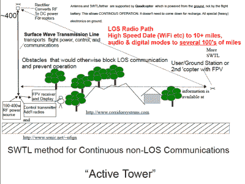

# 高频供电的无人机天线

> 原文：<https://hackaday.com/2016/08/24/hf-powered-drone-antenna/>

业余无线电在 VHF 波段有几个很好的分配，但因为信号不像短波信号那样从电离层反射，所以使用基本上限于视线。一种解决方法是使用高天线中继器，但这需要大量的基础设施或山腰巢穴。

如果你能在无人机上发射天线会怎么样？嗯，首先，你会很快耗尽电池，除非你可以远程供电。如果你试图栓住它，电源线会变得太重而抬不起来。或者他们有吗？！？！

这就是我们的故事变得奇怪的地方。[Glenn，n6gn]建造了一个钻机，[使用一根非常细的电线](http://www.sonic.net/~n6gn/SWTL_Powered_Drone_Antennas.html)远距离传输巨大的能量。诀窍是将高频电力沿着电线传输，此时它变得更像传输线而不是导体。(我们并没有 100%地了解这里的物理原理。)信号在另一端被整流到 DC，在这种情况下，用于驱动四轴飞行器。查看视频(嵌入在下面)，其中[Glenn]演示了早期测试设置。

[格伦]还没有完全实现，但他已经能够发送近 200 瓦的 0.32 毫米的电线，他已经证明了使用气球提升的基本原理。在[Glenn]的网站上有一些更详细的 pdf，其中一些是他在实验性业余无线电项目的 ARRL[QEX 杂志](http://www.arrl.org/qex/)上的文章的转载。这些实验都是用对火腿友好的零件和纸板进行的，所以没有什么能阻止你亲自尝试。

 [https://www.youtube.com/embed/2irtYGsb5kg?version=3&rel=1&showsearch=0&showinfo=1&iv_load_policy=1&fs=1&hl=en-US&autohide=2&wmode=transparent](https://www.youtube.com/embed/2irtYGsb5kg?version=3&rel=1&showsearch=0&showinfo=1&iv_load_policy=1&fs=1&hl=en-US&autohide=2&wmode=transparent)

谢谢[马丁]的提示！