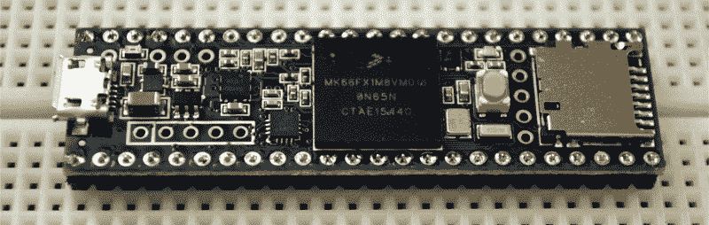
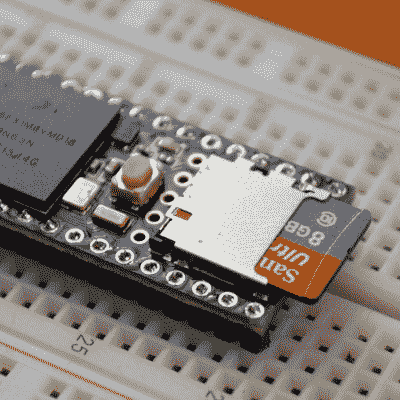
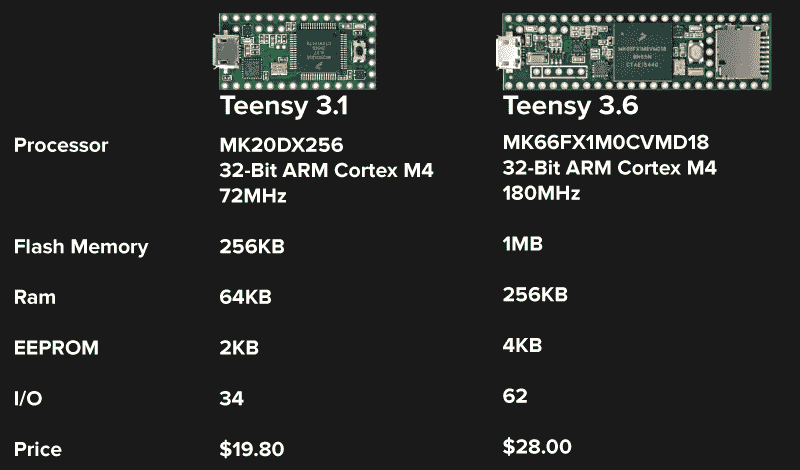

# 介绍 Teensy 3.5 和 3.6

> 原文：<https://hackaday.com/2016/08/17/introducing-the-teensy-3-5-and-3-6/>

Paul Stoffregen 建立了一个新的 Teensy。Teensy 3.5 和 3.6 开发板是功能强大、支持 USB 的微控制器系列中的最新产品。它速度更快、功能更强、体积更大，可以在无焊试验板上放置更多引脚。

第一个 Teensy 是第一个具有原生 USB 的 Arduino 兼容板之一。Teensy 2.0 甚至更好，支持 USB 键盘、鼠标和 MIDI。即使在今天，如果你想构建类似 USB 键盘的东西，Teensy 2.0 也是事实上的主板。在 Teensy 2.0 之后是异常强大的 Teensy 3.0，这是第一个 32 位 Arduino 兼容板，由于 Paul 贡献了一堆 Arduino 库，更快地做酷的东西从未如此容易。自 Teensy 3.0 推出以来，其继任者 3.1 和 3.2 也相继推出。如果您想要 ARM 微控制器的强大功能和最深层次的 Arduino 库支持，那么只有一种板可以考虑。

就像 Teensy 3.0 的发布一样， [Paul 正在通过众筹活动启动最新的 Teensys](https://www.kickstarter.com/projects/paulstoffregen/508891821) 的发布。让我们深入了解这些新主板所能提供的一切。

### 在 Teensy 3.6 里面

Teensys 新系列中的高端产品是 Teensy 3.6。主 CPU 是运行频率为 180 MHz 的飞思卡尔/恩智浦 Kinetis K66 ARM Cortex-M4。该芯片上有 1 兆字节的闪存，256K 的 RAM 和 EEPROM 的 4K，32 个 DMA 通道，两个 CAN 总线端口和一个 USB 高速(480 Mbit/sec)端口。

A native SD card port

微控制器还支持 25 个 13 位分辨率的模拟输入、2 个 12 位分辨率的模拟输出、一个原生 SD 卡端口、支持 100 Mbps 的以太网 MAC(为此您需要一个“屏蔽”)、I2S 音频、一个加密加速单元、随机数发生器、6 个串行端口、3 个 SPI 端口、4 个 I2C 端口和一个实时时钟。

像之前的 Teensy 3.0、3.1 和 3.2 一样，3.5 和 3.6 也装载了 IO。别针。有 62 个 IO 引脚可用作 0.1”接头和背面的 SMD 焊盘，它们都与 Teensy 3.2 完全兼容。这意味着 Teensy 音频适配器板和[道具护罩](http://hackaday.com/2016/03/29/teensy-gets-a-prop-shield/)仍将与这些最新的 Teensys 一起工作。

当然，Teensy 只是一个微控制器板，你需要用它来构建任何东西。在 PJRC 论坛上的大量帖子中，一群青少年黑客[在过去的几个月里一直在整理设备库](https://forum.pjrc.com/threads/34808-K66-Beta-Test?p=106266&viewfull=1#post106266)。FAT 文件系统在 SD 卡上工作，你可以有六个串行端口，Paul 一直在努力让加密加速器库工作。

最新 Teensy 的[众筹活动](https://www.kickstarter.com/projects/paulstoffregen/508891821)现已开始，Teensy 3.6 售价 28 美元，规格稍低，但支持 5 伏电压的 Teensy 3.5 售价 23 美元。

### 这东西很快，我不知道用它做什么

现在有更快的微控制器。STM32F7 是一款运行频率为 216MHz 的 ARM Cortex M7[于去年](http://hackaday.com/2015/06/26/new-part-day-stm32f7-an-arm-cortex-m7)发布，但迄今为止，我们只看到了一个开发板和几个使用这款强大微控制器的项目。当前的工作状态仍然牢牢植根于 ARM Cortex M4，我们已经看到了一些非常令人印象深刻的项目，从视频生成到四轴飞行器控制板都采用了这些芯片。

Teensy 3.5 和 3.6 比你目前能找到的更强大一些——这种芯片才上市几个月。随之而来的是很多可能性，我甚至不知道它能用来做什么。粗略地看了一下数据表，我知道有可能以某种方式将 SDRAM 连接到这个芯片上。我还没有深入研究这一点，看看 Teensy 3.6 是否可行。如果是的话，我们将会看到一些非常令人印象深刻的构建，为 LED 墙生成视频，或者对存储在 SD 卡上的音频波形进行实时合成。

你可以用这个小东西做很多事情，我们迫不及待地想看看社区会做出什么。保罗已经击中了这个公园，这一次你可能会被你的想象力所限制，而不是一个微控制器能做什么。