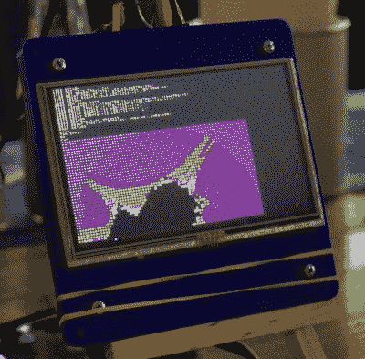

# 伦敦及其他地方的啤酒和出租车

> 原文：<https://hackaday.com/2016/08/18/beer-and-hacks-in-london/>

这个月我们已经走遍了英国，我们最近的一次 Hackaday 聚会就在两天前。由于有很多硬件和黑客展示和讲述(下面详述)，我想确保没有人错过加入的机会，因为我们将于周六在 [Bletchley](https://hackaday.io/event/13187-uk-day-trip-the-national-museum-of-computing) 和周三在[剑桥](https://hackaday.io/event/13177-cambridge-bring-a-hack)参加。无论你是需要更多的说服力来走出家门并加入到乐趣中，还是只想看看迄今为止展示的优秀硬件，请继续阅读，从周三晚上开始分享乐趣。

伦敦的酒吧在当地人中形象不佳，是一个奇怪的霓虹闪烁的地方，住着一大群穿着西装、声音很大的人，喝着价格昂贵的廉价酒。然而事实是，首都的酒吧和美国其他地方的酒吧一样多种多样，从破旧安静的后街酒馆，年长的顾客喝着一品脱一品脱的富勒啤酒，到时髦的仿维多利亚风格的杜松子酒宫殿，留着荒谬胡子的年轻人在那里喝着你不会听说过的用玻璃大酒杯盛的啤酒，他们会在五年后后悔。在一个炎热的八月夜晚，顾客们涌上人行道，为想喝酒的人提供了一个便利的参考，让他们了解这家酒吧的性质。

前一天晚上，这种温暖的傍晚出游很好地服务了我们的社区，因为当一群 Hackaday 读者和 Tindie 卖家聚集在菲茨罗维亚的一家酒吧时，有足够的空间到达酒吧，虽然很难安静，但我们至少可以讨论我们带来的东西。我的同事(贾斯敏)组织了这次活动，手里拿着一大堆贴纸和其他纪念品。

一群经过挑选的黑客和制造者踏上了旅程。他们中的一些人，比如我的朋友大卫，我经常在网上遇到，但从未见过面，所以最好能看到一个名字，而其他人我只知道他们通过在 Hackaday.io 或 Tindie 上的项目获得的声誉。毫无疑问，在这个项目的快速总结中，我不会提到几个名字，所以在我开始之前，我想感谢每个人的到来，让这个夜晚如此美好。

[![[Jasmine] as seen by [Mike]'s LED screen.](img/5438ec94a4ab89bd6a5452227fe0954f.png)](https://hackaday.com/wp-content/uploads/2016/08/jasmine-on-screen.jpg)

[Jasmine] as seen by [Mike]’s LED screen.

### 迈克工作室的电器

最引人注目的是[迈克]，因为他广泛的非常明亮的 LED 项目，他以[迈克的电子产品]而闻名。他的 PCB 密度令人印象深刻，尽管他承认有一台取放机。对于那些大的 LED 矩阵尤其有用。值得注意的是一个五边形的 LED 屏幕，集成了摄像头，最初是 LED 屏幕多面体的一部分。该板提供了一个在野外难得一见的树莓 Pi 计算模块。

### 无磅水槽的示波器探头

整个晚上的大部分时间里，我的对面是【Leonerd】，他带着他的[示波器电流探头适配器](https://www.tindie.com/products/leonerd/oscilloscope-current-probe-adapter/)。正如您所料，该板包含一个非常低的分流电阻和一个放大器，允许精确测量低电流瞬变，而无需拿出一个小国的 GDP 从高端测试设备制造商那里购买。我参加了他和[Mike]关于仪表放大器的一次非常有趣的谈话，这是我个人对 RF 测试设备的经验感兴趣的一点。

The RC2014 in mid-render

### 一辆狂野的 Z80 出现了

出席的还有【斯潘塞】和他的 [RC2014 Z80 电脑](http://rc2014.co.uk/)。他带来了配有键盘和屏幕的完整版本，并让它运行一个用 BASIC 编写的分形图形生成器。这是一个触及到特定年龄人群内心深处的项目，如果你的第一台电脑来自克莱夫·辛克莱爵士，那么也许你会理解。

不过，当晚的价值并不仅仅在于展示的套件和项目。每当你在一个欢乐的环境中让来自我们更广泛的社区的一群人聚在一起时，创造性的话语以意想不到的方向流动，知识被分享，新的想法形成。昨天晚上，全球 Hackaday 和 Tindie 社区的部分成员开始相互了解，由此将产生新的项目。它们不一定能改变世界，但一切都得从某个地方开始。

这个活动是我们在 EMF 夏令营成功的一系列活动中的一个。我们很高兴看到人们带来的项目，他们全面超越了我提供的小广播板。英国活动还没有结束，我们将在[布莱切利](https://hackaday.io/event/13187-uk-day-trip-the-national-museum-of-computing)和[剑桥](https://hackaday.io/event/13177-cambridge-bring-a-hack)举办活动，并一如既往地关注[hackaday . io 活动页面](https://hackaday.io/events)了解我们社区的全球活动。