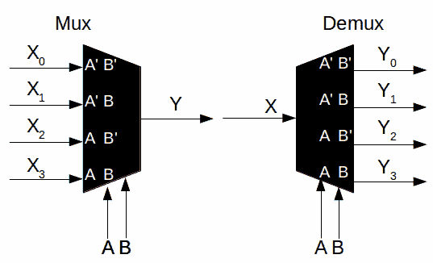

# 黑客字典:Mux/Demux

> 原文：<https://hackaday.com/2016/09/06/hackaday-dictionary-muxdemux/>

在本期 Hackaday Dictionary 中，我们将讨论多路复用器和多路分解器(也称为 mux 和 demux)。它们本质上是对立的，但它们的工作原理是一样的。有三个部分:输入、输出和选择器。

## 基础知识

有了多路复用器，你就有了多个输入，选择器选择使用哪一个输出，并通过管道将其传输到单个输出。就好像一堆人想立刻对你说些什么，你却只能一次听一个。

使用多路分解器，单个输入通过管道传输到多个输出中的一个(但只能是一个)。继续这个例子，就像你想单独对一堆人说些什么，但一次只能对一个人说。

也有芯片两者兼得；称为 mux/demux 芯片。它们也被称为双向多路复用器或交换机。这使得信号可以双向传递，所以你不仅可以和别人说话，而且他们也可以和你说话。

选择器通常是一些以二进制寻址的独立输入。几乎总是有一个“输出使能”线。因此，1:4 解复用器将具有以下引脚:

*   1 个输入引脚
*   4 个输出引脚
*   2 个选择引脚(因为您用 00、01、10 或 11 寻址 4 个输出)
*   1 个 OE(输出使能)引脚
*   1 个 VCC 引脚(通常为 3.3V 或 5V)
*   1 个接地引脚

您经常会在数据手册中看到一个比率，比如 1:2、1:4(通常是 2 的幂)。这意味着单个输入可以分别指向 2 个或 4 个输出。一些多路复用器可以切换多个信号，因此您会看到类似双通道 1:4 的信号，相当于两个独立的多路复用器组合成一个芯片。当将多条并行线路(如 UART 的 RX 和 TX)连接到不同输出时，这些特别有用。

有模拟和数字多路复用器。数字电路本质上是逻辑门，输出电压与 VCC 相同。模拟更适合于读取多个模拟值(如果缺少模拟输入，可以使用单个 demux 将一组模拟读数连接到单个输入)。

## 使用

早期的使用可以追溯到电话交换机。在开关出现之前，有人类操作员。爱丽丝会拿起电话，接线员会回答。这就是 mux 部分，因为在所有的电话线中(大部分是不活动的),操作员选择监听 Alice。她会告诉接线员她想和鲍勃通话(他的电话地址是宾夕法尼亚 6-5000)。这是选择器部分，操作员获取地址并选择对应于 Bob 电话的插孔。这是 demux 部分，其中一行被映射到许多可能输出中的一个。现在爱丽丝和鲍勃可以说话了。这最终实现了自动化，出现了巨大的交换机库，它们可以多路复用呼出的电话，并把它们多路分解到适当的目的地。这是必要的，因为目的地之间只有有限的可用线路。这是一个关于这些机械开关如何工作的视频:

 [https://www.youtube.com/embed/xZePwin92cI?version=3&rel=1&showsearch=0&showinfo=1&iv_load_policy=1&fs=1&hl=en-US&autohide=2&wmode=transparent](https://www.youtube.com/embed/xZePwin92cI?version=3&rel=1&showsearch=0&showinfo=1&iv_load_policy=1&fs=1&hl=en-US&autohide=2&wmode=transparent)

mux 或 demux 的最大用途之一是，如果 GPIO 有限，可以扩展您的输入和输出选项。如果有一堆传感器，可以将它们连接到一个多路复用器，然后将它们全部接入一个 ADC 引脚，通过选择器循环，一次测量一个。

当你有多个相同的 I2C 芯片时，多路复用器/多路分解器也是很好的选择。假设您有多种温度传感器，但它们都使用相同的地址。为了避免混乱，你可以通过一个开关来连接 SDA/SCL 线，并且一次和一条线通信。

另一个巧妙之处是，其中一些芯片能够为您进行电平转换，允许您混合搭配 1.8V、3.3V 和 5V 器件的组合。有些还具有 ESD 保护，因此它们非常适合作为外部元件的接口，而您可能不知道插入的是什么。

这些都是方便的工具。对于通信和一般用途，最好在器件箱中安装双向多路复用器/多路分解器，以便根据需要双向使用，但当进出引脚有限时，这些器件绝对有用，必要时可用于扩展 GPIO 受限的微控制器。