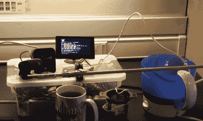
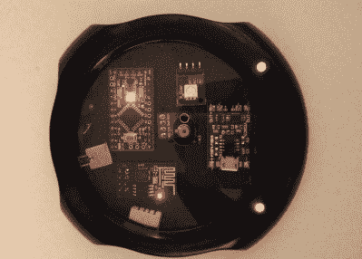
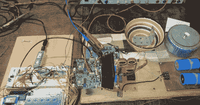

# Hacklet 121 茶黑客

> 原文：<https://hackaday.com/2016/08/20/hacklet-121-tea-hacks/>

上周在 Hacklet 上，我报道了咖啡黑客。然而，并不是每个人都喜欢咖啡。世界上很大一部分人喜欢喝杯茶。不同的文化对于如何准备他们选择的饮料是相当讲究的。美国人倾向于用袋泡茶，而英国人、中国人(以及世界上其他地方的人)通常更喜欢散装茶叶。每个人都有自己独特的风格，这导致了相当多的茶黑客。本周的 Hacklet 是关于 Hackaday.io 上的一些最好的茶项目！

 我们先从【詹姆士·p】[茶丕](https://hackaday.io/project/156)说起。Tea Pi 的设计是为了模仿售价数百美元的商业制茶机。操作的核心是树莓派，这是我们听说过的第一个 Linux 驱动的泡茶器。Adafruit 电源开关的尾部允许 Pi 控制一个标准的茶壶。Pi 通过 DS18B20 温度传感器监控水温。一个简单的伺服下降到水中冲泡茶篮。时间到了，服务员拉起篮子，茶就可以上桌了。[詹姆斯·P]计划在他的茶创作中加入语音控制。我敢打赌，有了亚马逊的树莓派语音服务，这将非常容易。

 下一个出场的是【汤姆】和。有了这个项目，连你的一杯茶都可以加入物联网。Eye-O-Tea 本质上是一个内置温度监控的网络连接杯垫。用 Melexis MLX90615 红外温度计测量温度。Arduino Pro Mini 读取温度并将其传递给 ESP8266 WiFi 模块。整个设备由一个脂肪电池供电，并整齐地放置在一个中空的保温杯中。在云端，[Tom]用 ThinkSpeak 和 freeboard.io 做了一个他可以用手机访问的界面。如果他的茶太烫了，Eye-O-Tea 会告诉他的。如果他忘了拿杯子，杯子变凉了，它还会给他发短信。

 接下来我们有【阿德里安】和[柴博特](https://hackaday.io/project/10684)。Chaibot 是由[Adrian]的儿子[Oliver]创建的，用来解决一个常见的问题。父亲和儿子都会倒上一杯茶，然后参与到一个项目中。他们回来的时候，已经有墨水了。ChaiBot 将茶浸泡一定时间，每分钟搅拌一次。该项目的机制来自一个旧的光盘驱动器。一个 PIC16F887 运行显示，确保陡峭的时间是准确的，并激活电机驱动。当 tea 完成后，ESP8266 会向用户的手机发送推送通知。这个项目被安置在一个木箱里，正好放在厨房的柜台上。

 最后，我们有【Siggi】带[露营者电磁炉](https://hackaday.io/project/10719)，2016 年 Hackaday 奖参赛作品。[Siggi]在旅途中需要热液体，但他不想摆弄加热元件。感应加热器是合适的选择。塞浦瑞斯·PSOC 的微处理器控制着这个系统。金属旅行风格的杯子可以不加修改地使用。对于陶瓷或塑料杯子，一个金属垫圈(希望涂有食品安全的东西)充当浸入式加热器。这个项目目前肯定有点笨拙，但我可以看到[Siggi 的]想法被纳入汽车杯架。[Siggi]在六月份暂停了他的项目。我希望在头版看到他的作品会让发展再次向前推进。

如果你想看更多的茶叶项目，请查看我们新的[茶叶项目清单](https://hackaday.io/list/13192-tea-projects)。看到一个我可能错过的项目？不要害羞，[在 Hackaday.io 上给我留言就行了](https://hackaday.io/adam)。这就是本周的 Hacklet，一如既往，下周见。同样的黑客时间，同样的黑客频道，带给你最好的 [Hackaday.io](https://hackaday.io/) ！