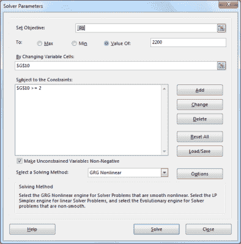
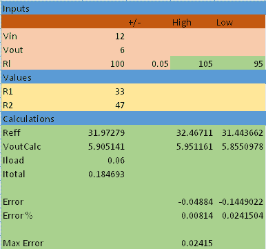

# 优化分布:更多电子表格电路设计技巧

> 原文：<https://hackaday.com/2016/09/14/optimizing-the-spread-more-spreadsheet-circuit-design-tricks/>

上次我向你展示了如何在电子表格中建立一个相当复杂的设计:一个共发射极双极晶体管放大器。将设计放在电子表格中，可以很容易地进行“如果…会怎样”的假设，并且几乎可以立即看到对设计的影响。

电子表格提供的另一个优势是“求解”或优化方程的方法。一旦你有了自己的模型，这将非常有用。对于 Excel，您需要安装规划求解加载项(转到 Excel 选项对话框，选择管理加载项，然后选择规划求解加载项)。你可能也会喜欢 [OpenSolver](http://opensolver.org/) 。你甚至可以在 Google Sheets 中找到它(尽管它目前缺少一个非线性求解器，这使得它对我们所需要的不太有用)。

## 解决方案

I  如果你还记得，晶体管电子表格( [amp.xlsx on GitHub](https://github.com/wd5gnr/ExcelCircuit) )可以为分压器(`R1`和`R2`)选择任何值，只要该比值产生正确的基极电压。为了能够选择一组值，电子表格有一个单元格来设置当前乘数(在下面的示例中为 5)。这将通过分压器的总电流设置为基极电流。因此，在这种情况下，基地将采取 1/5 的总电流和`R2`将进行 4/5，平衡。

然而，2044 和 596 不是标准电阻值。您可以通过反复试验来改变分频器电流倍增器，以使`R1`达到标准值。然而，这也正是求解器的用途。

在“数据”选项卡上，您应该可以找到“规划求解”按钮(如果您安装了加载项)。按下它会弹出这样一个屏幕:

我填写的方式告诉 Excel 修改单元格`G10`(分压器电流)直到`R1`等于 2200。然而，在所有情况下，`G10`的值必须至少为 2。按“求解”,您将在电子表格中看到结果。如果分流器大约是 4.65，你得到的`R1`是 2200 欧姆。

不幸的是，这将`R2`设置为 905.5 欧姆。这仍然非常接近 1 K，我添加了一个子表来显示使用分压器“正确”值的效果(但保持发射极和集电极电阻的标称值)。你可以从 [GitHub](https://github.com/wd5gnr/ExcelCircuit) 下载 amp2.xlsx。

在使用`R1` = 2200 欧姆和`R2` = 1000 欧姆的情况下，集电极电压降至约 5.6 V，误差为 7%。请记住，您的电阻可能不超过 5%，因此这可能不是问题。例如，`R1`高 5%，`R2`低 5%，`VC`就是 6.09 V，误差约 1.5%。翻转容差，误差超过 16% ( `VC`在那种情况下正好是 5 V 左右)。

你的设计能容忍 16%的误差吗？最好是这样。因为晶体管的变化和温度会使它变得更糟。当然，您可以收紧电阻容差，并使用电阻组合来获得更接近的值，但您不能过于自满，认为您的模型值绝对会设置真实世界的参数。

当然，如果你不喜欢这样，尝试用不同的值运行另一个求解器。如果将电流比设置为约 3.4，可以看到`R1`为 3K，`R2`接近 1.5K。这给出了 5.9V 的`VC`，误差约为 2%，最差情况下误差接近 11%。

## 更多示例

在同一个 GitHub 项目中，您会发现模拟分压器和 RC 滤波器的电子表格。这些真的可以炫耀求解器的威力。考虑分压器电子表格: 

这考虑了与`R2`并联的负载电阻，并允许您改变一定量的负载(在上述示例中为 5%)。现在你可以要求求解器做一些事情，比如在保持`VoutCalc`与`Vout`相同的同时最小化误差。

考虑这种情况:您要求求解器最小化最大误差像元(D18)。你允许它修改单元格 B7 和 B8。使用以下四个约束条件:

*   `Vout` = `VoutCalc`
*   _ `R1` > =10
*   _`R2`<:47000
*   _ `R2` > =10

现在，当您求解时，从精度角度来看，您将获得最佳电阻值(10 和 11.11 欧姆)。通过改变约束，你可以确保得到你需要的答案。

## 展开它们

当然，如果你真的想做很多复杂的数学建模，有很多选择。然而，电子表格的广泛可用性和易用性是无可匹敌的。下一次，当你拿起你的计算器，或者，如果你像我一样，你的[计算尺](https://hackaday.com/2015/11/05/slide-rules-were-the-original-personal-computers/)，也许打开一个电子表格。你也可以使用你的电子表格[开发复杂的波形](https://hackaday.com/2015/09/15/how-to-build-a-pocket-sized-mbed-signal-generator/)。