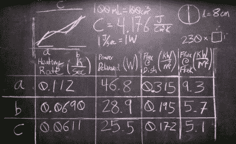

# 描绘死亡射线…呃，太阳能烤箱

> 原文：<https://hackaday.com/2016/08/29/characterizing-a-death-ray-er-solar-oven/>

你们中的许多人可能会在某个时候看着碟形卫星天线，漫不经心地想知道如果你把它镀银并对准太阳，它是否会收集有用的热量。也许你想象一个太阳能热狗的便利来源，或者也许你是一个纵火狂。

[ 查理·索德]不只是想想，他做到了。[找到一个废弃的偏焦直播电视天线，他在上面粘上了一个 230 平方英寸的镜面瓷砖网格](https://www.youtube.com/watch?v=QnnspyvXXFU)，并开始研究其焦点处聚集的太阳能。

废棉、报纸和碎布很容易烧焦和燃烧。一支香烟几乎从头到尾点燃，它能在一根竹子上烧出一个洞。大部分能量以光的形式存在，所以透明或反光的物品需要一点帮助才能从黑暗的东西吸收能量。他通过向糖中加入一些木炭来使糖焦糖化，证明了这一点。一旦木炭变得足够热，使其周围的糖焦糖化，蔓延的深色会导致其余的糖焦糖化，而无需进一步的帮助。

Solar furnace calculations

为了对他的太阳能炉的能量有所了解，他记录了一系列温度读数，因为它加热了一些水，这些水用一点木炭吸收热量。当一朵云经过太阳时，产生的图形有一个平点，但是根据这个平点，他能够根据太阳计算出从略低于 30 瓦到略低于 50 瓦的瞬时功率值。

他在休息时间下面的视频中记录了自己的进步。我们会是唯一一个看完之后还在寻找剩余菜肴的人吗？

 [https://www.youtube.com/embed/QnnspyvXXFU?version=3&rel=1&showsearch=0&showinfo=1&iv_load_policy=1&fs=1&hl=en-US&autohide=2&wmode=transparent](https://www.youtube.com/embed/QnnspyvXXFU?version=3&rel=1&showsearch=0&showinfo=1&iv_load_policy=1&fs=1&hl=en-US&autohide=2&wmode=transparent)

在这些页面上，我们似乎没有太多的碟形卫星天线太阳能炉，但是我们有一两个更传统的太阳能炉。这种基于碟形天线的解决方案可能会受益于[的太阳追踪器](http://hackaday.com/2016/07/24/dual-axis-solar-tracker-with-online-energy-monitor/)。