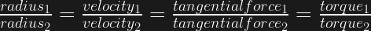
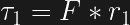
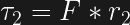
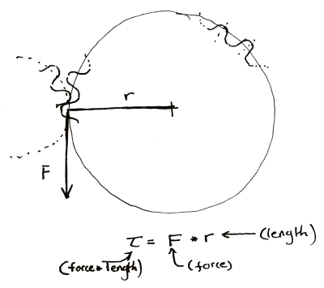
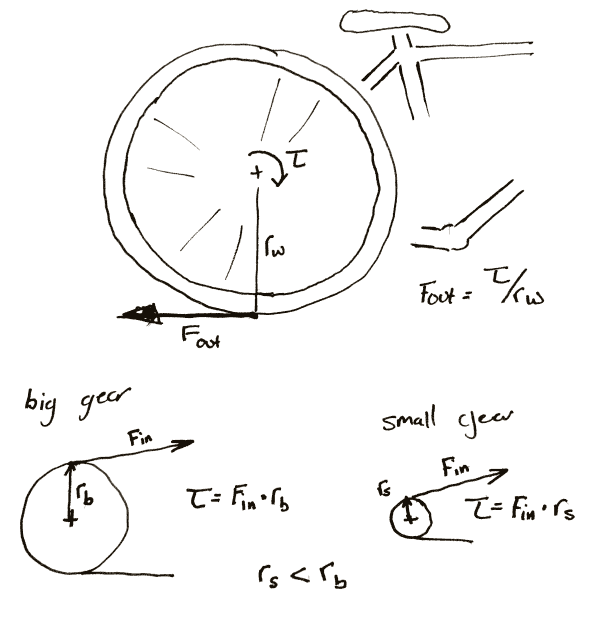
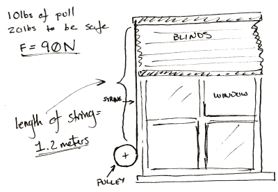
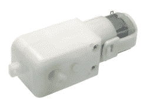
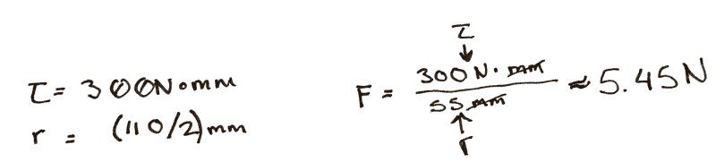
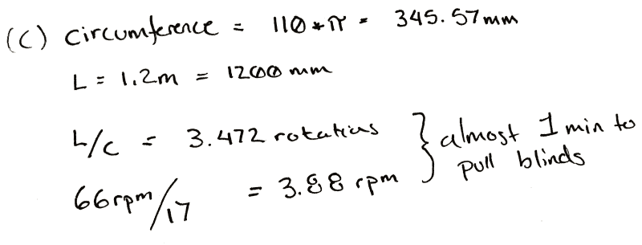

# 磨齿:计算出比率

> 原文：<https://hackaday.com/2016/09/19/grinding-gears-figuring-out-the-ratio/>

实际上，电机和变速箱的任何组合都可以通过数学方法来解决各种问题。你可以用呼机马达吊起一台起重机，但这可能需要几百年的时间。然而，在你第一次做的时候，精确地计算出你需要的比率会感觉有点落后。

齿轮只不过是一种巧妙的方法，可以让两个圆协调一致地旋转，就好像它们在圆周上完美地结合在一起一样。设计者并不依赖于两个相互接触的旋转圆盘之间的摩擦力，而是依赖于轮齿的强度作为限制施加到齿轮上的扭矩大小的因素。

一切都是成比例的。只要你的参考点是正确的，和其他一些东西。呃，越练习越容易。

现在，正如我的物理教授教我做的那样，让我们跳过语义学，省掉一些学究气。让我们假设所有的齿轮都有一个恒定的速度，当你把它平均后。当然，完美的渐开线和原始的灯笼齿轮之间有明显的区别，但为了讨论的目的，这一点都不重要。尤其是如果你只是要 3D 打印这个东西。让我们说，他们坐在完美的轴承和摩擦不是一件事，除非我们让它这样做。此外，我们还将继续让它们完全对齐、去深度和公差。

通常，变速箱有两个用途。你有一个较小的转矩，你想变成一个较大的，或者你有一个转速，你想换成另一个。通常，扭矩用大写或小写的τ(ω)表示，转速用小写的ω(ω)表示。这也完全无关紧要；这只会让你的方程式看起来更酷。

现在很多教程都喜欢以小圆对大圆的思路开始。如果小圆是大圆的三分之一大，那么小圆旋转三次才能使大圆旋转两次。然而，我的观点是，从所施加的力的角度来考虑，可以让设计者更有效地考虑传动装置。

如果圆的两个表面之间的摩擦力是完美的，那么任何切向施加在其中一个圆上的力都会在两个圆的接触点上对另一个圆产生一个完全垂直且相等的力。写到一半我开始明白为什么课本这么深奥了，于是我也画了一张图。这导致两个方程。

 现在，当你有一个垂直于描绘半径的线的力时，力矩的方程就变得非常简单了。

乘以“杠杆臂”、“半径”等的长度。通过力来得到前面的方程。确保包括单位。

你应该得到力单位*长度单位。因为我通常使用较小的齿轮，所以我喜欢使用 N * mm。美国网站通常使用 oz-in 来评价电机。从技术上来说，它是盎司力，但是美国的习惯体系有一种对迟钝的迷恋。

我们可以做一些观察。较小的齿轮在其中心总是受到较小的扭矩。起初，这似乎有点违背我的直觉。如果我用作弊棒来拧螺栓，我把棒做得越长，就能给螺栓施加越大的扭矩。因此，如果我触摸一个非常大的齿轮的外部，我应该会在一个小齿轮的中心看到一吨的扭矩。然而，正如我们之前提到的，任何施加在大齿轮外侧的扭矩在小齿轮上都是相等的和相切的。就好像你在摸小齿轮的外面。扭矩必须更小。

这就是为什么当自行车的后链轮变小时，你必须更加努力地踩踏板。每次你把链轮做得更小，你就缩小了输入车轮的扭矩。如果车轮着地时的垂直输出是 / <radius of="" the="" wheel="">，那么为什么会这样就很明显了。</radius>

Hopefully my diagram doesn’t win a prize for awfulness. Then again, an award is an award. Remember that the bicycle wheel and  its input gear are rigidly attached to each other.

同样重要的是要注意，任何时候你增加扭矩，齿轮的速度都以同样的比例降低。如果你需要一个能提供 20 N*m 的电机输出 60 N*m，而你使用 3:1 的变速箱来完成。如果马达以前以 30 转/分的速度运转，那么现在它以 10 转/分的速度运转。

让我们直接看一个例子。比方说，你想做一个能自动提升百叶窗的装置。你有一些垃圾和一台 3D 打印机。

The problem set-up.

现在你拿起弹簧秤，一直拉，直到快门移动，你知道你需要 10 磅。把百叶窗拉起来。为了方便起见，你把这个数字乘以 2，这样你就知道你需要 20 磅的力才能把窗帘拉起来。然后为了简单起见，把它们都转换成牛顿。大约是北纬 90 度。

现在你真的不在乎百叶窗拉起来有多快，而是自己动手拉起来。你会觉得百叶窗不会喜欢在两秒钟内被提升得比整个范围更快。你个人不在乎是否需要十秒钟，但你希望不要花太长时间。

你还要测量拉起百叶窗的绳子的长度。一米二。

A classic.

最后，在你[遵循了一篇黑客文章中的建议](http://hackaday.com/2016/05/31/path-to-craftsmanship-the-art-of-throwing-it-away/)之后，你的整个实验室只剩下一个备用电源和一个匹配的电机。诅咒作者出生的那一天，你绷着脸写下最后的规格。你有一个便宜的 GM9 齿轮马达。5 V、66 rpm 和 300 N*mm。当你深情地想起你扔掉的堆积如山的挡风玻璃洗涤器电机和 80 磅服务器机架电源时，你诅咒他。

首先，你用滑轮做一些实验。你随意挑选，3D 打印，并发现一个直径 100 毫米的滑轮似乎很好地用手缠绕。缠绕结束时，绳子的外径是 110 毫米。所以你使用上面的扭矩公式。你发现在旋转结束时，如果你直接连接电机，只有 5.45 N 的力施加在弦上。远远不够。

Hrm..

所以，既然你知道所有的东西或多或少都是成比例的，你除以 90 N / 5.45 N，得到的答案是 17。因此，滑轮每转一圈，你至少需要电机转 17 圈来获得所需的扭矩。

这没问题，但它与我们的其他规格相冲突。在 17:1 的比例下，我们的 66 转/分的马达需要将近一分钟来卷起百叶窗。

Damn.

这是一个值得深思的时刻。冲杯咖啡。也许去给一个无聊的作家写一篇轻松的评论，列出他们各种各样的缺点，感知的和真实的，极其详细的。

如果你把绳子绕在壁橱挂杆上呢？那些直径只有 30 毫米左右。你拿一根杆子，把它卷起来。这似乎是可行的，因为它更宽，绳子最终只增加了 5 毫米的最终直径。你重新计算，发现在这种情况下你只需要一个比率 6！是的。

现在你们中的一些人可能已经咬牙切齿了，或者更有可能已经在评论中写下来了。不幸的是，这都是成比例的。而你现在只需要 6:1 的比例，将近三分之一。你还需要将滑轮旋转大约三次来拉动相同长度的绳索。

有时候你赢不了。在这种情况下，唯一的解决办法是订购一台新电机。你在网上搜索了一下，发现你上周扔掉的 12 V 电机中的一个非常适合这个。你甚至不需要变速箱。你可以把它直接连在滑轮上。你环顾干净整洁的车库，感觉空荡荡的。

然而，只是为了好玩，你还是造了一个 6:1 的变速箱。毕竟是个黑。

有趣复杂的封面照片[无所事事的机器](http://www.craftsmanshipmuseum.com/Wahlstrom.htm)归功于乔·马丁基金会。