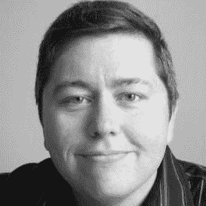
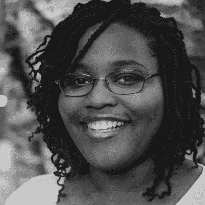
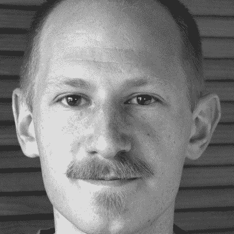
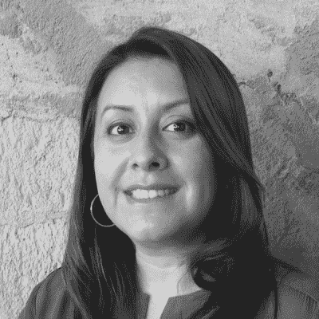
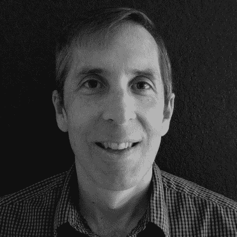
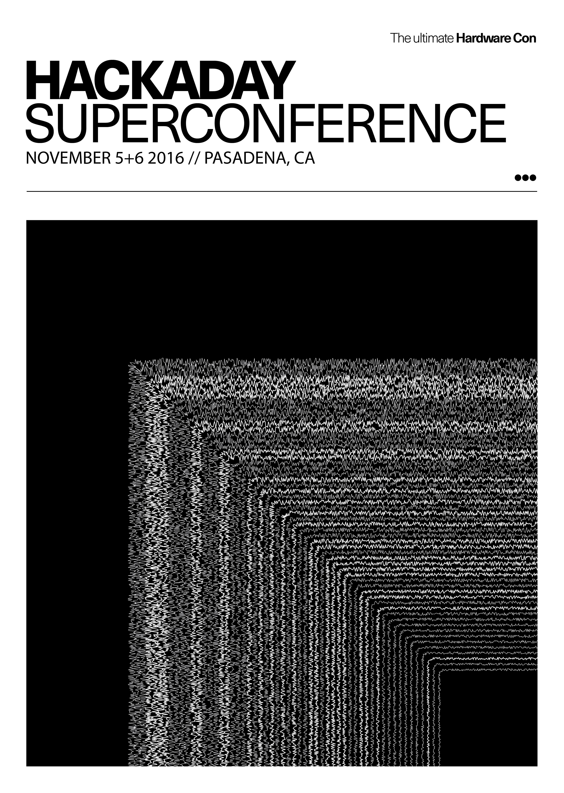

# 获得超级电脑的入场券，这是最大的硬件创作大会

> 原文：<https://hackaday.com/2016/09/12/get-your-ticket-to-supercon-the-greatest-hardware-creation-con/>

[https://player.vimeo.com/video/182073231](https://player.vimeo.com/video/182073231)

世界上最优秀的硬件创造会议 Hackaday SuperConference 回来了。[现在就买票](https://www.eventbrite.com/e/hackaday-super-conference-2016-tickets-27343845177)今年 11 月在帕萨迪纳度过两个神奇的日子。

这是黑客、设计师和工程师的独家聚会，是聪明人与他们的同行一起极客的地方。讲座讲述了研究、原型制作、产品设计、制造以及将新硬件推向世界的故事。在其他任何地方，你都无法获得如此集中的西斯廷教堂般的细节，来了解大大小小的企业、地下室、大学实验室以及其他任何地方都在建设什么。

早期门票为 128 美元，[现在就获得会议通行证](https://www.eventbrite.com/e/hackaday-super-conference-2016-tickets-27343845177)！这张票可以让你在这两天参加会谈、早餐和午餐，一个会议徽章，以及周六晚上的派对。SuperCon 还包括实践研讨会——这些研讨会的容量有限，有些还涉及材料成本，下周会有更多介绍。

### 你会在 SuperCon 找到什么

首先也是最重要的，SuperCon 挤满了了不起的人。谁会在那里？提到一些演讲者是最容易的，但关键是，在场的每个人都想庆祝你设计的电路、你加工的外壳、你突然出现的产品，以及你用原型或研究项目碰到的无法解释的行为。

Alan Yates

Christal Gordon

Ben Krasnow

Luz Rivas

Ken Shirriff

*   艾伦·耶茨是一名多学科的工程师。他在 90 年代末开始从事软件和电信行业，经营自己的 ISP，然后在 web 和企业应用程序开发方面花了很多年，最后才回到他的电气工程领域，研究无线网络硬件和最近的精密室内定位。Alan 来自悉尼，目前居住在西雅图，在 Valve 公司从事虚拟现实技术工作。
*   克里斯塔尔·戈登博士是一名工程师和教育家。她设计了生物启发和生物接口系统、高速电子设备和复杂系统模型。这些系统的应用包括低功耗消费电子产品和神经假体。她热衷于将科学带给大众..
*   [Ben Krasnow](https://twitter.com/benkrasnow) 在谷歌[x]工作，创建高级原型，之前在 Valve 开发虚拟现实硬件。他因其 YouTube 频道上有趣的科学技术应用而闻名:[应用科学](https://www.youtube.com/user/bkraz333)。
*   Luz Rivas 是一名工程师、教育家和社会企业家，热衷于让孩子们探索和创新技术。她是 [DIYgirls](http://www.diygirls.org/) 的创始人。
*   肯·希尔瑞夫写了一个很受欢迎的博客(righto.com)，内容是从充电器到微处理器的逆向工程。他为 Arduino 创建了非远程库。Ken 以前是谷歌的程序员，拥有加州大学伯克利分校的计算机科学博士学位。

这个舞台上还有你的位置。[立即提交您的演讲提议](https://docs.google.com/forms/d/e/1FAIpQLScDw3-DVJSYZT8cQZBId671xSDScnJc6VSQ_Ga961ZEBu6F_A/viewform)！

### 建设黑客村

今年最让我兴奋的是打造黑客村的概念。会议通常在酒店举行——一切都在一个屋檐下:单调的会谈舞厅，普通的餐厅，不起眼的“大堂骗局”发生的走廊。

今年，SuperCon 在帕萨迪纳老城，这是我们的黑客村成形的地方。我们有一个从未在任何会议上被平等对待的工作室:供应框架设计实验室。就在隔壁，[洛杉机音乐学院](http://www.lacm.edu/)举办了超级音乐会。在这些场所周围，优质的食物、饮料和娱乐都在几个街区之外。黑客村的概念同等重视会议的最佳部分:你与每个与会者的互动与组织的活动本身一样重要。

帕萨迪纳是一个科技的好地方，像 SpaceX、iRobot、JPL 这样的公司和艺术中心设计学院这样的机构意味着这个地区挤满了有趣的人。距离伯班克机场 15 分钟，洛杉矶国际机场是国际航班的便捷目的地。我们期待着来自世界各地的与会者和演讲者，11 月意味着好天气，而此时许多其他地区正步入寒冷和沉闷。

### 回顾 2015 年黑客日超级大会

今年的 SuperCon 将远超去年；演讲者、节目和场地已经证实了这种说法。查看去年的所有 23 场演讲[，然后帮助我们确保今年活动的最后一场:](http://hackaday.com/2015/12/24/23-superconference-talks-you-shouldnt-miss/)[我们需要你出席](https://www.eventbrite.com/e/hackaday-super-conference-2016-tickets-27343845177)。

