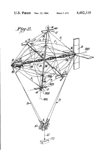
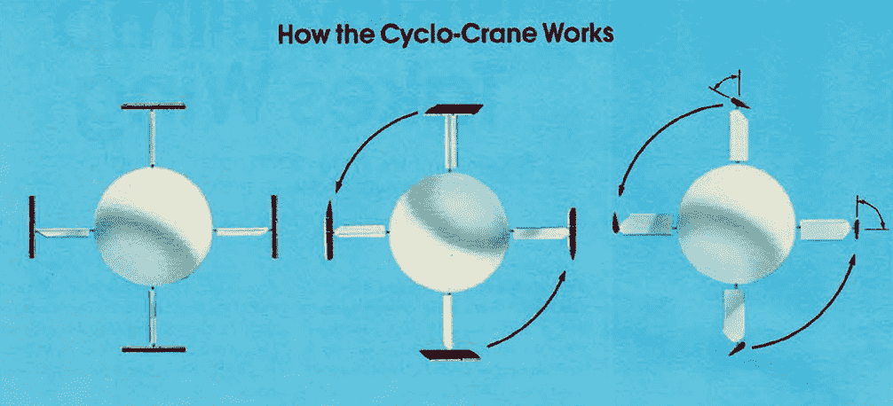

# 也许你的下一个机器人应该是自行车起重机

> 原文：<https://hackaday.com/2016/10/06/maybe-your-next-robot-should-be-a-cyclocrane/>

在我的大学里，我们都被迫上一门叫做工程 101 的课。奇怪的是，我们可以在学校职业生涯的任何时候参加。所以我把它推迟到更有趣的课程上，直到我被迫在最后一年上这门课。这是一堂乱七八糟的课，似乎从来没有形成一个主题或一个信息。然而，每隔三个班左右，他们就会从他们的毕业生队伍中挖掘出一块名副其实的化石。这些老人会坐在教室的前面，给我们讲一些不可思议的事情。无论哪个工程学教授为他们的助教抽到了短签，这两天毫无特色的漫谈都是值得的。

The patent drawing.

尤其是一个灰胡子，他在美国没完没了的“制造酷东西，帮助我们让坏人更死”项目中有很长的职业生涯。他研究过隐形船、机翼可弯曲的飞机，以及各种非常酷的东西。我忘记了那些的细节，但是让我印象深刻的是自行车起重机。它有一大堆问题，正如一位有军衔的 DARPA 高层给出的最终结论是，它“看起来像狗屎一样愚蠢”(或者灰胡子是这么告诉我们的)。

## 三轮车-什么？

Cyclocrane 是一种混合飞艇。一部分是空气动力的，一部分是空气静力的，或者更简单地说，一个粘着飞机的大气球。飞艇之所以伟大，是因为它们具有恒定的静态升力，几乎在所有情况下，这都是由比空气轻的气体产生的浮力。这艘船没有“重量”，所以唯一需要消耗的能量是将它在空中移动到它需要去的任何地方所需的能量。飞机也很棒，但是需要消耗燃料来提升自己离开地面以及指向正确的方向。直升机很酷，因为它们制造的噪音太大，地球无法忍受靠近它们，提供升力。现在，有一个巨大的利弊清单，我们使用飞机而不是飞船来完成大多数任务肯定是有原因的。Cyclocrane 的设计适合一个有趣的用例。

在伐木业，他们经常使用直升机将机械运进运出偏远地区。然而，用直升机提升两吨并不是最有效的方式。飞机效率更高，但这有一个明显的问题。它们只有在各种空气动力学表面被调整的速度和方向下才能达到最高效率。同样值得注意的是，它们不擅长悬停。当车辆以每小时 120 英里的速度行驶时，很难将一篮子链锯安全地拖出树林。

循环起重机想要飞船的所有效率和直升机的机动性。它也希望能够使用飞机机翼的有效升力设计。它想吃三块蛋糕。它几乎做到了。

## 带翅膀的旋转气球

旋转的气球伸出四个翅膀。气球提供了将飞机和货物保持在空中所需的一半空气静力升力。重物系在气球的静止端，并通过电缆悬挂在建筑物下方。巧妙的部分是四个等距的翅膀从船的中心以直角伸出。每个机翼的顶端都有一个由螺旋桨和第二个机翼组成的结构。使用这一系列的翼型和引擎，循环起重机可以以每分钟 13 转的速度旋转它的核心。这为机翼产生了 60 英里每小时的空速。当机翼以循环方式前后倾斜时，会产生一吨的升力。自始至终，船保持完全静止。

There’s a really [great description of its operation in the article this photo came from.](http://www.robcrimmins.com/wp-content/uploads/2013/10/1982-Nov-Discover-p2.jpg)

It really didn’t like strong winds.

现在这艘船有很多问题。它太重了。它需要更大的引擎。它很慢。它看起来很傻。它不喜欢强风。最大的问题是缺乏资金。如果 cyclocrane 的设计者能够继续测试它，它可能已经改变了一些行业。最后，在钱花光之前，它仅有的商业合同只记录了 7 个小时的飞行时间。

然而！这里可能有黑客的机会。如果你想让四轴飞行器的书呆子感到一点嫉妒，一个自行车起重机是你的项目。一个可能比带风扇的气球更有效率的重型起重机器人非常漂亮。T2 在做出真正的性能声明之前，还需要做一些逆向工程。不说别的。这只是一段很酷的航天历史，它提醒我们一个令人欣慰的事实，那就是我们甚至还没有接近发明它。

如果你想了解更多，工程师网站上有大量的信息和图片。自然[维基](https://en.wikipedia.org/wiki/AeroLift_CycloCrane)有一点要说。在 [youtube](https://www.youtube.com/watch?v=CiU71GFs4Fs) 上也有不错的纪录片，如下所示。

 [https://www.youtube.com/embed/CiU71GFs4Fs?version=3&rel=1&showsearch=0&showinfo=1&iv_load_policy=1&fs=1&hl=en-US&autohide=2&wmode=transparent](https://www.youtube.com/embed/CiU71GFs4Fs?version=3&rel=1&showsearch=0&showinfo=1&iv_load_policy=1&fs=1&hl=en-US&autohide=2&wmode=transparent)

照片鸣谢:罗布·克里明斯和哈尔·丹尼森