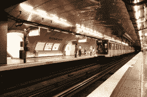
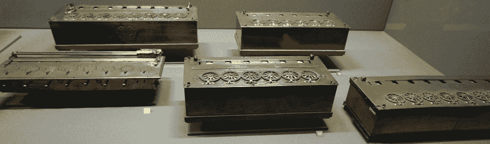
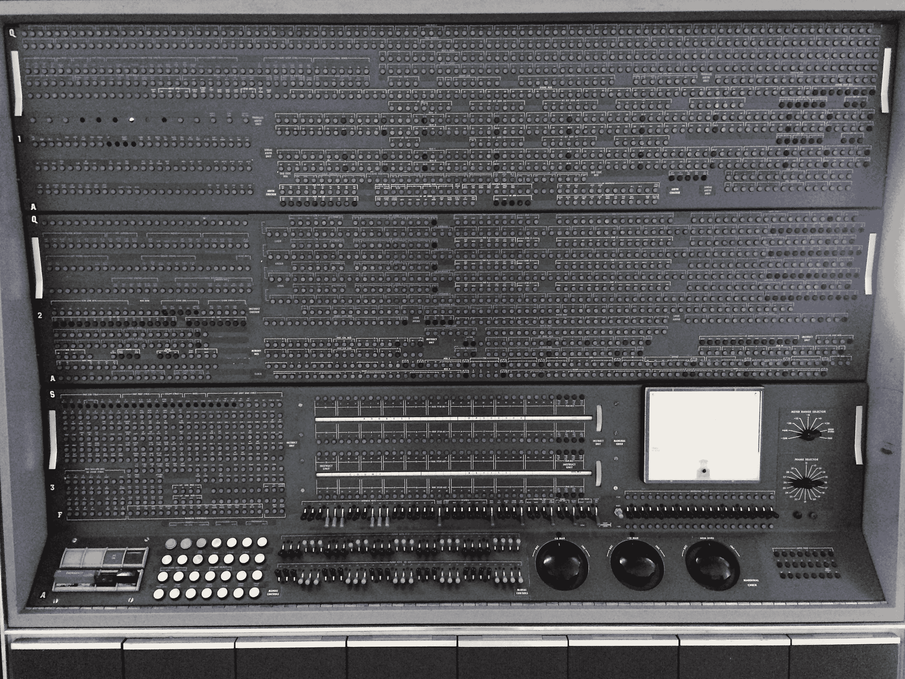
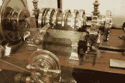
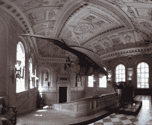
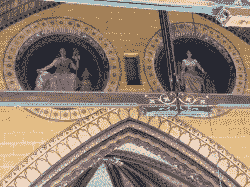

# 黑客值得参观的地方:巴黎艺术博物馆

> 原文：<https://hackaday.com/2016/09/22/hacker-places-to-visit-musee-des-arts-et-metiers-in-paris/>

I think the restaurant is really close now… [*CC: E. Broeks*](https://commons.wikimedia.org/wiki/File:M11_-_Station_Arts_%26_Metiers.jpg)

实施这一骗局的最好方法是:告诉你的另一半，你只想在巴黎度过浪漫的一周。抵达巴黎，藏起你的行李，然后搭乘地铁 3 号线或 11 号线。当你到达看起来像一个巨大的蒸汽机内部的车站时，下车。你现在离一个黑客可以参观的最酷的博物馆只有 10 欧元了。

现代科学的开端有很大一部分是在博物馆里进行的，精致而美丽。他们中的大多数都被放在柜子里，这些柜子太旧了，以至于成为了展览的一部分。现在，密歇根州底特律市的亨利·福特博物馆是工业化的一座纪念碑，本身就很酷，但它留下了一些未解之谜。我们都被桌面 CNC、分币精密测量工具等等宠坏了。我们是怎么到这里的？在精密数字千分尺出现之前，他们是如何测量轴或转动螺丝的？早期的自动化是什么样子的？前期施工？

我还提到过福柯的钟摆吗？你知道，就是那个最终让所有人相信地球绕轴旋转的人？没什么大不了的。

该博物馆有一些永久性展览:科学仪器、材料、建筑、通信、能源、机械和运输。

What kind of basic museum would have just one example of Pascal’s work? *CC: [Anton Lefterov](https://commons.wikimedia.org/wiki/File:17th-century-mechanical-calculators_-Detail.jpg)*

仪器科学是我的最爱之一。它不仅包括旧的科学仪器，还有包含一些光学、计算等方面的原始实验的部分。例如，你可以看到不止一个，而是几个帕斯卡的帕斯卡灵(Pascaline)的原始例子，可以说是现代第一个由门外汉用于日常计算的机械计算器，由帕斯卡签名。同样值得注意的是这些工具的做工是多么的不可思议。它们很漂亮。

Matériaux 一开始我很失望，因为我走错了方向。对我来说，它始于一个可悲的无聊和简单的回收材料展示，主要是为了折磨实地考察的儿童。幸运的是，它很快就变成了材料制造技术的迷人展示。我们是如何从手工织布机发展到全自动提花织布机(你可以看到一些早期的例子)再发展到今天的机器人织布机的？陶瓷是如何发展的？早期炼钢是什么样的？天气很凉爽，模特们都很漂亮。

It reeked of copper, machine oil, and phenolics. They just don’t make computers like they used to.

当我开始[交流](http://www.arts-et-metiers.net/collections/communication-objets-phares)的时候，我已经到了我的忍耐极限，也到了你在博物馆一天所能容纳的东西的极限。这是一座大建筑。它包含了许多早期的计算机、电视和太空的例子。展出了相当多的早期摄影设备。你可以离一些真正的大型旧电脑足够近，闻闻仍在排气的酚醛树脂。

我对建筑有很长一段时间的兴趣。这不是我通常的兴趣，但在巴黎住了一个月左右后，我完全被好奇心点燃了。没有单一动力起重机或车辆的人是如何用石头建造这么多建筑的？它为四个房间和两个商店包装，从地板到天花板都是漂亮的小木头模型，解释着具体的方法。

能源效率相当高。它在很大程度上跟随了蒸汽动力的发展。它始于原始的水车。转移到涡轮机上。然后显示出复杂性的逐渐增加，直到现代。它也有一些内部燃烧，但大部分是留给博物馆的运输部分。它也有一些互动显示器来娱乐儿童和黑客作家。然而，他们迫切需要上油，这是迄今为止整个建筑中最刺耳的吱吱声。

A lathe fit for a king! *CC: [Rama](https://commons.wikimedia.org/wiki/File:CNAM-IMG_0609.jpg?uselang=fr)*

Mécanique 与 instruments scientifique 竞争我最喜欢的展品。你有没有想过看看成百上千的螺丝车床、旧车床和铣床的进化？制造蒸汽机或大型货车车轮的工厂模型呢？他们甚至有一台属于法国国王的车床。显然，他认为金工是接触普通人的方式。

交通工具是一个很好的展览，但对我来说有点不够，因为我去过前面提到的亨利·福特博物馆。然而，它很好地涵盖了一些欧洲汽车制造商的历史。在火车和地铁上玩得很开心。甚至还有一些用于欧洲航天局的 T2 飞船 T3 的模型。

The entrance of the school. Has some original, “flying,” machines. *CC: [King Boshi](https://commons.wikimedia.org/wiki/File:Mus%C3%A9e_des_Arts_et_M%C3%A9tiers_-_Avion_III_de_Cl%C3%A9ment_Ader.jpg?uselang=fr)*

最后一个展品是[博物馆](https://fr.wikipedia.org/wiki/Mus%C3%A9e_des_arts_et_m%C3%A9tiers)本身。这是一座历史建筑。它最初是在 1794 年作为一所培训工程师的学校建造的，但随着学校的发展，它慢慢转变成了今天的博物馆。建筑很漂亮。像所有的法国博物馆一样，它用石头和雕像装饰。它还在建筑的一些较高的楼层上切割了一些部分，所以你可以看到它是如何建造的。

它的美丽部分也与学校吞并圣马丁教堂有关(如果你不懂法语，谷歌翻译做得很好)。郇山隐修会是一座美丽的老教堂，建于 1079 年。这是这个国家最后一次审判的地方。你可以在专门讲述战斗人员[让·德·卡鲁吉斯](https://en.wikipedia.org/wiki/Jean_de_Carrouges)和[雅克·勒·格里斯](https://en.wikipedia.org/wiki/Jacques_Le_Gris)的两页之间拼凑故事。

The muses of agriculture and industry now look over the sanctuary.

博物馆的最后一件展品是在教堂里。它支撑着福柯的钟摆，悬挂在避难所的中央。如果你一天中足够早到达那里，你可能会看到它撞倒一两个钉子，并为自己证明旋转。

与其说是圣徒的雕像，不如说是工农业女神的雕像。大厅里摆满了更多的展品。有切掉的原始汽车。自由女神像的模型。走台可以让你俯瞰周围的景色。它本身也很美。这座教堂维护得很好，并按照他们原来的风格粉刷。

如果你在巴黎有几个小时(或几天)的空闲时间，我强烈推荐这个博物馆。任何技术人员都很难对这个展示不感兴趣。对过去有个看法是件好事。

*精选* *照片抄送: [Roi 卜式](https://commons.wikimedia.org/wiki/File:La_chapelle_du_Mus%C3%A9e_des_Arts_et_M%C3%A9tiers.jpg?uselang=fr)*