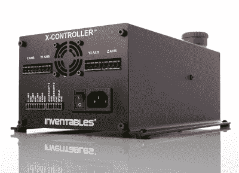

# Inventables 发布改进的 X-Carve 数控路由器

> 原文：<https://hackaday.com/2016/09/01/inventable-releases-improved-x-carve-cnc-router/>

Inventables 去年推出的 X-Carve 是对非常受欢迎的 Shapeoko CNC 路由器的改进，已经成为社区中非常受尊敬的机器。如果你在上面放一个 DeWalt 主轴就更好了，它允许你切割几乎所有不是钢的东西。随着最近对 X-Carve 的升级，它的功能更加强大，拥有来自围绕这台机器成长起来的社区的最佳模式和建议。

X-Carve 的最新版本具有更高的功率驱动器、更好的刚性和主轴散热器。最后一项是一个有趣的工具——布线需要时间，一个 1 马力的马达可以非常有效地将电能转化为热能。

 除了之前推出的 500mm 见方和 1000mmm 见方的路由器，还有一款新的 750mm 见方的机器。所有的机器都有一个新的 X 雕刻电子盒，[X 控制器](https://www.inventables.com/technologies/x-controller-kit)。这个“大脑盒子”是一个结合了电源、步进驱动器和运动控制器的盒子。步进驱动器能够为电机提供 4A，能够进行 1/16 微步，并具有限位开关、主轴控制速度、Z 探针和真空或冷却系统输出的连接。底层控制器基于 [grbl](https://github.com/grbl/grbl) ，使得这个大脑盒成为任何 3 轴 CNC 构建的非常坚实的基础。考虑到关于 [Lulzbot 独立于 3D 打印机出售其 Taz6 brainbox](http://hackaday.com/2016/03/19/mrrf-3d-printing-spectacular/) 的传言，这种“大脑盒”格式似乎是业余爱好者 CNC 市场的发展方向。

新的 X-Carve 现已上市，满载的 1000 毫米宽的机器售价约为 1400 美元。这与许多相同体积的其他机器相当，[不像中国的 3040 数控机器](http://hackaday.com/2015/09/08/how-to-upgrade-a-chinese-cnc-machine/)，你不需要找到一个带并行端口的旧笔记本电脑。